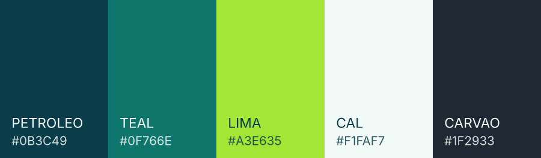

<p align="center">
  
</p>

# BoxFlow

ERP para empresas de **cartonagem** — fabricantes de caixas de papelão ondulado que **compram chapa
pronta e convertem** (imprimem, riscam, cortam, vincam e colam), sem onduladeira própria.

O BoxFlow é um **SaaS**: cada empresa que contrata vê o sistema com o nome e as cores dela, e a marca
BoxFlow fica na tela de entrada e no rodapé. O primeiro contratante substitui o **Sistema Cartonagem
(PcBoot)**, um sistema de duas décadas cujo levantamento é a base de todo o desenho documentado aqui.

Este repositório tem duas coisas: a **documentação de desenho** do sistema e um **protótipo navegável**
da interface. Ainda não há backend.

## Protótipo navegável

**▶ <https://douglas-vitoriano.github.io/project_erp/>**

[](https://github.com/douglas-vitoriano/project_erp/actions/workflows/pages.yml)

Quatro dispositivos, um sistema — escritório, tablet de máquina, tablet do vendedor e painel de galpão.
É HTML, CSS e JavaScript puros, sem dependência externa e sem etapa de build. Publicado automaticamente
a cada alteração em `prototipo/`; detalhes em [`prototipo/README.md`](prototipo/README.md).

> **Primeira publicação:** falta marcar **Read and write permissions** em *Settings → Actions → General*
> e rodar o workflow. Sem isso o GitHub não deixa o workflow habilitar o Pages, e o endereço acima
> responde 404. É um clique, uma vez só.

> O protótipo mostra a interface **antes** da virada para BoxFlow: ele ainda usa a identidade antiga e
> descreve a topologia com servidor local. A decisão foi não retrabalhá-lo agora — ele serve para validar
> fluxo de tela, e os fluxos não mudaram.

Por onde começar, dependendo do que você quer ver:

| Quero ver | Abrir |
|---|---|
| O cálculo de caixa recalculando ao vivo | [Engenharia · F.T. 92281](https://douglas-vitoriano.github.io/project_erp/escritorio.html#engenharia/92281) |
| Como o operador aponta produção na máquina | [Tablet · Corte e Vinco 01](https://douglas-vitoriano.github.io/project_erp/maquina.html?posto=m3) |
| A assinatura do cliente sendo coletada offline | [App do vendedor](https://douglas-vitoriano.github.io/project_erp/campo.html) |
| Onde está cada pedido | [Rastreamento](https://douglas-vitoriano.github.io/project_erp/escritorio.html#rastreamento) |
| O que trava a fábrica hoje | [Painel de galpão](https://douglas-vitoriano.github.io/project_erp/painel.html) |

Duas coisas nele funcionam de verdade, porque são o coração técnico do projeto:

- **Motor de fórmulas de caixa** — lexer, parser descendente recursivo e avaliação, aceitando apenas as
  sete variáveis do legado (`C L A S I W R`). Na tela de Engenharia, mude comprimento, largura ou altura
  e veja riscador, impressão, chapa, peso, custo, aproveitamento e plano de corte recalcularem. As
  fórmulas cadastradas reproduzem **exatamente** o que está gravado na F.T. 92281 do PcBoot
  (riscador 122/116/122 = 360 e impressão 30/463/243/463/241 = 1.440).
- **Captura de assinatura do cliente** — canvas com eventos de ponteiro, escalado por `devicePixelRatio`,
  exportado em PNG e encadeado por hash. Funciona com o aparelho offline: ligue o *modo avião* na barra
  do app de campo antes de assinar.

## Documentação

Leia na ordem 00 → 01 → 02 → 03. Marca e infraestrutura são independentes. Os ADRs são referenciados de
dentro dos documentos.

| Doc | Conteúdo |
|---|---|
| [docs/00-CENARIO-E-PREMISSAS.md](docs/00-CENARIO-E-PREMISSAS.md) | Situação atual do legado, volumes, lacunas do modelo inicial, premissas e restrições |
| [docs/01-ARQUITETURA.md](docs/01-ARQUITETURA.md) | Topologia em nuvem pura, clientes offline, rede da fábrica, isolamento entre contratantes, orçamento de latência, segurança e backup |
| [docs/02-ENGENHARIA.md](docs/02-ENGENHARIA.md) | Stack Rails, padrões, motor de fórmulas, Fichas de Serviço e homem-máquina, sincronização, migração do legado, fases |
| [docs/03-BANCO-DE-DADOS.md](docs/03-BANCO-DE-DADOS.md) | Modelo de dados completo: convenções, tabelas, colunas, tipos, chaves, restrições, índices e views |
| [docs/04-MARCA.md](docs/04-MARCA.md) | Identidade do BoxFlow, paleta com contraste medido, e o contrato de marca branca por contratante |
| [docs/05-INFRAESTRUTURA-E-CUSTOS.md](docs/05-INFRAESTRUTURA-E-CUSTOS.md) | Onde hospedar, quanto custa, domínio HTTPS sem Registro.br |
| [docs/06-PARIDADE-COMPETITIVA.md](docs/06-PARIDADE-COMPETITIVA.md) | Comparação com o Kiwiplan: as lacunas reais, a ordem em que fecham e o que não vamos copiar |
| [docs/adr/](docs/adr/) | Registros de decisão de arquitetura — o "por quê" de cada escolha estrutural |

O processo para manter os documentos vivos quando houver mudança está em
[`docs/README.md`](docs/README.md).

## As seis decisões que definem o sistema

**Nuvem pura: nada é instalado na fábrica.** Como o BoxFlow é SaaS, um servidor on-premise por contratante
significaria o fornecedor operando um parque de servidores espalhados, com defasagem de versão entre
clientes. O custo disso é maior que o do desenvolvimento. Em troca, o tablet de máquina passou a ser
offline-first de verdade — fixa o turno e enfileira apontamentos — e link redundante com failover 4G
virou requisito de implantação. O que a máquina faz continua durante a queda; o que o escritório faz,
para. Ver [ADR-0004](docs/adr/0004-nuvem-pura-sem-servidor-na-fabrica.md).

**Ruby on Rails, com a NF-e deliberadamente fora.** Hotwire renderiza no servidor as telas de escritório,
que são a maioria, por uma fração do custo de uma SPA; os dois clientes que precisam funcionar sem rede
são escritos à mão contra uma API JSON. A emissão de nota fica em um serviço .NET isolado, porque o
ecossistema fiscal maduro está lá e manter só isso em outra linguagem custa um contêiner. Ver
[ADR-0005](docs/adr/0005-ruby-on-rails-e-hotwire.md).

**Conflito de escrita é eliminado por construção, não resolvido depois.** Todo dado pertence a uma de
três classes — referência com dono único, fato imutável em modo *append-only*, e documento com ciclo de
vida e transferência explícita de propriedade. Não existe *merge* automático de campo. Essa classificação
é o que permitiu tirar o servidor da fábrica sem inventar mecanismo novo: tudo que a fábrica produz é
fato imutável, e união de conjuntos não tem conflito. Ver
[ADR-0002](docs/adr/0002-propriedade-de-dados-e-sincronizacao.md).

**Numeração offline por blocos pré-alocados.** Cada aparelho recebe uma faixa, e a não sobreposição é
garantida por restrição de exclusão no banco (`int8range` + `gist`), não pela aplicação. É isso que
permite numerar, imprimir e assinar um protocolo de amostra sem internet. Numeração fiscal nunca sai
offline. Ver [ADR-0003](docs/adr/0003-numeracao-offline-por-blocos.md).

**O cliente escolhe as cores, mas não a sinalização.** O contratante informa **uma** cor e o sistema
deriva a escala inteira, validando contraste na gravação. As cores de estado do chão de fábrica —
parada, setup, produzindo, refugo — são fixas e não customizáveis, porque o operador **aprende a cor**:
se vermelho é parada em um cliente e barra superior em outro, vermelho deixa de significar algo. Ver
[ADR-0006](docs/adr/0006-marca-branca-por-contratante.md) e [04-MARCA](docs/04-MARCA.md).

**O sequenciamento de produção propõe; a pessoa aceita.** A comparação com o Kiwiplan mostrou que a única
lacuna funcional séria é a programação automática da fábrica. Ela entra — mas gravando uma proposta com
motivo em português por posição, que o PCP aceita, edita ou recusa. O que o chão de fábrica vê é sempre
uma sequência aprovada por um humano identificado. Duas razões: os nossos tempos de setup e velocidade
ainda não são medidos, e a divergência entre proposta e aceite é justamente o dado que calibra o modelo.
Ver [ADR-0007](docs/adr/0007-sequenciamento-como-proposta-auditavel.md) e
[06-PARIDADE-COMPETITIVA](docs/06-PARIDADE-COMPETITIVA.md).

## Marca

<p align="center">
  
</p>

O símbolo é uma caixa vista de frente com a **onda do papelão atravessando-a**: os lados verticais são
interrompidos onde a onda passa, e a onda transborda para fora. Chapa ondulada entra, caixa sai.

Os arquivos em [`images/marca/`](images/marca/) são **gerados por parâmetro**, não exportados de um
editor: [`gerar-marca.py`](images/marca/gerar-marca.py) desenha o símbolo a partir de medidas e converte
o letreiro de Inter Bold em curvas. Para mudar traço, curvatura ou número de cristas, muda-se o parâmetro
e regenera-se tudo. Regras de aplicação e contraste em [04-MARCA](docs/04-MARCA.md).

## Descoberta do banco legado

O motor de banco usado pelo PcBoot ainda não é conhecido. Em [`etl/descoberta/`](etl/descoberta/) há um
script PowerShell **somente leitura** que investiga a estação de trabalho da fábrica — executáveis, DLLs
de acesso a dados, assinaturas de arquivo, strings de conexão, aliases BDE no registro, DSNs ODBC,
serviços e portas em escuta — e conclui qual motor é, com o caminho de extração correspondente. Não exige
administrador e não lê dado de cliente.

## Sobre dados neste repositório

O repositório é público, então **nenhum dado real de cliente está versionado**:

- A pasta `Print PcBoot/` (prints, PDFs e planilhas do legado, com razão social, CNPJ, contatos,
  telefones e preços praticados) está no `.gitignore` e permanece apenas na máquina local. Ela é a
  evidência do levantamento e a base dos testes de regressão descritos no doc 02.
- No protótipo, razões sociais, nomes fantasia, CNPJ, telefones e nomes de pessoas são **fictícios**.
  O que permanece fiel ao legado é o vocabulário de fábrica e os números de geometria, que não
  identificam ninguém.
- O workflow de publicação tem uma **trava**: se qualquer imagem, PDF ou planilha for versionada fora de
  `images/marca/`, a publicação aborta.

## Estado atual

| Frente | Situação |
|---|---|
| Documentação de arquitetura, engenharia, banco, marca e infraestrutura | Escrita e revisada |
| Marca BoxFlow (vetor, variações, favicon) | Gerada e documentada |
| Protótipo de interface dos quatro dispositivos | Navegável; ainda com a identidade anterior |
| Paridade funcional contra o Kiwiplan | Levantada; plano e critérios de aceite no [doc 06](docs/06-PARIDADE-COMPETITIVA.md) |
| Identificação do banco legado | Script pronto, aguardando execução na fábrica |
| Backend, banco e migração | Não iniciados |

## Estrutura do repositório

```
├── README.md                    este arquivo
├── .github/workflows/pages.yml  verifica e publica o protótipo no Pages
├── docs/                        cenário, arquitetura, engenharia, banco, marca, custos e ADRs
├── images/marca/                marca BoxFlow gerada por parâmetro (SVG + PNG)
├── etl/descoberta/              script somente leitura que identifica o banco do legado
├── prototipo/                   protótipo navegável (é a raiz do site publicado)
└── Novo Documento de Texto.txt  modelo de dados v0, superado pelo doc 03 (registro histórico)
```
