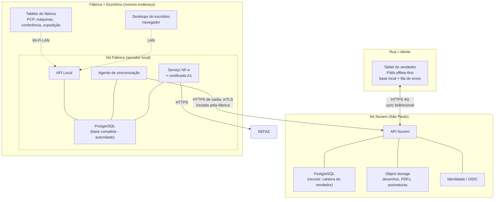

# 01 — Arquitetura

## 1. Resumo da decisão

O sistema roda em **dois nós que se sincronizam**, mais clientes que funcionam offline:

- **Nó Fábrica (on-premise)** — servidor local na fábrica/escritório. É a **autoridade** de cadastros,
  engenharia, produção, estoque, expedição, fiscal e financeiro. Atende os tablets de fábrica e os
  desktops do escritório pela rede local. Continua funcionando com a internet caída.
- **Nó Nuvem** — servidor em nuvem (região Brasil). É o **ponto de encontro** dos vendedores em rua e a
  autoridade de identidade/autenticação e dos documentos criados em campo (requisição de amostra,
  assinatura, rascunho de orçamento/pedido, visita). Não é cópia do ERP inteiro: replica um **recorte**.
- **Clientes offline-first** — tablets de fábrica e de campo são aplicações que guardam dados localmente
  e enviam em fila. Funcionam sem rede; sincronizam quando há rede.

A conexão entre os nós é **iniciada sempre pela fábrica** (saída HTTPS). Não se abre porta, não se
publica o servidor local na internet, não se usa VPN para o vendedor. Ver
[ADR-0001](adr/0001-topologia-hibrida-local-nuvem.md).

## 2. A pergunta central: como atender o vendedor em rua

### 2.1 Por que não acesso remoto ao servidor local

As três alternativas "óbvias" foram descartadas:

| Alternativa | Por que não |
|---|---|
| **VPN até o servidor da fábrica** | O link da fábrica passa a ser ponto único de falha do time comercial. Queda de energia ou de internet na fábrica = vendedor sem sistema no cliente. Somado a CGNAT/IP dinâmico, latência de 4G e a necessidade de expor o ERP, o risco não se paga. |
| **Acesso remoto / área de trabalho remota** | Interface de desktop não se opera em tablet. E continua exigindo conectividade contínua — justamente o que não existe na rua. |
| **Publicar o servidor local na internet** | Expõe o ERP inteiro (fiscal, financeiro, engenharia) na borda, com um servidor que não tem equipe de segurança dedicada nem janela de patch confiável. |

O ponto que elimina todas elas: **mesmo que a conexão fosse perfeita, o vendedor precisa trabalhar sem
sinal** — dentro do galpão do cliente, em subsolo, em cidade do interior. Qualquer desenho que dependa de
estar online na hora da visita falha no momento em que mais importa: o cliente assinando a amostra.

### 2.2 O desenho adotado



Em uma frase: **o vendedor nunca fala com a fábrica; ele fala com a nuvem, e a nuvem conversa com a
fábrica.** A nuvem absorve a instabilidade dos dois lados.

### 2.3 O que o vendedor tem no tablet, sem rede

Leitura (replicado, somente leitura no campo):

- Sua carteira de clientes com dados cadastrais, endereços, condição de pagamento e situação de crédito.
- F.T. dos clientes da carteira: referência, estilo, medidas, qualidade, preço vigente, desenho e foto.
- Histórico de orçamentos, pedidos e amostras desses clientes.
- **Situação de produção dos pedidos da carteira** — em que operação está, quanto já foi produzido,
  previsão e entregas já baixadas. É a resposta ao "saber remotamente onde está o pedido".
- Títulos em aberto do cliente (para a conversa comercial).

Escrita (criada offline, sobe depois):

- Requisição de amostra, com número real já impresso (ver §5.3).
- **Protocolo de amostra assinado pelo cliente** — assinatura no dedo/caneta na tela, com evidências.
- Rascunho de orçamento e de pedido.
- Registro de visita, ocorrência, S.A.C. e foto.
- Solicitação de alteração de cadastro do cliente (proposta, não edição direta — ver §6.2).

### 2.4 Escopo de sincronização (não sincronizar tudo)

Não faz sentido descer 94 mil F.T. para um tablet. O escopo é calculado por usuário:

```
Clientes:      os da carteira do vendedor (representante_id = usuário) + prospects atribuídos
F.T.:          as dos clientes da carteira, com status ativo
Histórico:     últimos 24 meses de orçamento/pedido/amostra desses clientes
Anexos:        desenho e foto principais em resolução reduzida; original sob demanda
Financeiro:    títulos em aberto e vencidos dos clientes da carteira
```

Isso é declarado em `escopo_sincronizacao` (ver [03-BANCO-DE-DADOS](03-BANCO-DE-DADOS.md#4-módulo-sincronização))
e avaliado pelo servidor — o cliente nunca escolhe seu próprio escopo, para não vazar carteira alheia.

## 3. Nó Fábrica

### 3.1 Responsabilidades

Autoridade (única fonte de verdade que pode alterar):

- Cadastros: cliente, fornecedor, representante, transportadora, funcionário, banco, parâmetros.
- Engenharia: F.T., estilo/fórmula, qualidade, ferramental, documentos, revisões.
- PCP e Produção: O.F., roteiro, Ficha de Serviço, apontamento, carga-máquina.
- Estoque, conferência e expedição.
- Fiscal (emissão de NF-e, séries, tributação) e Financeiro.
- Aprovação/efetivação de orçamentos e pedidos vindos do campo.

### 3.2 Hardware e infraestrutura mínima recomendada

| Item | Recomendação | Observação |
|---|---|---|
| Servidor | 8 vCPU, 32 GB RAM, 2× SSD NVMe 1 TB em RAID 1 | Postgres com ~20 anos de histórico + anexos cresce; separar volume de dados do de SO |
| SO | Linux LTS (Ubuntu Server ou Debian) | Se a TI só sustenta Windows, Windows Server + Docker Desktop é aceitável, com perda de previsibilidade |
| Runtime | Docker Compose (ou Podman) | Serviços: `api`, `postgres`, `minio`, `nginx`, `sync-agent`, `nfe`, `backup` |
| Energia | UPS com autonomia ≥ 20 min + desligamento gracioso | Queda suja de energia com Postgres aberto é a principal causa de corrupção |
| Rede | Switch gerenciado, VLAN separada para tablets de fábrica | Ver §4 |
| Wi-Fi | APs de grau industrial com roaming, cobrindo todas as máquinas e a expedição | Tablet que perde o AP no meio do galpão trava apontamento |
| Anexos | MinIO (S3 compatível) no volume local | Acaba com o caminho de rede gravado no registro; ver §9 |

### 3.3 Não haverá alta disponibilidade no nó local

Decisão consciente: um servidor, não cluster. O custo de HA on-premise não se justifica para esta
operação. A mitigação é: **os tablets de fábrica continuam coletando apontamento em fila local** se o
servidor cair, e o restore é testado mensalmente (§10). Se a indisponibilidade máxima aceitável for
menor que algumas horas, isso muda e exige ADR novo.

## 4. Rede e segmentação

```
VLAN 10  Escritório (desktops, impressoras)      → acessa API Local
VLAN 20  Tablets de fábrica                      → acessa SOMENTE a API Local (porta 443)
VLAN 30  Servidores                              → saída à internet apenas para SEFAZ, nuvem e updates
VLAN 99  Visitantes / Wi-Fi convidado            → isolada, sem rota para 10/20/30
```

Regras:

- Tablet de fábrica **não tem acesso à internet** aberto. Reduz drasticamente a superfície de ataque e
  impede uso indevido do equipamento.
- Nenhuma porta de entrada aberta no roteador em direção ao servidor local. A sincronização é conexão de
  **saída** da fábrica para a nuvem.
- DNS interno resolvendo `erp.local` com certificado próprio (CA interna) para os tablets e desktops.
- Tablet do vendedor **não pertence a nenhuma VLAN da fábrica** — ele fala com a nuvem, sempre, mesmo
  quando o vendedor está fisicamente na empresa. Isso mantém um só caminho de código e evita o bug
  clássico de "funciona no escritório, quebra na rua".

## 5. Operação offline

Há **três problemas de desconexão diferentes**, e tratá-los como um só é o erro que costuma afundar esse
tipo de projeto:

| Cenário | Duração típica | Volume de escrita | Tratamento |
|---|---|---|---|
| Tablet de fábrica perde o Wi-Fi | segundos a minutos | alto (apontamentos) | Fila local curta, reenvio automático, eventos idempotentes |
| Tablet do vendedor em rua | horas a dias | baixo (documentos) | Base local completa do escopo + sincronização bidirecional |
| Fábrica perde a internet | minutos a horas | — | Nó local segue operando; sincronização com a nuvem acumula e drena depois |

### 5.1 Tablet de fábrica

Como está sempre em LAN, não precisa de base local completa — precisa **não perder apontamento**. O
aplicativo grava cada evento em uma fila local (IndexedDB) com chave de idempotência e só remove da fila
após confirmação do servidor. A tela mostra explicitamente quantos eventos estão pendentes de envio; o
operador não fica adivinhando.

O que é exibido offline: a Ficha de Serviço corrente e a fila da máquina, cacheadas. O que **não** se
permite offline: abrir nova O.F., alterar roteiro ou dar baixa de estoque — operações que dependem de
estado global e exigem o servidor.

### 5.2 Tablet do vendedor

Base local relacional (SQLite) com o recorte do §2.4, mais os anexos reduzidos. A interface indica sempre
três coisas: **data/hora da última sincronização**, quantos itens estão pendentes de envio, e se algum
dado que ele está vendo pode estar desatualizado (ex.: preço da F.T. sincronizado há 6 dias).

Regra de produto importante: **preço e crédito têm prazo de validade offline**. Um orçamento gerado com
dado sincronizado há mais de N dias sai marcado como "sujeito a confirmação". Sem isso, o vendedor fecha
preço errado e o sistema vira o culpado.

### 5.3 Numeração offline

O Protocolo de Amostra é impresso e assinado na frente do cliente — precisa de **número de verdade** na
hora, sem rede. Solução: cada dispositivo recebe **blocos de numeração pré-alocados** pela nuvem quando
está conectado (ex.: protocolos 30.900 a 30.999 para o tablet do vendedor X). O dispositivo consome do
bloco offline e pede bloco novo quando o estoque de números cai abaixo de um limite.

Não há colisão porque o bloco é exclusivo. Não há lacuna suspeita porque o bloco não consumido é devolvido
e auditado. Detalhes em [ADR-0003](adr/0003-numeracao-offline-por-blocos.md).

## 6. Sincronização

### 6.1 Classificação do dado (a decisão que evita conflito)

Todo dado do sistema cai em uma de três classes, e cada classe tem regra própria:

| Classe | Exemplos | Regra |
|---|---|---|
| **Referência** (dono único) | cliente, F.T., estilo, qualidade, tabela de preço, máquina | Só o Nó Fábrica altera. Nuvem e tablets recebem réplica **somente leitura**. Zero conflito por construção. |
| **Fato imutável** (append-only) | apontamento de produção, assinatura, visita, foto, evento de amostra | Só se insere, nunca se altera. Sincronização é união de conjuntos. Zero conflito. |
| **Documento com ciclo de vida** | orçamento, pedido, requisição de amostra | Tem **dono explícito** que muda de mãos em momentos definidos (§6.2). |

### 6.2 Transferência de propriedade

O vendedor cria um orçamento offline: dono = o dispositivo dele. Enquanto é rascunho, só ele altera.
Ao **submeter**, a propriedade passa para o Nó Fábrica e o documento fica somente leitura no tablet — dali
em diante quem mexe é o escritório. Se o vendedor precisar mudar algo, ele cria uma **revisão nova**, não
edita a versão que já está na fábrica.

O mesmo vale para cadastro: o vendedor não edita o cliente, ele registra uma **solicitação de alteração**
que alguém no escritório aprova. Parece burocrático, mas é o que impede que o endereço de faturamento seja
sobrescrito por um cache de três dias atrás.

Resultado: **conflito de escrita simultânea deixa de ser um caso comum e passa a ser exceção**. Quando
ainda assim ocorrer (ex.: mesmo documento tocado por dois nós por falha de processo), a regra é
*dono vence*, e o caso é gravado em `sync_conflito` para revisão humana — nunca descartado em silêncio.

### 6.3 Mecanismo

- Cada tabela replicada tem `versao`, `no_origem`, `atualizado_em`, `deletado_em`.
- Gatilhos alimentam um log de alterações (`sync_alteracao`) com sequência global monotônica.
- Cada consumidor guarda um cursor (`sync_cursor`) e puxa `versao_global > cursor` em lotes.
- O envio (push) é **um lote de operações de domínio com chave de idempotência**, validado pelas regras de
  negócio do servidor — não um upsert cego de linha. Isso é o que permite rejeitar um pedido offline cujo
  cliente foi bloqueado no intervalo.
- Anexos sincronizam por referência (hash + URL), em canal separado e com prioridade menor que os dados.

Protocolo detalhado em [02-ENGENHARIA §6](02-ENGENHARIA.md#6-motor-de-sincronização).

### 6.4 Compatibilidade de versões entre nós

Nó local e nuvem nem sempre estarão na mesma versão (a nuvem atualiza primeiro; a fábrica atualiza em
janela). Portanto:

- Mudança de schema é **aditiva** por padrão: coluna nova é anulável ou tem default; remoção só acontece
  duas versões depois de o uso cessar.
- O contrato de sincronização é versionado (`/sync/v1/...`) e o nó anuncia sua versão no handshake.
- Nó em versão mais antiga que o mínimo suportado tem a sincronização **bloqueada com mensagem clara**, em
  vez de sincronizar errado.

## 7. Fiscal e contingência

- A **emissão de NF-e fica no Nó Fábrica**, que guarda o certificado A1 em cofre de segredos local.
  Motivo: o certificado não sai da empresa, e a emissão acompanha a expedição física.
- Se a internet cair durante a expedição: fila de emissão + contingência prevista na legislação
  (DANFE em contingência / EPEC, conforme a UF). O XML e o evento ficam registrados como pendentes e a
  transmissão é retomada automaticamente.
- Séries de numeração fiscal são **por estabelecimento (CNPJ)** e sempre atribuídas pelo nó local —
  numeração fiscal jamais é gerada offline em tablet.
- A Reforma Tributária (IBS/CBS/IS) entra como campos e regras próprios desde o início do modelo, com
  vigência por data, e não como "adaptação depois" (ver [03-BANCO-DE-DADOS §13](03-BANCO-DE-DADOS.md#13-módulo-fiscal)).

## 8. Segurança e LGPD

### 8.1 Identidade e autenticação

- Identidade central no **Nó Nuvem** (OIDC), tokens de curta duração + refresh.
- O Nó Fábrica valida token **offline**, por chave pública em cache (JWKS), para continuar autenticando com
  a internet caída.
- **Login de operador de fábrica é diferente do login de escritório**: crachá com QR + PIN, sessão curta
  amarrada ao posto de trabalho. Operador não digita e-mail e senha longa de luva, em pé, na máquina —
  se o login for chato, o apontamento não acontece.
- Tablet do vendedor: dispositivo **registrado e nominal** (`dispositivo`), com possibilidade de revogação
  remota e **apagamento da base local** no próximo contato. Perda de tablet é cenário esperado, não exceção.

### 8.2 Autorização

Papéis do legado preservados e expandidos: Admin, PCP, Produção/Operador, Qualidade, Engenharia, Vendas,
Representante, Compras, Financeiro, Fiscal, Expedição. Permissão por **módulo + operação**, e o
representante tem visão restrita à própria carteira — regra aplicada no servidor, nunca só na interface.

### 8.3 Proteção de dados

- TLS em todo tráfego; **mTLS** entre nós.
- Criptografia em repouso: disco cifrado no servidor local e no volume da nuvem.
- Base local do tablet cifrada, com chave protegida pelo hardware do dispositivo.
- Trilha de acesso (`acesso_log`) e trilha de alteração de campo (`revisao_campo`) — herdando o que o
  legado já fazia bem.
- LGPD: na nuvem fica **o recorte mínimo** necessário à operação de campo; retenção definida por tipo de
  dado; base de tratamento registrada; assinatura do cliente guarda nome, cargo e horário porque o
  documento exige — e só isso.

## 9. Anexos e documentos

Fim dos caminhos de rede gravados no registro. Todo desenho, layout, foto, PDF de protocolo e assinatura
vira objeto em storage S3-compatível, com:

`hash SHA-256` (identidade e deduplicação) · `versão` · `validade` · `vínculo` (F.T., amostra, pedido…) ·
`quem subiu` · `visibilidade` (interno / visível ao cliente).

Os arquivos que hoje estão em `W:\Desenhos` e `W:\Tabela\Desenho` são ingeridos na migração e ligados às
F.T. correspondentes pelo caminho original, que fica preservado em `caminho_legado` para conferência.

## 10. Backup, retenção e recuperação

| Camada | Estratégia | Frequência | Retenção |
|---|---|---|---|
| Postgres local | `pg_basebackup` + arquivamento contínuo de WAL | base diária, WAL contínuo | 30 dias em disco, 12 meses off-site |
| Postgres local → off-site | Cópia cifrada para a nuvem | diária, fora do horário | 12 meses |
| Anexos (MinIO) | Replicação para bucket na nuvem | contínua | 12 meses + versionamento |
| Postgres nuvem | Backup gerenciado + PITR | contínuo | 35 dias |
| Fila dos tablets | Não é backup — é dado ainda não confirmado | — | Alerta se pendência > 2 h |

Metas: **RPO ≤ 15 min** (graças ao WAL contínuo) e **RTO ≤ 4 h** para o nó local.

Duas regras que valem mais que a tabela acima: **restore testado mensalmente** em servidor separado, com
registro do tempo gasto; e **alerta ativo de backup que não rodou** — backup silenciosamente quebrado é o
padrão da indústria, e só se descobre no pior dia possível.

## 11. Observabilidade

- Métricas e alertas por nó: fila de sincronização, idade do cursor, eventos pendentes por tablet,
  latência da API, espaço em disco, backup, transmissão de NF-e.
- Painel operacional que a fábrica entende: **quantos apontamentos não subiram**, **quantos tablets estão
  offline há mais de X**, **quantas amostras estão aguardando há mais de N dias** (indicador que hoje é
  uma dor real — 58% da fila em 2026).
- Log estruturado com `tenant_id`, `no_id`, `dispositivo_id` e `correlacao_id` atravessando os nós — sem
  isso, depurar um dado que "não chegou" é impossível.

## 12. Riscos arquiteturais

| Risco | Impacto | Mitigação |
|---|---|---|
| Wi-Fi de fábrica insuficiente (metal, papel, empilhadeira) | Apontamento não acontece e o projeto é considerado fracasso | Site survey **antes** de comprar tablet; fila offline; APs industriais |
| Resistência do operador ao apontamento | Dados incompletos tornam OEE e rastreio inúteis | Interface de 3 toques, login por QR, ganho visível para o operador (fila da máquina, meta do turno) |
| Schema do PcBoot inacessível | Migração vira digitação ou scraping de relatório | Tratar como Q2 do doc 00, com prazo; plano B de extração via relatórios exportados |
| Servidor local único | Parada de horas | UPS, restore testado, peça de reposição, fila nos tablets |
| Divergência entre nós passar despercebida | Decisão tomada com dado velho | Idade do cursor visível na interface e alertada; reconciliação periódica por hash de bloco |
| Crescimento de anexos | Disco cheio no pior momento | Cota, alerta em 70%, política de resolução reduzida no tablet |

## Histórico de revisões

| Data | Autor | Mudança |
|---|---|---|
| 27/09/2026 | — | Versão inicial: topologia híbrida, operação offline, sincronização, segurança, backup |
