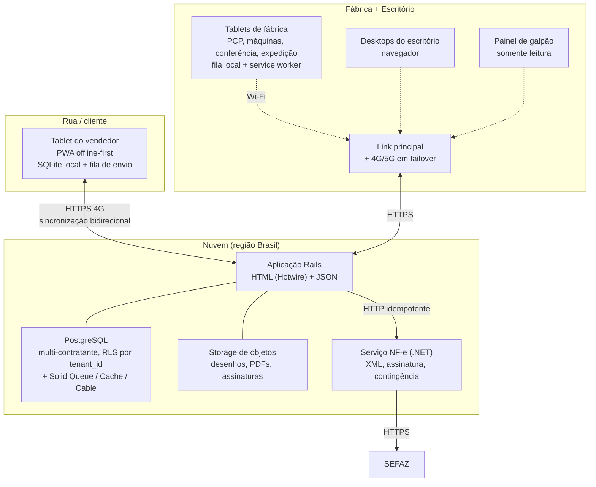

# 01 — Arquitetura

## 1. Resumo da decisão

O **BoxFlow** é um SaaS multi-contratante que roda **inteiramente em nuvem**. Nada é instalado na fábrica
além de navegador. Ver [ADR-0004](adr/0004-nuvem-pura-sem-servidor-na-fabrica.md), que substitui a
topologia híbrida original.

- **Um nó, na nuvem (região Brasil)** — autoridade de tudo: cadastros, engenharia, PCP, produção, estoque,
  expedição, fiscal, financeiro e identidade. Aplicação em **Ruby on Rails**
  ([ADR-0005](adr/0005-ruby-on-rails-e-hotwire.md)), com a emissão de NF-e em serviço separado.
- **Quatro clientes, todos navegador** — escritório, tablet de máquina, tablet de vendedor e painel de
  galpão. Dois deles funcionam sem rede por construção; dois não precisam.
- **Isolamento por contratante** dentro do mesmo banco, por `tenant_id` com Row Level Security no
  PostgreSQL.

O que desapareceu em relação à versão anterior deste documento: servidor na fábrica, UPS, MinIO local,
VLAN de servidores, mTLS entre nós, sincronização entre nós e compatibilidade de versão entre nós. O que
apareceu no lugar: **link redundante na fábrica como requisito de implantação** e um tablet de máquina que
precisa ser offline de verdade, não apenas tolerante a soluço de Wi-Fi.

---

## 2. A pergunta central: manter a fábrica rodando sem servidor local

### 2.1 O que a nuvem pura custa, dito sem rodeio

A topologia anterior existia por um motivo bom: **a produção não pode parar por queda de internet.** Tirar
o servidor local não faz esse motivo desaparecer, apenas transfere a responsabilidade para o cliente que
roda na fábrica. Então a pergunta certa não é "a internet cai?", é **"o que exatamente para quando ela
cai?"**.

| Operação | Sobrevive à queda de link? | Como |
|---|---|---|
| Apontar produção, setup, parada, refugo | **Sim** | Fato imutável em fila local no tablet (§5.1) |
| Conferir e expedir (bipar volume, fechar carga) | **Sim** | Idem, com a carga do turno fixada localmente |
| Consultar a Ficha de Serviço do turno | **Sim** | Fixada no início do turno |
| Colher assinatura de amostra no cliente | **Sim** | Já era offline por natureza (§5.2) |
| Abrir O.F. nova, alterar roteiro, dar baixa de estoque | Não | Depende de estado global |
| Aprovar pedido, consultar crédito, fechar romaneio | Não | Escritório, e escritório tolera esperar |
| **Emitir NF-e** | Não | Nunca sobreviveu: depende da SEFAZ, que é remota de qualquer forma |

A leitura honesta da tabela: **o que a máquina faz continua; o que o escritório faz para.** Essa troca só
é aceitável porque a máquina é que custa dinheiro parada, e porque a mitigação é barata — um roteador com
4G em failover custa uma fração de um servidor com UPS, disco redundante e alguém para cuidar dele.

### 2.2 O desenho adotado



Em uma frase: **todos os clientes falam com o mesmo serviço, e os dois que podem ficar sem rede carregam
o dado de que precisam antes de precisar dele.**

### 2.3 O que o vendedor tem no tablet, sem rede

Leitura (replicado, somente leitura no campo):

- Sua carteira de clientes com dados cadastrais, endereços, condição de pagamento e situação de crédito.
- F.T. dos clientes da carteira: referência, estilo, medidas, qualidade, preço vigente, desenho e foto.
- Histórico de orçamentos, pedidos e amostras desses clientes.
- **Situação de produção dos pedidos da carteira** — em que operação está, quanto já foi produzido,
  previsão e entregas já baixadas. É a resposta ao "saber remotamente onde está o pedido".
- Títulos em aberto do cliente, para a conversa comercial.

Escrita (criada offline, sobe depois):

- Requisição de amostra, com número real já impresso (§5.4).
- **Protocolo de amostra assinado pelo cliente** — assinatura no dedo ou caneta na tela, com evidências.
- Rascunho de orçamento e de pedido.
- Registro de visita, ocorrência, S.A.C. e foto.
- Solicitação de alteração de cadastro do cliente — proposta, não edição direta (§6.2).

### 2.4 Escopo de sincronização (não sincronizar tudo)

Não faz sentido descer 94 mil F.T. para um tablet. O escopo é calculado por usuário:

```
Clientes:      os da carteira do vendedor (representante_id = usuário) + prospects atribuídos
F.T.:          as dos clientes da carteira, com status ativo
Histórico:     últimos 24 meses de orçamento/pedido/amostra desses clientes
Anexos:        desenho e foto principais em resolução reduzida; original sob demanda
Financeiro:    títulos em aberto e vencidos dos clientes da carteira
```

Isso é declarado em `escopo_sincronizacao` (ver [03-BANCO-DE-DADOS](03-BANCO-DE-DADOS.md#4-módulo-2--sincronização))
e avaliado **pelo servidor** — o cliente nunca escolhe seu próprio escopo, para não vazar carteira alheia.

---

## 3. O que fica na fábrica

Nenhum servidor. O que a implantação exige do cliente é rede, e a lista abaixo é curta de propósito: ela
é o contrato de implantação.

| Item | Requisito | Por que é requisito, e não recomendação |
|---|---|---|
| **Link principal** | Fibra dedicada ou banda larga empresarial | É por onde o sistema existe |
| **Link de reserva** | Roteador com 4G/5G e **failover automático** | Queda de link é a falha comum. Sem isso, o escritório para de verdade |
| **Wi-Fi** | Pontos de acesso de grau industrial, com roaming, cobrindo todas as máquinas e a expedição | Tablet que perde o AP no meio do galpão interrompe apontamento. Papelão empilhado e estrutura metálica derrubam sinal doméstico |
| **Segmentação** | VLAN separada para tablets de fábrica (§4) | Tablet é equipamento de trabalho, não de navegação |
| **Tablets** | 10", robustos, bateria para o turno inteiro, leitura de QR pela câmera | Bateria é o que limita a degradação em queda longa (§5.1) |
| **Impressora** | Térmica para etiqueta de amarrado; laser para Ficha de Serviço e romaneio | A impressão da carga do turno é o último recurso do [ADR-0004](adr/0004-nuvem-pura-sem-servidor-na-fabrica.md) |
| **Painel** | TV 43"+ em posição visível do galpão, com navegador em modo quiosque | Ver [04-MARCA §3.5](04-MARCA.md) |

Um **site survey de Wi-Fi antes de comprar tablet** continua sendo a recomendação mais importante desta
seção, e agora com mais força: sem servidor local, o Wi-Fi ruim não tem rede de segurança nenhuma além da
fila no dispositivo.

---

## 4. Rede na fábrica

```
VLAN 10  Escritório (desktops, impressoras)   → saída HTTPS para a nuvem
VLAN 20  Tablets de fábrica                   → saída HTTPS SOMENTE para o domínio do BoxFlow
VLAN 30  Painel de galpão                      → saída HTTPS somente para o domínio do BoxFlow
VLAN 99  Visitantes / Wi-Fi convidado          → isolada, sem rota para 10/20/30
```

Regras:

- Tablet de fábrica **não tem internet aberta**: apenas o domínio do BoxFlow. Reduz a superfície de ataque
  e impede uso indevido do equipamento.
- **Nenhuma porta de entrada** aberta no roteador da fábrica. Não existe mais nada lá para alcançar — o
  que também significa que a fábrica deixou de ter superfície de ataque própria.
- O tablet do vendedor **não pertence a nenhuma VLAN da fábrica**, mesmo quando o vendedor está na
  empresa. Um só caminho de código, e evita o bug clássico de "funciona no escritório, quebra na rua".
- Como não há DNS interno nem CA própria, desaparece toda a operação de certificado interno que a
  topologia anterior exigia. O certificado é público, do domínio do BoxFlow
  ([05-INFRAESTRUTURA-E-CUSTOS](05-INFRAESTRUTURA-E-CUSTOS.md)).

---

## 5. Operação offline

Há **três problemas de desconexão diferentes**, e tratá-los como um só é o erro que costuma afundar esse
tipo de projeto:

| Cenário | Duração típica | Volume de escrita | Tratamento |
|---|---|---|---|
| Tablet de fábrica perde o Wi-Fi | segundos a minutos | alto (apontamentos) | Fila local, reenvio automático, eventos idempotentes |
| **Fábrica perde o link** | minutos a horas | alto (apontamentos) | Mesma fila, com o turno fixado localmente (§5.1). Escritório para |
| Tablet do vendedor em rua | horas a dias | baixo (documentos) | Base local relacional + sincronização bidirecional |

A diferença em relação à arquitetura anterior está na linha do meio: antes ela era absorvida pelo servidor
local. Agora ela é absorvida pelo dispositivo, e por isso o tablet de fábrica mudou de categoria.

### 5.1 Tablet de fábrica

Deixou de ser "tela em LAN com fila curta" e passou a ser **cliente offline-first**
([ADR-0005](adr/0005-ruby-on-rails-e-hotwire.md)).

**No início do turno, fixa localmente:**

- as Fichas de Serviço previstas para o posto, com medidas, quantidade, qualidade e observação;
- os dados de apoio: operadores, motivos de parada, motivos de refugo, postos;
- o desenho e o plano de corte das F.T. envolvidas, em resolução reduzida.

**Durante o turno, grava offline** — todos são fatos imutáveis, e por isso não geram conflito (§6.1):
apontamento de produção, início e fim de setup, parada com motivo, refugo com motivo, troca de operador,
conferência de volume, carregamento e fechamento de carga.

**Não permite offline**, porque depende de estado global: abrir O.F. nova, alterar roteiro, dar baixa de
estoque, emitir nota.

A tela mostra sempre, sem o operador precisar perguntar: **quantos eventos estão pendentes de envio** e
**há quanto tempo** o dispositivo não fala com a nuvem. Fila que cresce em silêncio é fila que ninguém
descobre até o fechamento do mês.

**Degradação prevista, em ordem:** Wi-Fi cai → fila local, invisível para o operador. Link cai → fila
local continua, escritório para. Link cai *e* tablet fica sem bateria → a produção segue pela Ficha de
Serviço impressa no início do turno e o apontamento é lançado depois, com hora retroativa e marca de
lançamento manual.

### 5.2 Tablet do vendedor

Base local relacional (SQLite em WASM/OPFS) com o recorte do §2.4, mais os anexos reduzidos. A interface
indica sempre três coisas: **data e hora da última sincronização**, quantos itens estão pendentes de
envio, e se algum dado exibido pode estar velho — por exemplo, preço de F.T. sincronizado há seis dias.

Regra de produto que vale repetir: **preço e crédito têm prazo de validade offline.** Orçamento gerado com
dado sincronizado há mais de N dias sai marcado como "sujeito a confirmação". Sem isso o vendedor fecha
preço errado e o sistema vira o culpado.

### 5.3 Escritório e painel de galpão

Os dois são **online**, por decisão ([ADR-0004](adr/0004-nuvem-pura-sem-servidor-na-fabrica.md)). O que
eles ganham em troca é uma obrigação de comportamento durante a queda:

- O escritório detecta a perda de conexão e **bloqueia envio em vez de aceitar e perder**. Formulário
  preenchido fica preservado no navegador e é reenviado quando a conexão volta.
- O painel de galpão, quando perde conexão, **mostra explicitamente a hora do último dado** em vez de
  continuar exibindo número velho como se fosse atual. Painel que mente é pior que painel apagado.

### 5.4 Numeração offline

O Protocolo de Amostra é impresso e assinado na frente do cliente — precisa de **número de verdade** na
hora, sem rede. Solução: cada dispositivo recebe **blocos de numeração pré-alocados** pela nuvem quando
está conectado (por exemplo, protocolos 30.900 a 30.999 para o tablet do vendedor X). O dispositivo
consome do bloco offline e pede bloco novo quando o estoque de números cai abaixo de um limite.

Não há colisão porque o bloco é exclusivo. Não há lacuna suspeita porque o bloco não consumido é devolvido
e auditado. Detalhes em [ADR-0003](adr/0003-numeracao-offline-por-blocos.md).

Com a nuvem pura, isso **deixou de ser recurso do campo** e passou a valer para todo documento de fábrica
que pode nascer offline, porque não existe mais autoridade local para atribuir número durante a queda.
A exceção permanece absoluta: **numeração fiscal nunca é gerada offline** (§8).

---

## 6. Sincronização

Só existe um eixo: **dispositivo ↔ nuvem**. O eixo fábrica ↔ nuvem, que era a parte mais difícil da
arquitetura anterior, deixou de existir.

### 6.1 Classificação do dado (a decisão que evita conflito)

Todo dado do sistema cai em uma de três classes, e cada classe tem regra própria:

| Classe | Exemplos | Regra |
|---|---|---|
| **Referência** (dono único) | cliente, F.T., estilo, qualidade, tabela de preço, máquina | Só a nuvem altera. Dispositivos recebem réplica **somente leitura**. Zero conflito por construção |
| **Fato imutável** (append-only) | apontamento, parada, refugo, conferência, assinatura, visita, foto | Só se insere, nunca se altera. Sincronização é união de conjuntos. Zero conflito |
| **Documento com ciclo de vida** | orçamento, pedido, requisição de amostra | Tem **dono explícito** que muda de mãos em momentos definidos (§6.2) |

Vale notar o que essa classificação fez pelo [ADR-0004](adr/0004-nuvem-pura-sem-servidor-na-fabrica.md):
**tudo que a fábrica produz é fato imutável.** Foi isso que permitiu tirar o servidor local sem inventar
mecanismo novo — a fila do tablet é união de conjuntos, e união de conjuntos não tem conflito para
resolver.

### 6.2 Transferência de propriedade

O vendedor cria um orçamento offline: dono é o dispositivo dele. Enquanto é rascunho, só ele altera. Ao
**submeter**, a propriedade passa para a nuvem e o documento fica somente leitura no tablet — dali em
diante quem mexe é o escritório. Se o vendedor precisar mudar algo, ele cria uma **revisão nova**, não
edita a versão que já foi submetida.

O mesmo vale para cadastro: o vendedor não edita o cliente, ele registra uma **solicitação de alteração**
que alguém no escritório aprova. Parece burocrático, mas é o que impede o endereço de faturamento ser
sobrescrito por um cache de três dias atrás.

Quando ainda assim houver conflito — mesmo documento tocado por dois caminhos por falha de processo — a
regra é **dono vence**, e o caso é gravado em `sync_conflito` para revisão humana, nunca descartado em
silêncio.

### 6.3 Mecanismo

- Cada tabela replicada tem `versao`, `atualizado_em` e `deletado_em`.
- Gatilhos alimentam um log de alterações (`sync_alteracao`) com sequência global monotônica.
- Cada dispositivo guarda um cursor (`sync_cursor`) e puxa `versao_global > cursor` em lotes.
- O envio é **um lote de operações de domínio com chave de idempotência**, validado pelas regras de
  negócio do servidor — não um `upsert` cego de linha. É isso que permite rejeitar um pedido offline cujo
  cliente foi bloqueado no intervalo.
- Anexos sincronizam por referência (hash + URL), em canal separado e com prioridade menor que os dados.

Protocolo detalhado em [02-ENGENHARIA §6](02-ENGENHARIA.md).

### 6.4 Compatibilidade de versões

A defasagem de versão não desapareceu, **mudou de lugar**: antes era entre dois servidores, agora é entre
o servidor e um PWA instalado em tablet que pode ficar semanas sem recarregar.

- O contrato de sincronização é versionado (`/sync/v1/...`) e o cliente anuncia sua versão no handshake.
- Mudança de schema é **aditiva** por padrão: coluna nova é anulável ou tem default; remoção só acontece
  duas versões depois de o uso cessar.
- Cliente em versão abaixo do mínimo suportado tem a sincronização **bloqueada com mensagem clara** e é
  forçado a atualizar, em vez de sincronizar errado.
- O service worker verifica versão a cada abertura de turno. Atualização **nunca** acontece no meio de um
  turno com fila pendente: primeiro drena, depois atualiza.

---

## 7. Isolamento entre contratantes

Consequência direta da nuvem pura: o dado fiscal e financeiro de todos os contratantes mora no mesmo
banco. O isolamento passa a ser requisito de primeira ordem, não detalhe de implementação.

- **`tenant_id` em toda tabela multi-contratante**, com Row Level Security no PostgreSQL. Cada requisição
  abre a conexão com `SET LOCAL app.tenant_id` e as políticas filtram.
- A RLS é **rede de segurança, não enfeite**: escopo esquecido no Active Record é o erro mais fácil de
  cometer em SaaS, e a única forma de ele não virar vazamento entre clientes é o banco recusar a linha.
  Ver [ADR-0005](adr/0005-ruby-on-rails-e-hotwire.md).
- **Storage de objetos com prefixo por contratante** e URL assinada de vida curta. Nunca URL pública.
- Teste automatizado obrigatório de vazamento: para cada recurso, uma requisição autenticada como
  contratante A pedindo identificador de B tem que devolver 404 — não 403, que já confirmaria a
  existência.
- Trilha de acesso carrega `tenant_id` sempre, porque incidente aqui é incidente multi-cliente e a
  primeira pergunta será "quem viu o quê".

---

## 8. Fiscal e contingência

- A emissão fica no **serviço de NF-e** ([ADR-0005](adr/0005-ruby-on-rails-e-hotwire.md)): o Rails é dono
  da máquina de estados do documento; o serviço monta o XML, assina, transmite e trata o retorno.
- **O certificado A1 deixou de morar na fábrica.** Passa a ser guardado cifrado por contratante, com a
  chave em cofre gerenciado, carregado em memória só durante a assinatura, com registro de cada uso. É
  obrigação nova e precisa estar no contrato: o certificado digital é do cliente.
- Alerta de **vencimento de certificado** com 30 e 7 dias de antecedência. Certificado vencido é parada
  de faturamento, e é falha 100% previsível.
- Se a SEFAZ estiver fora durante a expedição: fila de emissão mais contingência prevista na legislação
  (DANFE em contingência / EPEC, conforme a UF). O XML e o evento ficam registrados como pendentes e a
  transmissão é retomada automaticamente.
- Séries de numeração fiscal são **por estabelecimento (CNPJ)** e sempre atribuídas pela nuvem.
  **Numeração fiscal jamais é gerada offline** — é a única exceção absoluta ao §5.4.
- A Reforma Tributária (IBS/CBS/IS) entra como campos e regras próprios desde o início do modelo, com
  vigência por data, e não como adaptação posterior (ver
  [03-BANCO-DE-DADOS §13](03-BANCO-DE-DADOS.md#13-módulo-12--fiscal)).

---

## 9. Segurança e LGPD

### 9.1 Identidade e autenticação

- Identidade na aplicação, tokens de curta duração com refresh.
- **Login de operador de fábrica é diferente do login de escritório**: crachá com QR mais PIN, sessão
  curta amarrada ao posto de trabalho. Operador não digita e-mail e senha longa de luva, em pé, na
  máquina — se o login for chato, o apontamento não acontece.
- O tablet de fábrica precisa autenticar **durante a queda de link**: o token do posto é validado
  localmente contra chave pública em cache, com validade limitada ao turno. Expirado, o dispositivo
  continua **coletando em fila** mas não abre tela nova.
- Tablet do vendedor: dispositivo **registrado e nominal** (`dispositivo`), com revogação remota e
  **apagamento da base local** no próximo contato. Perda de tablet é cenário esperado, não exceção.

### 9.2 Autorização

Papéis do legado preservados e expandidos: Admin, PCP, Produção/Operador, Qualidade, Engenharia, Vendas,
Representante, Compras, Financeiro, Fiscal, Expedição. Permissão por **módulo mais operação**, e o
representante tem visão restrita à própria carteira — regra aplicada no servidor, nunca só na interface.

### 9.3 Proteção de dados

- TLS em todo o tráfego, sem exceção, com HSTS.
- Criptografia em repouso no banco e no storage de objetos.
- Base local do tablet cifrada, com chave protegida pelo hardware do dispositivo.
- Trilha de acesso (`acesso_log`) e trilha de alteração de campo (`revisao_campo`), herdando o que o
  legado já fazia bem.
- LGPD: o BoxFlow é **operador** de dados pessoais e cada contratante é o **controlador** — isso precisa
  estar escrito no contrato, com as obrigações de cada lado. Retenção definida por tipo de dado; base de
  tratamento registrada; a assinatura do cliente guarda nome, cargo e horário porque o documento exige,
  e só isso.
- Logotipo enviado pelo contratante é arquivo de terceiro entrando no sistema: limite de tamanho,
  verificação de tipo real e **sanitização de SVG**, que aceita script
  ([ADR-0006](adr/0006-marca-branca-por-contratante.md)).

---

## 10. Anexos e documentos

Fim dos caminhos de rede gravados no registro. Todo desenho, layout, foto, PDF de protocolo e assinatura
vira objeto em storage S3-compatível, com:

`hash SHA-256` (identidade e deduplicação) · `versão` · `validade` · `vínculo` (F.T., amostra, pedido…) ·
`quem subiu` · `visibilidade` (interno ou visível ao cliente).

Os arquivos que hoje estão em `W:\Desenhos` e `W:\Tabela\Desenho` são ingeridos na migração e ligados às
F.T. correspondentes pelo caminho original, preservado em `caminho_legado` para conferência.

---

## 11. Backup, retenção e recuperação

Com um nó só, a tabela encurtou — e é justamente por isso que as duas regras no fim desta seção ficaram
mais importantes, não menos.

| Camada | Estratégia | Frequência | Retenção |
|---|---|---|---|
| PostgreSQL | Backup gerenciado com PITR | contínuo | 35 dias |
| PostgreSQL → cópia independente | `pg_dump` cifrado para **outro provedor** | diária | 12 meses |
| Storage de objetos | Versionamento + replicação para outro provedor | contínua | 12 meses |
| Fila dos dispositivos | Não é backup — é dado ainda não confirmado | — | Alerta se pendência > 2 h |

Metas: **RPO ≤ 15 min** e **RTO ≤ 2 h**.

A cópia para **outro provedor** não é zelo excessivo: com nuvem pura, o provedor é ponto único de falha do
negócio inteiro, e backup que mora no mesmo lugar que o dado não é backup. Custa poucos dólares por mês
([05-INFRAESTRUTURA-E-CUSTOS](05-INFRAESTRUTURA-E-CUSTOS.md)).

Duas regras que valem mais que a tabela acima: **restore testado mensalmente** em ambiente separado, com
registro do tempo gasto; e **alerta ativo de backup que não rodou** — backup silenciosamente quebrado é o
padrão da indústria, e só se descobre no pior dia possível.

---

## 12. Orçamento de latência

Seção nova, e necessária: a LAN virou WAN. Consulta que antes custava milissegundos agora atravessa o
link da fábrica. Sem orçamento declarado, isso vira "o sistema está lento" sem ninguém saber o que medir.

| Cliente | Operação | Meta p95 |
|---|---|---|
| Escritório | Abrir tela de listagem | 800 ms |
| Escritório | Salvar formulário | 1 s |
| Tablet de fábrica | Registrar apontamento (resposta na tela) | **100 ms** — é local, não espera rede |
| Tablet de fábrica | Drenar fila de um evento | 2 s |
| Tablet do vendedor | Sincronizar carteira típica | 60 s em 4G |
| Painel de galpão | Atualizar por push | 5 s |

Consequências de projeto que vêm do orçamento, não do gosto:

- **Paginação por cursor** em toda listagem, nunca por offset. As tabelas têm 20 anos de histórico.
- Resposta renderizada no servidor com carga pequena, trocando fragmento em vez de tela inteira
  (Turbo Frames) — ver [ADR-0005](adr/0005-ruby-on-rails-e-hotwire.md).
- Apontamento **responde na tela antes de subir**. Os 100 ms da tabela são de gravação local; a rede é
  assunto da fila.

---

## 13. Observabilidade

- Métricas e alertas: fila de sincronização, idade do cursor por dispositivo, eventos pendentes por
  tablet, latência por rota contra o orçamento do §12, backup, transmissão de NF-e, vencimento de
  certificado.
- Painel operacional que a fábrica entende: **quantos apontamentos não subiram**, **quantos tablets estão
  offline há mais de X**, **quantas amostras estão aguardando há mais de N dias** — indicador que hoje é
  dor real, com 58% da fila em 2026.
- Métrica de negócio do SaaS, que não existia antes: **contratantes ativos, dispositivos por contratante,
  crescimento de anexos por contratante**. Sem isso não se sabe se o plano cobre o custo.
- Log estruturado com `tenant_id`, `dispositivo_id` e `correlacao_id`. Sem `tenant_id` no log, depurar um
  SaaS multi-cliente é impossível — e responder a um incidente de vazamento, mais ainda.

---

## 14. Riscos arquiteturais

| Risco | Impacto | Mitigação |
|---|---|---|
| **Queda de link na fábrica** | Escritório para; fiscal para | Link redundante com failover automático como requisito de implantação (§3); fila no tablet mantém a produção |
| Wi-Fi de fábrica insuficiente (metal, papel, empilhadeira) | Apontamento não acontece e o projeto é considerado fracasso | Site survey **antes** de comprar tablet; fila offline; APs industriais |
| **Vazamento entre contratantes** | Incidente multi-cliente, dano reputacional irreversível | RLS no banco como rede de segurança; teste automatizado de vazamento por recurso; `tenant_id` em todo log (§7) |
| **Indisponibilidade do provedor de nuvem** | Sistema inteiro fora | Implantação por Kamal, sem amarra a fornecedor; backup em provedor distinto; RTO de 2 h ensaiado |
| Resistência do operador ao apontamento | Dados incompletos tornam OEE e rastreio inúteis | Interface de 3 toques, login por QR, ganho visível para o operador (fila da máquina, meta do turno) |
| **Certificado A1 na nuvem** | Objeção do cliente; risco de custódia | Cifrado por contratante, chave em cofre, registro de cada uso, cláusula contratual explícita (§8) |
| Schema do PcBoot inacessível | Migração vira digitação ou raspagem de relatório | Tratar como Q2 do doc 00, com prazo; plano B de extração via relatórios exportados |
| Bateria do tablet em queda longa | Última linha de defesa cai | Ficha de Serviço impressa no início do turno; carregador no posto |
| Crescimento de anexos | Custo de storage sobe sem ninguém perceber | Cota por contratante, alerta em 70%, resolução reduzida no tablet, métrica por contratante (§13) |

---

## Histórico de revisões

| Data | Mudança |
|---|---|
| 27/09/2026 | Versão inicial: topologia híbrida, operação offline, sincronização, segurança, backup |
| 28/09/2026 | **Reescrita para nuvem pura** ([ADR-0004](adr/0004-nuvem-pura-sem-servidor-na-fabrica.md)): removidos nó fábrica, sincronização entre nós e mTLS entre nós; tablet de fábrica promovido a offline-first; link redundante virou requisito; seções novas de isolamento entre contratantes (§7) e orçamento de latência (§12); stack Rails ([ADR-0005](adr/0005-ruby-on-rails-e-hotwire.md)) |
