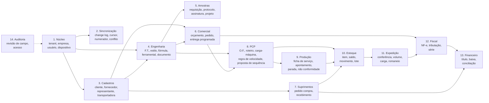

# 03 — Banco de Dados

Modelo de dados completo do **BoxFlow**. **Substitui** o arquivo
`Novo Documento de Texto.txt` (modelo v0), cujo conteúdo foi integralmente absorvido.

PostgreSQL 16+, **um banco para todos os contratantes**, isolados por `tenant_id` com Row Level Security
([01-ARQUITETURA §7](01-ARQUITETURA.md)). Todo DDL abaixo é o desenho de referência; a implementação sai
em migrações versionadas conforme [02-ENGENHARIA §3.3](02-ENGENHARIA.md#33-migrações-de-banco) — com
`schema_format = :sql`, porque `EXCLUDE`, RLS e domínio com `CHECK` não cabem no `schema.rb` do Rails.

## 1. Visão macro dos módulos



## 2. Convenções

### 2.1 Nomenclatura

- `snake_case`, português, **singular** (`ficha_tecnica`, `pedido_venda_item`).
- Chave estrangeira = nome da tabela + `_id` (`cliente_id`). Se houver duas FKs para a mesma tabela,
  prefixo qualifica o papel (`qualidade_interna_id`, `qualidade_fornecedor_id`).
- Unidade no nome quando houver risco de ambiguidade: `_mm`, `_kg`, `_g`, `_min`, `_pct`, `_seg`.
- Booleano com prefixo verbal (`tem_`, `eh_`, `permite_`) ou adjetivo claro (`ativo`).
- Views de leitura com prefixo `vw_`; materializadas com `mvw_`.

### 2.2 Colunas padrão (`COLUNAS_PADRAO`)

Presentes em **toda** tabela transacional e de cadastro. Para manter o documento legível, o DDL abaixo
as referencia pelo marcador `-- + COLUNAS_PADRAO` em vez de repeti-las.

```sql
-- COLUNAS_PADRAO
id              uuid         primary key default gen_random_uuid(),
tenant_id       uuid         not null references tenant(id),
empresa_id      uuid         not null references empresa(id),

-- controle de versão e sincronização (ver módulo 2)
versao          bigint       not null default 1,
dispositivo_origem_id uuid            references dispositivo(id),
proprietario_dispositivo_id uuid      references dispositivo(id),

-- auditoria
criado_em       timestamptz  not null default now(),
criado_por      uuid                  references usuario(id),
atualizado_em   timestamptz  not null default now(),
atualizado_por  uuid                  references usuario(id),

-- exclusão lógica: nunca DELETE em tabela com histórico
deletado_em     timestamptz,
deletado_por    uuid                  references usuario(id),

-- procedência do dado
origem          text         not null default 'SISTEMA'
                             check (origem in ('SISTEMA','PCBOOT','IMPORTACAO','CAMPO')),
codigo_legado   text,
qualidade_dado  text         check (qualidade_dado in ('OK','SUSPEITO','INCOMPLETO'))
```

Notas:

- O padrão é **`uuidv7()`**, nativo do Postgres 18, que é a versão fixada em
  [07 §1](07-CRIACAO-DO-PROJETO.md#1-versões-e-por-que-são-fixadas). Por ser ordenável no tempo, reduz
  fragmentação de índice nas tabelas que recebem milhões de eventos. Os trechos de DDL abaixo escrevem
  `gen_random_uuid()` porque são anteriores a essa decisão; leia como `uuidv7()`, e note que
  `gen_random_uuid()` **é função do núcleo do Postgres desde a versão 13** — não depende de `pgcrypto`,
  como uma versão anterior deste documento afirmava. A troca é transparente para a aplicação.
- `empresa_id` existe porque o legado já opera **multi-empresa dentro da mesma instalação** (campo
  `Empresa` no cadastro de cliente). Tabelas realmente globais do tenant omitem essa coluna e isso é
  anotado caso a caso.
- `codigo_legado` guarda o número que os usuários conhecem de cor (F.T. 92281). Não é chave, mas é
  indexado e pesquisável.

### 2.3 Domínios e tipos

```sql
create extension if not exists pg_trgm;      -- busca por similaridade em razão social / referência
create extension if not exists btree_gist;   -- restrição de exclusão por período
create extension if not exists pgcrypto;     -- digest() na cadeia de hash da assinatura (§7),
                                             -- NÃO para gerar UUID: uuidv7() é nativo no Postgres 18

create domain dinheiro       as numeric(14,4);
create domain percentual     as numeric(9,4)  check (value >= 0 and value <= 100);
create domain medida_mm      as numeric(10,2) check (value >= 0);
create domain quantidade     as numeric(18,4);
create domain gramatura_gm2  as numeric(8,2)  check (value > 0);
create domain cnpj_cpf       as text          check (value ~ '^[0-9]{11}$' or value ~ '^[0-9]{14}$');
```

Decisão sobre enumerados: valores **estáveis e definidos pelo sistema** usam `text` + `CHECK`
(simples de migrar, legível em consulta). Valores **mantidos pelo usuário** (motivo de parada, qualidade
de chapa, estilo, atividade) são **tabelas de apoio** — porque a fábrica inventa motivo novo e não pode
depender de deploy para isso.

### 2.4 Regras transversais

1. **Sem `DELETE` físico** em tabela com histórico fiscal, financeiro ou de engenharia. Só `deletado_em`.
2. **Sem `UPDATE` em tabela de evento** (`*_apontamento`, `movimento_estoque`, `assinatura`,
   `sync_alteracao`). Correção é evento de estorno. Garantido por `REVOKE UPDATE, DELETE` no papel da
   aplicação.
3. **Índice composto `(tenant_id, empresa_id, status, criado_em desc)`** nas tabelas de listagem pesada.
4. **RLS (Row Level Security)** habilitada por `tenant_id` nas tabelas multi-tenant, como rede de
   segurança além do filtro da aplicação.
5. Toda tabela replicada para dispositivo tem gatilho de `sync_alteracao` (§4.2).
6. `timestamptz` sempre — nunca `timestamp` sem fuso. Tablet em rua e servidor precisam concordar.
7. **A ordem de leitura deste documento não é a ordem de criação das tabelas.** Os módulos estão agrupados
   por assunto, então há referência para frente (`necessidade_chapa` aponta para `item`, que só aparece no
   §12). A ordem real de criação está em [08-MIGRACOES §2](08-MIGRACOES.md#2-a-ordem-em-vinte-e-cinco-migrações),
   e as três dependências que cruzam módulos estão no
   [§3 de lá](08-MIGRACOES.md#3-as-três-dependências-que-cruzam-módulos). É também por isso que o
   `structure.sql` é a fonte da verdade do schema, não este texto.

---

## 3. Módulo 1 — Núcleo

```sql
create table tenant (                  -- a empresa que contratou o BoxFlow
  id                  uuid primary key default gen_random_uuid(),
  razao_social        text not null,
  nome_exibicao       text,                          -- como aparece na tela; nulo = usa razao_social
  subdominio          text not null unique
                      check (subdominio ~ '^[a-z0-9][a-z0-9-]{1,30}[a-z0-9]$'),
  cnpj                cnpj_cpf not null unique,
  plano_contratado    text not null default 'BASICO'
                      check (plano_contratado in ('BASICO','PRO','ENTERPRISE')),
  ativo               boolean not null default true,
  criado_em           timestamptz not null default now()
);

-- Marca branca do contratante. Ver 04-MARCA §3 e ADR-0006.
create table tenant_marca (
  tenant_id           uuid primary key references tenant(id),

  -- O contratante informa UMA cor. A escala inteira e derivada pelo sistema.
  cor_primaria        text not null default '#0B3C49'
                      check (cor_primaria ~ '^#[0-9A-Fa-f]{6}$'),
  escala              jsonb not null default '{}'::jsonb,   -- {"50":"#...", ..., "900":"#..."}

  -- Resultado da validacao de contraste, calculado na gravacao e nunca por requisicao.
  validacao           jsonb not null default '{}'::jsonb,   -- razoes medidas, tom escolhido por papel
  cor_ajustada        boolean not null default false,       -- true = sistema corrigiu o que foi informado
  matiz_reservado     boolean not null default false,       -- true = cor cai em faixa de estado (§3.4)

  logotipo_claro_id   uuid,                          -- FK adiada: documento (Active Storage)
  logotipo_escuro_id  uuid,                          -- FK adiada: documento
  favicon_id          uuid,                          -- FK adiada: documento; derivado do logotipo

  -- Impressao digital do tema, usada no caminho do CSS servido ao navegador.
  -- Sem ela, cache intermediario pode entregar o tema de um contratante a outro.
  hash_tema           text not null default '',

  atualizado_em       timestamptz not null default now(),
  atualizado_por      uuid references usuario(id)
);

create table empresa (                 -- empresa/filial dentro do tenant (multi-CNPJ)
  id                  uuid primary key default gen_random_uuid(),
  tenant_id           uuid not null references tenant(id),
  codigo              text not null,
  razao_social        text not null,
  nome_fantasia       text,
  cnpj                cnpj_cpf not null,
  inscricao_estadual  text,
  inscricao_municipal text,
  regime_tributario   text not null
                      check (regime_tributario in ('SIMPLES','PRESUMIDO','REAL')),
  crt                 smallint,                      -- código de regime tributário (NF-e)
  endereco            jsonb not null,                -- logradouro, numero, bairro, municipio, uf, cep, cod_municipio
  matriz              boolean not null default false,
  ativo               boolean not null default true,
  criado_em           timestamptz not null default now(),
  unique (tenant_id, codigo),
  unique (tenant_id, cnpj)
);

create table usuario (
  id                  uuid primary key default gen_random_uuid(),
  tenant_id           uuid not null references tenant(id),
  nome                text not null,
  email               text,
  login               text not null,
  subject_oidc        text,                          -- vínculo com o provedor de identidade
  pin_hash            text,                          -- login rápido de fábrica (crachá + PIN)
  cracha_codigo       text,                          -- QR do crachá
  funcionario_id      uuid,                          -- FK adiada: funcionario (módulo 3)
  representante_id    uuid,                          -- FK adiada: representante (módulo 3)
  ativo               boolean not null default true,
  ultimo_acesso_em    timestamptz,
  criado_em           timestamptz not null default now(),
  unique (tenant_id, login),
  unique (tenant_id, cracha_codigo)
);

create table papel (
  id          uuid primary key default gen_random_uuid(),
  tenant_id   uuid not null references tenant(id),
  codigo      text not null
              check (codigo in ('ADMIN','PCP','PRODUCAO','QUALIDADE','ENGENHARIA','VENDAS',
                                'REPRESENTANTE','COMPRAS','FINANCEIRO','FISCAL','EXPEDICAO','CONSULTA')),
  descricao   text not null,
  unique (tenant_id, codigo)
);

create table permissao (                             -- catálogo global (sem tenant)
  codigo      text primary key,                      -- ex.: 'engenharia.ficha_tecnica.alterar'
  modulo      text not null,
  operacao    text not null check (operacao in ('VER','CRIAR','ALTERAR','EXCLUIR','APROVAR','EXECUTAR')),
  descricao   text not null
);

create table papel_permissao (
  papel_id        uuid not null references papel(id),
  permissao_codigo text not null references permissao(codigo),
  primary key (papel_id, permissao_codigo)
);

create table usuario_papel (
  usuario_id  uuid not null references usuario(id),
  papel_id    uuid not null references papel(id),
  empresa_id  uuid references empresa(id),           -- nulo = vale em todas as empresas do tenant
  primary key (usuario_id, papel_id, empresa_id)
);

create table dispositivo (                           -- tablet, desktop, servidor
  id                  uuid primary key default gen_random_uuid(),
  tenant_id           uuid not null references tenant(id),
  versao_contrato     text not null default 'v1',   -- contrato de sincronizacao aceito
  tipo                text not null
                      check (tipo in ('TABLET_FABRICA','TABLET_CAMPO','DESKTOP','SERVIDOR')),
  identificacao       text not null,                 -- "Tablet Coladeira 02", "Tablet Renato"
  fingerprint         text not null unique,          -- impressão do dispositivo
  usuario_id          uuid references usuario(id),   -- tablet nominal (campo)
  maquina_id          uuid,                          -- FK adiada: tablet fixo em posto de trabalho
  chave_publica       text,                          -- mTLS / assinatura de lote
  situacao            text not null default 'ATIVO'
                      check (situacao in ('ATIVO','SUSPENSO','REVOGADO')),
  apagar_base_local   boolean not null default false,-- ordem de wipe no próximo contato
  ultimo_contato_em   timestamptz,
  versao_app          text,
  criado_em           timestamptz not null default now()
);

create index on dispositivo (tenant_id, situacao);
create index on dispositivo (tenant_id, ultimo_contato_em desc);
```

---

## 4. Módulo 2 — Sincronização

O módulo que não existia no modelo v0 e sem o qual os clientes offline não funcionam.
Ver [ADR-0002](adr/0002-propriedade-de-dados-e-sincronizacao.md).

### 4.1 Não existe tabela de nós

A versão anterior deste modelo tinha uma tabela `no_sincronizacao`, com tipos `FABRICA`, `NUVEM` e
`DISPOSITIVO`. Ela foi **removida** pelo [ADR-0004](adr/0004-nuvem-pura-sem-servidor-na-fabrica.md): com
um único nó em nuvem, sobraram apenas duas origens possíveis para qualquer registro, e as duas já eram
representáveis sem tabela nova:

| Origem do registro | Como é representada |
|---|---|
| Criado no servidor | `dispositivo_origem_id` **nulo** |
| Criado em um dispositivo | `dispositivo_origem_id` aponta para o `dispositivo` |

O que a tabela de nós guardava de útil — versão do contrato, versão do aplicativo, último contato —
migrou para `dispositivo` (§3), que já existia e já carregava `versao_app` e `ultimo_contato_em`. Menos
uma tabela, menos uma junção em toda consulta de sincronização, e a pergunta "de onde veio este
apontamento?" passa a ser respondida com o nome do tablet em vez de com o nome de um nó.

A coluna `proprietario_dispositivo_id` de `COLUNAS_PADRAO` (§2.2) segue a mesma convenção: nula
significa que o documento pertence ao servidor, e é isso que a transferência de propriedade do
[ADR-0002](adr/0002-propriedade-de-dados-e-sincronizacao.md) escreve ao submeter um rascunho.

### 4.2 Log de alterações

```sql
create table sync_alteracao (
  versao_global   bigserial primary key,             -- sequência monotônica: a ordem da verdade
  tenant_id       uuid not null references tenant(id),
  empresa_id      uuid,
  tabela          text not null,
  registro_id     uuid not null,
  operacao        text not null check (operacao in ('INSERIR','ALTERAR','EXCLUIR')),
  versao_registro bigint not null,
  dispositivo_origem_id uuid references dispositivo(id),   -- nulo = criado no servidor
  usuario_id      uuid references usuario(id),
  payload         jsonb not null,                    -- estado completo após a operação
  registrado_em   timestamptz not null default now()
) partition by range (registrado_em);

create index on sync_alteracao (tenant_id, versao_global);
create index on sync_alteracao (tabela, registro_id);
```

Particionada por mês: o log cresce rápido e a poda é rotina. Retenção padrão de 90 dias — nó que fica
mais tempo que isso sem sincronizar precisa de **recarga completa do escopo**, não de replay incremental.

```sql
create table sync_cursor (
  dispositivo_id      uuid not null references dispositivo(id),
  direcao             text not null check (direcao in ('PULL','PUSH')),
  ultima_versao_global bigint not null default 0,
  atualizado_em       timestamptz not null default now(),
  primary key (dispositivo_id, direcao)
);

create table sync_lote (                             -- rastro de cada troca, para diagnóstico
  id              uuid primary key default gen_random_uuid(),
  tenant_id       uuid not null references tenant(id),
  dispositivo_id  uuid not null references dispositivo(id),
  direcao         text not null check (direcao in ('PULL','PUSH')),
  qtd_itens       integer not null default 0,
  qtd_aceitas     integer not null default 0,
  qtd_duplicadas  integer not null default 0,
  qtd_rejeitadas  integer not null default 0,
  bytes           bigint,
  iniciado_em     timestamptz not null default now(),
  concluido_em    timestamptz,
  situacao        text not null default 'EM_ANDAMENTO'
                  check (situacao in ('EM_ANDAMENTO','CONCLUIDO','FALHOU')),
  erro            text
);

create table sync_operacao (                         -- fila de push com idempotência
  id                  uuid primary key default gen_random_uuid(),
  tenant_id           uuid not null references tenant(id),
  idempotencia_chave  uuid not null,
  dispositivo_id      uuid not null references dispositivo(id),
  tipo                text not null,                 -- 'CriarRequisicaoAmostra', 'RegistrarApontamento'...
  payload             jsonb not null,
  situacao            text not null default 'PENDENTE'
                      check (situacao in ('PENDENTE','ACEITA','DUPLICADA','REJEITADA')),
  motivo_rejeicao     text,                          -- em linguagem clara, vai para a tela do usuário
  entidade_id         uuid,                          -- id gerado no servidor, devolvido ao cliente
  recebido_em         timestamptz not null default now(),
  processado_em       timestamptz,
  unique (tenant_id, idempotencia_chave)
);

create index on sync_operacao (tenant_id, situacao, recebido_em);

create table sync_conflito (
  id              uuid primary key default gen_random_uuid(),
  tenant_id       uuid not null references tenant(id),
  tabela          text not null,
  registro_id     uuid not null,
  versao_dono     bigint not null,
  versao_rejeitada bigint not null,
  dispositivo_dono      uuid references dispositivo(id),   -- nulo = servidor
  dispositivo_rejeitado uuid references dispositivo(id),
  payload_dono    jsonb not null,
  payload_rejeitado jsonb not null,                  -- nada é descartado em silêncio
  situacao        text not null default 'ABERTO'
                  check (situacao in ('ABERTO','ANALISADO','RESOLVIDO','IGNORADO')),
  resolucao       text,
  resolvido_por   uuid references usuario(id),
  detectado_em    timestamptz not null default now(),
  resolvido_em    timestamptz
);
```

### 4.3 Numeração por blocos (offline)

Ver [ADR-0003](adr/0003-numeracao-offline-por-blocos.md).

```sql
create table numerador (
  id              uuid primary key default gen_random_uuid(),
  tenant_id       uuid not null references tenant(id),
  empresa_id      uuid not null references empresa(id),
  chave           text not null,                     -- 'FICHA_TECNICA','AMOSTRA','ORCAMENTO','PEDIDO','OF','FS'
  proximo_valor   bigint not null,                   -- inicia acima do maior valor migrado do legado
  tamanho_bloco   integer not null default 100,
  permite_offline boolean not null default false,    -- numeração fiscal: SEMPRE false
  unique (tenant_id, empresa_id, chave)
);

create table numerador_bloco (
  id              uuid primary key default gen_random_uuid(),
  numerador_id    uuid not null references numerador(id),
  dispositivo_id  uuid references dispositivo(id),
  valor_inicio    bigint not null,
  valor_fim       bigint not null,
  proximo_valor   bigint not null,
  situacao        text not null default 'ATIVO'
                  check (situacao in ('ATIVO','ESGOTADO','DEVOLVIDO','EXPIRADO')),
  alocado_em      timestamptz not null default now(),
  expira_em       timestamptz,
  devolvido_em    timestamptz,
  check (valor_fim >= valor_inicio),
  check (proximo_valor between valor_inicio and valor_fim + 1)
);

-- garante que dois blocos do mesmo numerador nunca se sobreponham
alter table numerador_bloco add constraint numerador_bloco_sem_sobreposicao
  exclude using gist (
    numerador_id with =,
    int8range(valor_inicio, valor_fim, '[]') with &&
  );
```

A restrição de exclusão acima é o que torna a colisão de número **impossível no banco**, e não apenas
improvável na aplicação.

### 4.4 Escopo de sincronização

```sql
create table escopo_sincronizacao (
  id                    uuid primary key default gen_random_uuid(),
  tenant_id             uuid not null references tenant(id),
  papel_codigo          text,
  dispositivo_tipo      text check (dispositivo_tipo in ('TABLET_FABRICA','TABLET_CAMPO','DESKTOP')),
  tabela                text not null,
  filtro                text not null,               -- expressão avaliada NO SERVIDOR
  meses_historico       integer,
  inclui_anexo          boolean not null default false,
  resolucao_anexo       text check (resolucao_anexo in ('ORIGINAL','REDUZIDA','NENHUMA')),
  somente_leitura       boolean not null default true
);
```

O escopo é sempre avaliado no servidor. O cliente **não escolhe o próprio escopo** — caso contrário um
tablet comprometido baixaria a carteira inteira da empresa.

---

## 5. Módulo 3 — Cadastros

### 5.1 Cliente

```sql
create table cliente (
  -- + COLUNAS_PADRAO
  codigo                integer not null,            -- número humano (legado: 11, 12, 13...)
  razao_social          text not null,
  nome_fantasia         text,
  cnpj_cpf              cnpj_cpf,
  inscricao_estadual    text,
  inscricao_municipal   text,
  indicador_ie          text check (indicador_ie in ('CONTRIBUINTE','ISENTO','NAO_CONTRIBUINTE')),
  atividade_id          uuid references atividade(id),

  -- situação (legado: Cliente Top / Em análise / Bloqueado / Inativo)
  situacao              text not null default 'ATIVO'
                        check (situacao in ('ATIVO','TOP','EM_ANALISE','BLOQUEADO','INATIVO')),
  limite_credito        dinheiro,
  cliente_desde         date,

  -- contato
  contato_principal     text,
  contato_cobranca      text,
  fone_1                text,
  fone_2                text,
  fone_3                text,
  email                 text,
  email_fiscal          text,

  -- endereço principal (os demais em cliente_endereco)
  logradouro            text,
  numero                text,
  complemento           text,
  bairro                text,
  municipio             text,
  uf                    char(2),
  cep                   text,
  codigo_municipio_ibge text,
  codigo_pais           text default '1058',
  zona_id               uuid references zona_entrega(id),

  -- comercial
  representante_id      uuid references representante(id),
  comissao_pct          percentual,
  transportadora_id     uuid references transportadora(id),
  tipo_transporte       text,                         -- legado: "CARRO PROPRIO", "FOB", "CIF"
  documento_cobranca    text check (documento_cobranca in ('BOLETO','DEPOSITO','PIX','CARTEIRA','OUTRO')),
  tolerancia_pct        percentual,                   -- tolerância de quantidade aceita na entrega
  origem_contato        text,                         -- legado: "Google", "Indicação"
  usa_kanban            boolean not null default false,
  pedido_unico          boolean not null default false,

  -- observações (o legado separa por finalidade e isso importa na operação)
  obs_entrega           text,
  obs_pedido            text,
  obs_fabricacao        text,
  obs_laudo             text,
  obs_faturamento       text,

  unique (tenant_id, empresa_id, codigo)
);

create index on cliente (tenant_id, empresa_id, situacao);
create index on cliente (tenant_id, cnpj_cpf);
create index on cliente using gin (razao_social gin_trgm_ops);
create index on cliente (representante_id) where deletado_em is null;

create table cliente_endereco (
  -- + COLUNAS_PADRAO
  cliente_id            uuid not null references cliente(id),
  tipo                  text not null check (tipo in ('COBRANCA','FATURAMENTO','ENTREGA')),
  apelido               text,                         -- "Fábrica Sorocaba", "CD Guarulhos"
  razao_social          text,
  cnpj_cpf              cnpj_cpf,
  inscricao_estadual    text,
  logradouro            text,
  numero                text,
  complemento           text,
  bairro                text,
  municipio             text,
  uf                    char(2),
  cep                   text,
  codigo_municipio_ibge text,
  fone                  text,
  fax                   text,
  padrao                boolean not null default false,
  janela_recebimento    text,                         -- "seg-sex 08:00-11:00"
  exige_agendamento     boolean not null default false
);

-- um único endereço padrão por cliente e tipo
create unique index cliente_endereco_padrao_unico
  on cliente_endereco (cliente_id, tipo)
  where padrao and deletado_em is null;

create table cliente_contato (
  -- + COLUNAS_PADRAO
  cliente_id  uuid not null references cliente(id),
  nome        text not null,
  cargo       text,
  setor       text check (setor in ('COMPRAS','QUALIDADE','ENGENHARIA','FINANCEIRO','RECEBIMENTO','OUTRO')),
  email       text,
  fone        text,
  celular     text,
  recebe_nf   boolean not null default false,
  assina_amostra boolean not null default false,       -- quem pode aprovar protocolo
  ativo       boolean not null default true
);

create table cliente_condicao_pagamento (
  -- + COLUNAS_PADRAO
  cliente_id          uuid not null references cliente(id),
  condicao_pagamento_id uuid not null references condicao_pagamento(id),
  banco_id            uuid references banco(id),
  conta_cobranca      text,
  valor_minimo        dinheiro,                       -- legado: "Abaixo de:" usa outra condição
  condicao_alternativa_id uuid references condicao_pagamento(id),
  status_cobranca     text check (status_cobranca in ('NORMAL','SUSPENSA','JURIDICO')),
  antecipacao_prorrogacao text check (antecipacao_prorrogacao in ('ANTECIPA','PRORROGA','MANTEM')),
  dia_semana_venc     smallint check (dia_semana_venc between 1 and 7),
  dia_mes_venc        smallint check (dia_mes_venc between 1 and 31),
  periodo_de          smallint,
  periodo_ate         smallint,
  vence_dia           smallint,
  padrao              boolean not null default false
);

create table condicao_pagamento (
  -- + COLUNAS_PADRAO
  codigo      text not null,
  descricao   text not null,                          -- "28/35/42 DDL"
  parcelas    integer not null default 1,
  dias        integer[] not null,                     -- {28,35,42}
  tipo        text not null default 'PRAZO' check (tipo in ('VISTA','PRAZO','ANTECIPADO')),
  ativo       boolean not null default true,
  unique (tenant_id, empresa_id, codigo)
);

create table cliente_historico (                      -- S.A.C., informação comercial, visita
  -- + COLUNAS_PADRAO
  cliente_id      uuid not null references cliente(id),
  tipo            text not null
                  check (tipo in ('SAC','INFORMACAO_COMERCIAL','VISITA','LIGACAO','EMAIL','RECLAMACAO','OCORRENCIA')),
  data_hora       timestamptz not null default now(),
  assunto         text,
  descricao       text not null,
  contato_id      uuid references cliente_contato(id),
  pedido_venda_id uuid,
  ficha_tecnica_id uuid,
  geolocalizacao  point,                              -- visita registrada em campo
  dispositivo_id  uuid references dispositivo(id),
  acao_requerida  text,
  prazo           date,
  situacao        text not null default 'ABERTO'
                  check (situacao in ('ABERTO','EM_ANDAMENTO','CONCLUIDO','CANCELADO'))
);

create index on cliente_historico (cliente_id, data_hora desc);

create table cliente_alteracao_solicitada (            -- vendedor propõe, escritório aprova (§6.2 do doc 01)
  -- + COLUNAS_PADRAO
  cliente_id      uuid not null references cliente(id),
  campos          jsonb not null,                      -- { "fone_1": {"de":"...","para":"..."} }
  justificativa   text,
  situacao        text not null default 'PENDENTE'
                  check (situacao in ('PENDENTE','APROVADA','REJEITADA','PARCIAL')),
  analisado_por   uuid references usuario(id),
  analisado_em    timestamptz,
  motivo_rejeicao text
);
```

### 5.2 Demais cadastros

```sql
create table atividade (               -- legado: "QUIMICA", "ALIMENTOS"
  -- + COLUNAS_PADRAO
  codigo text not null, descricao text not null, cnae text,
  unique (tenant_id, codigo)
);

create table zona_entrega (
  -- + COLUNAS_PADRAO
  codigo text not null, descricao text not null,       -- "LESTE", "INTERIOR SP"
  prazo_entrega_dias integer, custo_frete_referencia dinheiro,
  unique (tenant_id, codigo)
);

create table representante (
  -- + COLUNAS_PADRAO
  codigo              text not null,
  nome                text not null,
  tipo                text not null default 'REPRESENTANTE'
                      check (tipo in ('REPRESENTANTE','VENDEDOR_INTERNO','DIRETO')),
  cnpj_cpf            cnpj_cpf,
  email               text,
  fone                text,
  comissao_padrao_pct percentual,
  regiao              text,
  usuario_id          uuid references usuario(id),
  ativo               boolean not null default true,
  unique (tenant_id, empresa_id, codigo)
);

create table comissao_regra (
  -- + COLUNAS_PADRAO
  representante_id uuid references representante(id),
  cliente_id       uuid references cliente(id),
  ficha_tecnica_id uuid,
  percentual       percentual not null,
  base_calculo     text not null default 'VALOR_LIQUIDO'
                   check (base_calculo in ('VALOR_BRUTO','VALOR_LIQUIDO','MARGEM')),
  evento_apuracao  text not null default 'FATURAMENTO'
                   check (evento_apuracao in ('PEDIDO','FATURAMENTO','RECEBIMENTO')),
  vigencia_inicio  date not null,
  vigencia_fim     date
);

create table comissao_apurada (
  -- + COLUNAS_PADRAO
  representante_id uuid not null references representante(id),
  nota_fiscal_id   uuid,
  pedido_venda_id  uuid,
  titulo_receber_id uuid,
  base_valor       dinheiro not null,
  percentual       percentual not null,
  valor            dinheiro not null,
  competencia      date not null,
  situacao         text not null default 'APURADA'
                   check (situacao in ('APURADA','APROVADA','PAGA','CANCELADA'))
);

create table fornecedor (
  -- + COLUNAS_PADRAO
  codigo                   integer not null,
  razao_social             text not null,
  nome_fantasia            text,
  cnpj_cpf                 cnpj_cpf,
  inscricao_estadual       text,
  tipo                     text[] not null,             -- {'CHAPA','TINTA','COLA','FACA','CLICHE','SERVICO'}
  prazo_entrega_medio_dias integer,
  endereco                 jsonb,
  contato                  text,
  fone                     text,
  email                    text,
  condicao_pagamento_id    uuid references condicao_pagamento(id),
  avaliacao                smallint check (avaliacao between 1 and 5),
  ativo                    boolean not null default true,
  unique (tenant_id, empresa_id, codigo)
);

create table transportadora (
  -- + COLUNAS_PADRAO
  codigo   integer not null, razao_social text not null, cnpj_cpf cnpj_cpf,
  inscricao_estadual text, antt text, endereco jsonb, contato text, fone text, email text,
  modalidade_frete text check (modalidade_frete in ('CIF','FOB','TERCEIROS','PROPRIO','SEM_FRETE')),
  ativo boolean not null default true,
  unique (tenant_id, empresa_id, codigo)
);

create table funcionario (
  -- + COLUNAS_PADRAO
  matricula  text not null,
  nome       text not null,
  cpf        cnpj_cpf,
  cargo      text,
  setor      text,
  centro_custo_id uuid,
  turno_id   uuid,
  custo_hora dinheiro,                                  -- base do custo de mão de obra na FS
  admissao   date, demissao date,
  ativo      boolean not null default true,
  unique (tenant_id, empresa_id, matricula)
);

create table banco (
  -- + COLUNAS_PADRAO
  codigo_febraban text not null, nome text not null,
  unique (tenant_id, codigo_febraban)
);

create table conta_bancaria (
  -- + COLUNAS_PADRAO
  banco_id uuid not null references banco(id),
  agencia text not null, agencia_digito text,
  conta text not null, conta_digito text,
  tipo text not null check (tipo in ('CORRENTE','POUPANCA','APLICACAO')),
  carteira text, convenio text,
  saldo_atual dinheiro not null default 0,
  ativo boolean not null default true
);

create table parametro (                                -- configuração geral (legado: Cadastros > Parâmetros)
  -- + COLUNAS_PADRAO
  chave text not null, valor jsonb not null, descricao text, grupo text,
  unique (tenant_id, empresa_id, chave)
);
```

---

## 6. Módulo 4 — Engenharia de Produto

O coração do sistema. Ausente do modelo v0.

### 6.1 Estilos e fórmulas

```sql
create table estilo_caixa (                             -- legado: 0201, 0227, 0427, 0008 (FEFCO)
  -- + COLUNAS_PADRAO
  codigo          text not null,                        -- '0201-B', '0201-C', '0427'
  codigo_fefco    text,                                 -- '0201'
  descricao       text not null,                        -- '0201 MALETA ONDA NORMAL INTEIRA'
  onda            text check (onda in ('B','C','E','BC','BB','EB','AC')),
  tipo            text not null default 'CAIXA'
                  check (tipo in ('CAIXA','DIVISORIA','TABULEIRO','TAMPA','FOLHA_ROSTO','ACESSORIO')),
  desenho_documento_id uuid,                             -- substitui 'W:\Desenhos\MALETA.jpg'
  observacao      text,
  ativo           boolean not null default true,
  unique (tenant_id, codigo)
);

create table estilo_formula_versao (                     -- fórmula é versionada: nunca reescreve o passado
  -- + COLUNAS_PADRAO
  estilo_caixa_id uuid not null references estilo_caixa(id),
  versao_numero   integer not null,
  vigencia_inicio date not null,
  vigencia_fim    date,

  -- limites de máquina (legado: Min./Máx. Imp., Min./Máx. Risc.)
  minimo_impressora_mm medida_mm,
  maximo_impressora_mm medida_mm,
  minimo_riscador_mm   medida_mm,
  maximo_riscador_mm   medida_mm,
  referencia_largura_mm     medida_mm,
  referencia_comprimento_mm medida_mm,
  largura_folha_mm     medida_mm,
  numero_por_impressao integer not null default 1,

  observacao      text,
  situacao        text not null default 'ATIVA' check (situacao in ('RASCUNHO','ATIVA','SUBSTITUIDA')),
  unique (estilo_caixa_id, versao_numero)
);

-- garante que não existam duas versões vigentes ao mesmo tempo para o mesmo estilo
alter table estilo_formula_versao add constraint estilo_versao_vigencia_unica
  exclude using gist (
    estilo_caixa_id with =,
    daterange(vigencia_inicio, coalesce(vigencia_fim, 'infinity'::date), '[)') with &&
  ) where (deletado_em is null and situacao = 'ATIVA');

create table estilo_formula_slot (                       -- legado: R1..R9 (largura) e I1..I9 (comprimento)
  -- + COLUNAS_PADRAO
  estilo_formula_versao_id uuid not null references estilo_formula_versao(id),
  eixo        text not null check (eixo in ('LARGURA','COMPRIMENTO')),
  sequencia   smallint not null check (sequencia between 1 and 9),
  expressao   text not null,                             -- '((L/2)+3)', 'A+8', 'C+4', '30'
  arredondamento text not null default 'INTEIRO'
                 check (arredondamento in ('INTEIRO','MEIO','CENTESIMO','NENHUM')),
  unique (estilo_formula_versao_id, eixo, sequencia)
);
```

Variáveis aceitas na `expressao` — **apenas estas sete**, qualquer outro token é recusado
(comportamento idêntico ao legado):

| Letra | Significado | Letra | Significado |
|---|---|---|---|
| `C` | Comprimento | `S` | Transpasse superior |
| `L` | Largura | `I` | Transpasse inferior |
| `A` | Altura | `W` | Comprimento da faca |
| | | `R` | Largura da faca |

### 6.2 Qualidade de papelão

A empresa **compra chapa pronta e converte** (ver
[00 §3.1](00-CENARIO-E-PREMISSAS.md#31-modelo-de-fabricação--conversão-confirmado-em-27092026)). Por isso a
qualidade é modelada em duas camadas: a **especificação da engenharia** (`qualidade_chapa`) e o que **cada
fornecedor entrega e por quanto** (`qualidade_chapa_fornecedor`). No legado isso aparece como os campos
distintos "Qual. int." e "Qual. forn.".

```sql
create table qualidade_chapa (                          -- especificação da engenharia
  -- + COLUNAS_PADRAO
  codigo            text not null,                      -- 'NCC40B', 'B2CH4', 'BMSK/C', 'NCC60BC'
  descricao         text,
  onda              text check (onda in ('B','C','E','BC','BB','EB','AC')),
  gramatura_gm2     gramatura_gm2,
  numero_camadas    smallint,                           -- 3, 5, 7
  resistencia_coluna_min numeric(10,2),                 -- ECT mínimo aceito
  resistencia_estouro_min numeric(10,2),                -- Mullen mínimo aceito
  eh_reciclado      boolean not null default false,
  tolerancia_gramatura_pct percentual,                  -- limite de aceitação no recebimento
  ativo             boolean not null default true,
  unique (tenant_id, codigo)
);

create table qualidade_chapa_fornecedor (               -- oferta de cada fornecedor de chapa
  -- + COLUNAS_PADRAO
  qualidade_chapa_id uuid not null references qualidade_chapa(id),
  fornecedor_id      uuid not null references fornecedor(id),
  codigo_fornecedor  text,                              -- como o fornecedor chama essa qualidade
  custo_m2           dinheiro,
  custo_kg           dinheiro,
  largura_folha_minima_mm  medida_mm,
  largura_folha_maxima_mm  medida_mm,
  larguras_disponiveis_mm  medida_mm[],                 -- restrição de PROJETO, não de máquina interna
  comprimento_minimo_mm    medida_mm,
  comprimento_maximo_mm    medida_mm,
  entrega_no_formato boolean not null default true,     -- false = vem padrão e refila-se internamente
  lote_minimo_m2     numeric(14,2),
  lead_time_dias     integer not null,                  -- entra na promessa de entrega ao cliente
  preferencial       boolean not null default false,
  vigencia_inicio    date not null,
  vigencia_fim       date,
  ativo              boolean not null default true,
  unique (qualidade_chapa_id, fornecedor_id, vigencia_inicio)
);

create index on qualidade_chapa_fornecedor (tenant_id, qualidade_chapa_id, preferencial);
```

Consequência de projeto: `larguras_disponiveis_mm` e `lead_time_dias` **não são informação decorativa de
cadastro**. A primeira é validada pelo motor de fórmulas ao gravar a F.T.
([02 §4.3](02-ENGENHARIA.md#43-saídas-e-validações)) — não se aprova um projeto cuja chapa nenhum
fornecedor entrega. A segunda entra no cálculo da data de entrega prometida ao cliente, somada à fila de
máquina.

### 6.3 Ficha Técnica (F.T.)

```sql
create table ficha_tecnica (
  -- + COLUNAS_PADRAO
  numero              integer not null,                 -- número humano: 92281, 65287 (segue o legado)
  tipo_registro       text not null default 'CAIXA'
                      check (tipo_registro in ('CAIXA','ACESSORIO')),   -- legado: prefixo Cx / Ac
  cliente_id          uuid not null references cliente(id),
  referencia          text not null,                    -- 'CX 04 ROLO PASTEL 3kg/MASSA LASANHA 1kg'
  local_descricao     text,                             -- legado: campo "Local" (planta/marca do cliente)
  ficha_tecnica_origem_id uuid references ficha_tecnica(id),  -- F.T. copiada de outra

  -- geometria de entrada
  estilo_caixa_id     uuid not null references estilo_caixa(id),
  estilo_formula_versao_id uuid not null references estilo_formula_versao(id),
  medida_interna_comprimento_mm medida_mm not null,
  medida_interna_largura_mm     medida_mm not null,
  medida_interna_altura_mm      medida_mm,
  transpasse_superior_mm        medida_mm,
  transpasse_inferior_mm        medida_mm,
  minimo_comprimento_mm         medida_mm,

  -- material
  qualidade_interna_id    uuid references qualidade_chapa(id),
  qualidade_fornecedor_id uuid references qualidade_chapa(id),
  onda                text check (onda in ('B','C','E','BC','BB','EB','AC')),
  gramatura_gm2       gramatura_gm2,
  numero_camadas      smallint,

  -- acabamento e ferramental
  fechamento          text check (fechamento in ('COLA','GRAMPO','FITA','ENCAIXE','SEM_FECHAMENTO')),
  tipo_orelha         text check (tipo_orelha in ('INTERNA','EXTERNA','SEM_ORELHA','DESMONTADA')),
  arranjo             text,
  faca_id             uuid references ferramental(id),
  cliche_id           uuid references ferramental(id),
  dti                 text,                             -- desenho técnico de impressão
  dtp                 text,                             -- desenho técnico do produto
  cores_descricao     text,                             -- 'PRETO', '2 CORES'

  -- saídas calculadas pelo motor de fórmulas
  chapa_largura_mm    medida_mm,
  chapa_comprimento_mm medida_mm,
  pecas_por_chapa     integer,
  aproveitamento_pct  percentual,
  peso_unitario_g     numeric(12,3),
  fator               numeric(12,4),
  area_m2             numeric(12,4),
  calculado_em        timestamptz,
  calculo_hash        text,                             -- detecta F.T. com cálculo desatualizado

  -- embalagem e tolerância
  pecas_por_caixa     integer,
  amarrado_qtd        integer,
  fardos_qtd          integer,
  tolerancia_positiva_pct percentual,
  tolerancia_negativa_pct percentual,
  unidade             text not null default 'PC' check (unidade in ('PC','MIL','KG','M2','CJ')),

  -- preço
  preco_caixa         dinheiro,
  preco_kg            dinheiro,
  preco_conjunto      dinheiro,
  preco_m2            dinheiro,
  desconto_pct        percentual,
  diluicao_pct        percentual,
  comissao_a_pct      percentual,
  comissao_b_pct      percentual,

  -- fiscal
  ncm                 text,                             -- legado: "Clas. fis." 48191000
  cest                text,
  situacao_tributaria text,
  ipi_pct             percentual,
  codigo_eipi         text,
  codigo_beneficio_fiscal text,
  exige_laudo         boolean not null default false,

  -- ciclo de vida
  status              text not null default 'EM_DESENVOLVIMENTO'
                      check (status in ('EM_DESENVOLVIMENTO','AGUARDANDO_AMOSTRA','PRODUTO_FINAL',
                                        'SUSPENSA','INATIVA')),
  tipo_producao       text not null default 'NORMAL' check (tipo_producao in ('NORMAL','ESPECIAL','AMOSTRA')),
  estoque_minimo      quantidade,

  -- observações, cada uma vai para um documento diferente (como no legado)
  obs_pedido          text,                             -- Obs. P.
  obs_impressao       text,                             -- Obs. I.
  obs_fabricacao      text,                             -- Obs. F.

  unique (tenant_id, empresa_id, numero)
);

create index on ficha_tecnica (tenant_id, empresa_id, cliente_id, status);
create index on ficha_tecnica (tenant_id, codigo_legado);
create index on ficha_tecnica using gin (referencia gin_trgm_ops);
create index on ficha_tecnica (estilo_caixa_id);
create index on ficha_tecnica (tenant_id, status, atualizado_em desc);

create table ficha_tecnica_medida (                      -- riscador e impressão: até 9 valores por eixo
  -- + COLUNAS_PADRAO
  ficha_tecnica_id uuid not null references ficha_tecnica(id),
  tipo        text not null check (tipo in ('RISCADOR','IMPRESSAO')),
  sequencia   smallint not null check (sequencia between 1 and 9),
  valor_mm    medida_mm not null,
  calculado   boolean not null default true,             -- false = ajustado à mão pela engenharia
  unique (ficha_tecnica_id, tipo, sequencia)
);

create table ficha_tecnica_composicao (                  -- base ↔ complemento (65287 ↔ 9818)
  -- + COLUNAS_PADRAO
  ficha_tecnica_base_id        uuid not null references ficha_tecnica(id),
  ficha_tecnica_complemento_id uuid not null references ficha_tecnica(id),
  quantidade      quantidade not null default 1,
  papel           text not null default 'COMPLEMENTO'
                  check (papel in ('COMPLEMENTO','DIVISORIA','TAMPA','TABULEIRO','FOLHA_ROSTO','ACESSORIO')),
  compoe_preco    boolean not null default true,         -- entra no "preço conjunto"
  unique (ficha_tecnica_base_id, ficha_tecnica_complemento_id),
  check (ficha_tecnica_base_id <> ficha_tecnica_complemento_id)
);

create table ficha_tecnica_cor (
  -- + COLUNAS_PADRAO
  ficha_tecnica_id uuid not null references ficha_tecnica(id),
  sequencia   smallint not null,
  tinta_id    uuid references tinta(id),
  codigo_cor  text,                                      -- Pantone
  descricao   text,
  area_cobertura_pct percentual,
  consumo_g_por_mil numeric(12,3),
  unique (ficha_tecnica_id, sequencia)
);

create table tinta (
  -- + COLUNAS_PADRAO
  codigo text not null, descricao text not null, cor_pantone text,
  fornecedor_id uuid references fornecedor(id), custo_kg dinheiro,
  ativo boolean not null default true,
  unique (tenant_id, codigo)
);

create table ficha_tecnica_processo (                    -- legado: "Processos e Valorização"
  -- + COLUNAS_PADRAO
  ficha_tecnica_id    uuid not null references ficha_tecnica(id),
  sequencia           smallint not null,
  operacao_id         uuid not null references operacao(id),
  maquina_id          uuid references maquina(id),
  descricao           text,
  quantidade_minima_setup quantidade,
  tempo_setup_min     numeric(10,2),
  valor_setup         dinheiro,
  tempo_producao_por_mil_min numeric(10,2),
  valor_hora_maquina  dinheiro,
  valor_producao      dinheiro,
  quantidade_por_hora quantidade,
  unique (ficha_tecnica_id, sequencia)
);
```

### 6.4 Ferramental (faca e clichê)

```sql
create table ferramental (
  -- + COLUNAS_PADRAO
  codigo            text not null,                       -- 'B-00000273'
  tipo              text not null check (tipo in ('FACA','CLICHE','DTI','DTP','MOLDE','OUTRO')),
  descricao         text,
  fornecedor_id     uuid references fornecedor(id),
  localizacao       text,                                -- onde está guardado fisicamente

  -- faca
  material_madeira  text,
  tipo_lamina       text,
  arranjo           text,
  comprimento_mm    medida_mm,                            -- variável W das fórmulas
  largura_mm        medida_mm,                            -- variável R das fórmulas
  quantidade_poses  integer,

  -- clichê
  material_cliche   text,                                 -- 'Cyrel pré-montado'
  numero_cores      smallint,

  -- custo e cobrança
  custo             dinheiro,
  cobrado_do_cliente boolean not null default false,
  valor_cobrado     dinheiro,
  nota_fiscal_compra_id uuid,

  -- vida útil
  data_aquisicao    date,
  tiragem_acumulada bigint not null default 0,
  tiragem_vida_util bigint,
  situacao          text not null default 'DISPONIVEL'
                    check (situacao in ('EM_CONFECCAO','DISPONIVEL','EM_USO','EM_MANUTENCAO','DESCARTADA')),
  documento_id      uuid,
  unique (tenant_id, empresa_id, tipo, codigo)
);

create index on ferramental (tenant_id, tipo, situacao);

create table ferramental_ficha_tecnica (                   -- ferramental serve várias F.T.
  -- + COLUNAS_PADRAO
  ferramental_id   uuid not null references ferramental(id),
  ficha_tecnica_id uuid not null references ficha_tecnica(id),
  unique (ferramental_id, ficha_tecnica_id)
);

create table solicitacao_ferramental (                     -- legado: "Solicitação de facas e clichês"
  -- + COLUNAS_PADRAO
  numero            integer not null,
  ficha_tecnica_id  uuid references ficha_tecnica(id),
  tipo              text not null check (tipo in ('FACA','CLICHE','AMBOS')),
  solicitado_por    uuid not null references usuario(id),
  data_solicitacao  date not null default current_date,
  fornecedor_id     uuid references fornecedor(id),
  desenho_documento_id uuid,
  custo_previsto    dinheiro,
  cobrado_do_cliente boolean not null default false,
  valor_cobrado     dinheiro,

  especificacao     jsonb,                                 -- madeira, lâmina, arranjo, material, áreas, poses

  verificacao_faca        text check (verificacao_faca in ('OK','NOK','NAO_APLICA')),
  verificacao_cliche      text check (verificacao_cliche in ('OK','NOK','NAO_APLICA')),
  comentario_faca         text,
  comentario_cliche       text,
  aprovado_por      uuid references usuario(id),
  aprovado_em       timestamptz,
  ferramental_id    uuid references ferramental(id),        -- preenchido quando chega
  situacao          text not null default 'SOLICITADA'
                    check (situacao in ('SOLICITADA','APROVADA','EM_CONFECCAO','RECEBIDA','VERIFICADA','REJEITADA','CANCELADA')),
  unique (tenant_id, empresa_id, numero)
);
```

### 6.5 Documentos e anexos

Substitui os caminhos de rede (`W:\Tabela\Desenho\...`) do legado.

```sql
create table documento (
  -- + COLUNAS_PADRAO
  tipo            text not null
                  check (tipo in ('DESENHO_CAIXA','DESENHO_ESTILO','LAYOUT_IMPRESSAO','FOTO',
                                  'FICHA_IMPRESSAO','PROTOCOLO_AMOSTRA','REQUISICAO_AMOSTRA',
                                  'LAUDO','CERTIFICADO','CONTRATO','NF_XML','NF_PDF','ASSINATURA','OUTRO')),
  nome            text not null,
  mime            text not null,
  tamanho_bytes   bigint not null,
  hash_sha256     text not null,                           -- identidade e deduplicação
  chave_storage   text not null,                           -- objeto no MinIO/S3
  versao_numero   integer not null default 1,
  documento_anterior_id uuid references documento(id),
  numero_embalagem text,                                   -- legado: "Núm. emb."
  validade        date,
  visibilidade    text not null default 'INTERNO'
                  check (visibilidade in ('INTERNO','CLIENTE','PUBLICO')),
  caminho_legado  text,                                    -- 'W:\Tabela\Desenho\SERRA AZUL\...'
  unique (tenant_id, hash_sha256, versao_numero)
);

create table documento_vinculo (                           -- um documento serve a várias entidades
  -- + COLUNAS_PADRAO
  documento_id  uuid not null references documento(id),
  entidade      text not null,                             -- 'ficha_tecnica', 'amostra', 'pedido_venda'...
  entidade_id   uuid not null,
  principal     boolean not null default false,
  unique (documento_id, entidade, entidade_id)
);

create index on documento_vinculo (entidade, entidade_id);
```

### 6.6 Revisão de campo da F.T.

Preserva o que o legado faz bem em "Alterações registradas dos produtos".

```sql
create table revisao_campo (
  id            uuid primary key default gen_random_uuid(),
  tenant_id     uuid not null references tenant(id),
  entidade      text not null,                             -- 'ficha_tecnica'
  entidade_id   uuid not null,
  revisao_numero integer not null,
  campo         text not null,                             -- '1ª Med. Imp.', 'preco_caixa'
  valor_de      text,
  valor_para    text,
  evento        text not null default 'ALTERACAO'
                check (evento in ('INCLUSAO','ALTERACAO','EXCLUSAO','REATIVACAO')),
  usuario_id    uuid references usuario(id),
  usuario_nome  text not null,                             -- desnormalizado: nome no momento do fato
  ocorrido_em   timestamptz not null default now(),
  dispositivo_origem_id uuid references dispositivo(id)   -- nulo = criado no servidor
);

create index on revisao_campo (entidade, entidade_id, revisao_numero);
create index on revisao_campo (tenant_id, ocorrido_em desc);
```

Tabela **append-only**: `REVOKE UPDATE, DELETE` no papel da aplicação.

---

## 7. Módulo 5 — Amostras e Desenvolvimento

```sql
create table requisicao_amostra (                          -- legado: RQA
  -- + COLUNAS_PADRAO
  numero            integer not null,                      -- compartilha numeração com a amostra no legado
  cliente_id        uuid not null references cliente(id),
  ficha_tecnica_id  uuid references ficha_tecnica(id),
  contato_id        uuid references cliente_contato(id),
  representante_id  uuid references representante(id),
  quantidade_amostras integer not null default 1,
  data_solicitacao  date not null default current_date,
  prazo_desejado    date,
  autorizado_por    uuid references usuario(id),
  autorizado_em     timestamptz,

  -- informações técnicas (podem existir antes da F.T., para produto novo)
  estilo_caixa_id   uuid references estilo_caixa(id),
  referencia        text,
  medida_interna_comprimento_mm medida_mm,
  medida_interna_largura_mm     medida_mm,
  medida_interna_altura_mm      medida_mm,
  qualidade_interna_id   uuid references qualidade_chapa(id),
  qualidade_externa_id   uuid references qualidade_chapa(id),
  fechamento        text,
  faca_id           uuid references ferramental(id),
  medidas_riscador  medida_mm[],
  medidas_impressao medida_mm[],
  observacao        text,

  elaborado_por     uuid references usuario(id),
  conferido_por     uuid references usuario(id),
  dispositivo_id    uuid references dispositivo(id),        -- criada em campo?
  situacao          text not null default 'ABERTA'
                    check (situacao in ('ABERTA','EM_PRODUCAO','PRODUZIDA','ENTREGUE','CANCELADA')),
  unique (tenant_id, empresa_id, numero)
);

create table amostra (                                      -- legado: Protocolo de Amostra (PA)
  -- + COLUNAS_PADRAO
  numero              integer not null,                     -- 30063 — número impresso, gerado de bloco offline
  numerador_bloco_id  uuid references numerador_bloco(id),
  requisicao_amostra_id uuid references requisicao_amostra(id),
  cliente_id          uuid not null references cliente(id),
  ficha_tecnica_id    uuid references ficha_tecnica(id),
  representante_id    uuid references representante(id),
  referencia          text not null,
  estilo_caixa_id     uuid references estilo_caixa(id),
  qualidade_id        uuid references qualidade_chapa(id),
  medida_descricao    text,                                  -- '460 x 240 x 110'
  fechamento          text,
  quantidade          integer not null default 1,
  tipo_registro       text check (tipo_registro in ('CAIXA','ACESSORIO')),  -- legado: coluna Cx/Ac

  data_emissao        date not null default current_date,
  prazo_resposta      date,
  status              text not null default 'AGUARDANDO'
                      check (status in ('AGUARDANDO','APROVADO','APROVADO_COM_DESVIO','REPROVADO','CANCELADO')),
  data_status         date,
  motivo_reprovacao   text,
  observacao          text,
  observacao_protocolo text,                                 -- sai impressa no protocolo

  assinatura_id       uuid references assinatura(id),
  documento_protocolo_id uuid references documento(id),      -- PDF gerado e assinado
  dispositivo_id      uuid references dispositivo(id),
  unique (tenant_id, empresa_id, numero)
);

create index on amostra (tenant_id, empresa_id, status, data_emissao desc);
create index on amostra (cliente_id, data_emissao desc);
create index on amostra (ficha_tecnica_id);
-- indicador operacional hoje crítico (58% da fila aguardando):
create index on amostra (tenant_id, data_emissao)
  where status = 'AGUARDANDO' and deletado_em is null;

create table amostra_evento (                               -- append-only
  id            uuid primary key default gen_random_uuid(),
  tenant_id     uuid not null references tenant(id),
  amostra_id    uuid not null references amostra(id),
  evento        text not null
                check (evento in ('EMITIDA','ENVIADA','ENTREGUE','APROVADA','APROVADA_COM_DESVIO',
                                  'REPROVADA','REAPRESENTADA','CANCELADA','COBRANCA_PRAZO')),
  ocorrido_em   timestamptz not null default now(),
  usuario_id    uuid references usuario(id),
  contato_nome  text,
  observacao    text,
  documento_id  uuid references documento(id),
  dispositivo_id uuid references dispositivo(id),
  dispositivo_origem_id uuid not null references dispositivo(id)
);

create index on amostra_evento (amostra_id, ocorrido_em);
```

### 7.1 Assinatura do cliente

```sql
create table assinatura (                                   -- append-only, valor probatório
  id                uuid primary key default gen_random_uuid(),
  tenant_id         uuid not null references tenant(id),
  empresa_id        uuid not null references empresa(id),
  entidade          text not null,                          -- 'amostra', 'orcamento', 'entrega'
  entidade_id       uuid not null,

  -- quem assinou
  signatario_nome   text not null,
  signatario_cargo  text,
  signatario_documento text,
  signatario_email  text,
  cliente_contato_id uuid references cliente_contato(id),

  -- o traço
  imagem_documento_id uuid not null references documento(id),  -- PNG do traço
  metodo            text not null default 'MANUSCRITA_TELA'
                    check (metodo in ('MANUSCRITA_TELA','ICP_BRASIL','ACEITE_ELETRONICO','FISICA_DIGITALIZADA')),

  -- o que foi assinado (imutável)
  documento_assinado_id uuid not null references documento(id),
  hash_documento    text not null,                          -- SHA-256 do PDF no momento da assinatura

  -- evidências
  assinado_em       timestamptz not null default now(),
  relogio_dispositivo timestamptz,                          -- informativo: nunca usado para ordenar
  geolocalizacao    point,
  precisao_gps_m    numeric(8,2),
  dispositivo_id    uuid not null references dispositivo(id),
  usuario_id        uuid not null references usuario(id),    -- vendedor que colheu
  ip_origem         inet,
  hash_anterior     text,                                   -- encadeamento: detecta remoção posterior
  hash_proprio      text not null,

  dispositivo_origem_id uuid not null references dispositivo(id)
);

create index on assinatura (entidade, entidade_id);
create index on assinatura (tenant_id, assinado_em desc);
```

O encadeamento por `hash_anterior`/`hash_proprio` faz com que remover ou alterar uma assinatura quebre a
cadeia de forma detectável. É o que dá peso à evidência sem depender de ICP-Brasil (ver Q7 do doc 00).

### 7.2 Projeto e Desenvolvimento

```sql
create table projeto_desenvolvimento (                      -- legado: "Cronograma de Projeto e Desenvolvimento"
  -- + COLUNAS_PADRAO
  numero              integer not null,
  ficha_tecnica_id    uuid references ficha_tecnica(id),
  cliente_id          uuid not null references cliente(id),
  coordenador_id      uuid references usuario(id),
  tipo                text not null default 'INCLUSAO' check (tipo in ('INCLUSAO','ALTERACAO')),

  -- características do produto
  produto_a_embalar   text,
  dimensao_produto_mm jsonb,                                -- {c, l, a}
  peso_unitario_kg    numeric(12,3),
  quantidade_por_caixa integer,
  peso_total_kg       numeric(12,3),

  -- desempenho e logística
  local_armazenamento text,
  tempo_armazenamento text,
  meio_transporte     text,
  exigencia_estrutural text,
  caracteristica_impressao text,
  observacao          text,

  data_inicio         date,
  data_prevista       date,
  data_conclusao      date,
  situacao            text not null default 'EM_ANDAMENTO'
                      check (situacao in ('EM_ANDAMENTO','APROVADO','REPROVADO','CANCELADO','CONCLUIDO')),
  unique (tenant_id, empresa_id, numero)
);

create table projeto_aprovacao (                            -- liberação por departamento
  -- + COLUNAS_PADRAO
  projeto_desenvolvimento_id uuid not null references projeto_desenvolvimento(id),
  departamento    text not null
                  check (departamento in ('VENDAS','COMPRAS','QUALIDADE','PRODUCAO','ENGENHARIA','FINANCEIRO')),
  liberado_por    uuid references usuario(id),
  liberado_em     timestamptz,
  prazo           date,
  situacao        text not null default 'PENDENTE'
                  check (situacao in ('PENDENTE','LIBERADO','REPROVADO','NAO_APLICA')),
  observacao      text,
  unique (projeto_desenvolvimento_id, departamento)
);

create table projeto_validacao (
  -- + COLUNAS_PADRAO
  projeto_desenvolvimento_id uuid not null references projeto_desenvolvimento(id),
  item            text not null
                  check (item in ('REQUISITOS_SAIDA','PROTOCOLO_AMOSTRA','LAYOUT_IMPRESSAO','TESTE_TRANSPORTE','OUTRO')),
  atendido        boolean,
  amostra_id      uuid references amostra(id),
  documento_id    uuid references documento(id),
  conferido_por   uuid references usuario(id),
  conferido_em    timestamptz,
  observacao      text
);
```

---

## 8. Módulo 6 — Comercial

```sql
create table orcamento (                                    -- entidade própria (não era no modelo v0)
  -- + COLUNAS_PADRAO
  numero            integer not null,                       -- 77120, segue o legado
  numerador_bloco_id uuid references numerador_bloco(id),   -- permite criação offline em campo
  revisao           integer not null default 0,
  orcamento_anterior_id uuid references orcamento(id),
  cliente_id        uuid not null references cliente(id),
  contato_id        uuid references cliente_contato(id),
  representante_id  uuid references representante(id),
  data_emissao      date not null default current_date,
  validade          date,
  condicao_pagamento_id uuid references condicao_pagamento(id),
  transportadora_id uuid references transportadora(id),
  modalidade_frete  text,
  valor_produtos    dinheiro not null default 0,
  valor_frete       dinheiro not null default 0,
  valor_desconto    dinheiro not null default 0,
  valor_total       dinheiro not null default 0,
  observacao        text,
  situacao          text not null default 'RASCUNHO'
                    check (situacao in ('RASCUNHO','ENVIADO','EM_NEGOCIACAO','APROVADO','RECUSADO','EXPIRADO','CONVERTIDO')),
  motivo_recusa     text,
  aprovado_em       timestamptz,
  assinatura_id     uuid references assinatura(id),
  pedido_venda_id   uuid,                                   -- preenchido na conversão
  dispositivo_id    uuid references dispositivo(id),
  preco_sujeito_confirmacao boolean not null default false, -- gerado offline com dado antigo
  unique (tenant_id, empresa_id, numero, revisao)
);

create index on orcamento (tenant_id, empresa_id, situacao, data_emissao desc);
create index on orcamento (cliente_id, data_emissao desc);

create table orcamento_item (
  -- + COLUNAS_PADRAO
  orcamento_id      uuid not null references orcamento(id),
  sequencia         smallint not null,
  ficha_tecnica_id  uuid references ficha_tecnica(id),
  -- produto novo ainda sem F.T.:
  descricao         text,
  estilo_caixa_id   uuid references estilo_caixa(id),
  comprimento_mm    medida_mm,
  largura_mm        medida_mm,
  altura_mm         medida_mm,
  qualidade_id      uuid references qualidade_chapa(id),

  quantidade        quantidade not null,
  unidade           text not null default 'PC',
  preco_unitario    dinheiro not null,
  preco_conjunto    dinheiro,
  desconto_pct      percentual,
  valor_total       dinheiro not null,
  prazo_entrega_dias integer,
  especificacoes_tecnicas jsonb,
  observacao        text,
  unique (orcamento_id, sequencia)
);

create table pedido_venda (
  -- + COLUNAS_PADRAO
  numero            integer not null,
  cliente_id        uuid not null references cliente(id),
  cliente_endereco_entrega_id uuid references cliente_endereco(id),
  contato_id        uuid references cliente_contato(id),
  representante_id  uuid references representante(id),
  orcamento_id      uuid references orcamento(id),
  pedido_cliente    text,                                   -- número do pedido no sistema do cliente
  tipo              text not null default 'NORMAL'
                    check (tipo in ('NORMAL','KANBAN','AMOSTRA','REPOSICAO','BONIFICACAO')),
  data_pedido       date not null default current_date,
  data_entrega_prevista date,
  condicao_pagamento_id uuid references condicao_pagamento(id),
  transportadora_id uuid references transportadora(id),
  modalidade_frete  text check (modalidade_frete in ('CIF','FOB','TERCEIROS','PROPRIO','SEM_FRETE')),
  valor_produtos    dinheiro not null default 0,
  valor_frete       dinheiro not null default 0,
  valor_desconto    dinheiro not null default 0,
  valor_total       dinheiro not null default 0,
  status            text not null default 'RASCUNHO'
                    check (status in ('RASCUNHO','AGUARDANDO_APROVACAO','APROVADO','EM_PRODUCAO',
                                      'PARCIALMENTE_FATURADO','FATURADO','ENTREGUE','CANCELADO')),
  bloqueio_credito  boolean not null default false,
  liberado_por      uuid references usuario(id),            -- liberação de crédito é nominal
  liberado_em       timestamptz,
  motivo_liberacao  text,
  observacao        text,
  obs_fabricacao    text,
  obs_expedicao     text,
  dispositivo_id    uuid references dispositivo(id),
  unique (tenant_id, empresa_id, numero)
);

create index on pedido_venda (tenant_id, empresa_id, status, data_pedido desc);
create index on pedido_venda (cliente_id, data_pedido desc);
create index on pedido_venda (representante_id, data_pedido desc);

create table pedido_venda_item (
  -- + COLUNAS_PADRAO
  pedido_venda_id   uuid not null references pedido_venda(id),
  sequencia         smallint not null,
  ficha_tecnica_id  uuid not null references ficha_tecnica(id),
  quantidade        quantidade not null,
  unidade           text not null default 'PC',
  preco_unitario    dinheiro not null,                      -- pode divergir do preço da F.T. (negociação)
  desconto_pct      percentual,
  valor_total       dinheiro not null,
  quantidade_produzida quantidade not null default 0,
  quantidade_faturada quantidade not null default 0,
  quantidade_entregue quantidade not null default 0,
  tolerancia_positiva_pct percentual,
  tolerancia_negativa_pct percentual,
  especificacoes_tecnicas jsonb,
  observacao        text,
  status            text not null default 'ABERTO'
                    check (status in ('ABERTO','EM_PRODUCAO','PRODUZIDO','FATURADO','ENTREGUE','CANCELADO')),
  unique (pedido_venda_id, sequencia)
);

create table pedido_item_entrega (                          -- programação de entregas parciais
  -- + COLUNAS_PADRAO
  pedido_venda_item_id uuid not null references pedido_venda_item(id),
  sequencia         smallint not null,
  data_programada   date not null,
  quantidade_programada quantidade not null,
  quantidade_baixada quantidade not null default 0,         -- legado: "Qtd. Baixada"
  saldo             quantidade generated always as (quantidade_programada - quantidade_baixada) stored,
  data_baixa        date,
  nota_fiscal_id    uuid,
  ordem_fabricacao_id uuid,
  situacao          text not null default 'PROGRAMADA'
                    check (situacao in ('PROGRAMADA','EM_PRODUCAO','PRONTA','FATURADA','ENTREGUE','CANCELADA')),
  unique (pedido_venda_item_id, sequencia)
);

create index on pedido_item_entrega (tenant_id, data_programada, situacao);

create table kanban_contrato (                              -- cliente com flag Kanban
  -- + COLUNAS_PADRAO
  cliente_id        uuid not null references cliente(id),
  ficha_tecnica_id  uuid not null references ficha_tecnica(id),
  estoque_minimo    quantidade not null,
  estoque_maximo    quantidade not null,
  lote_reposicao    quantidade not null,
  prazo_reposicao_dias integer not null,
  preco_unitario    dinheiro,
  vigencia_inicio   date not null,
  vigencia_fim      date,
  ativo             boolean not null default true,
  check (estoque_maximo > estoque_minimo)
);
```

---

## 9. Módulo 7 — Suprimentos

Módulo de peso maior do que o habitual num ERP industrial, porque **a chapa é o principal componente de
custo e é comprada** — não produzida. O fluxo central é
`necessidade_chapa` → cotação → `pedido_compra` → `recebimento` com conferência de qualidade de entrada
(ver [§10.1](#101-necessidade-de-chapa)).

```sql
create table pedido_compra (
  -- + COLUNAS_PADRAO
  numero            integer not null,
  fornecedor_id     uuid not null references fornecedor(id),
  data_pedido       date not null default current_date,
  data_entrega_prevista date,
  condicao_pagamento_id uuid references condicao_pagamento(id),
  valor_total       dinheiro not null default 0,
  solicitado_por    uuid references usuario(id),
  aprovado_por      uuid references usuario(id),
  aprovado_em       timestamptz,
  status            text not null default 'RASCUNHO'
                    check (status in ('RASCUNHO','AGUARDANDO_APROVACAO','APROVADO','ENVIADO',
                                      'PARCIALMENTE_RECEBIDO','RECEBIDO','CANCELADO')),
  observacao        text,
  unique (tenant_id, empresa_id, numero)
);

create table pedido_compra_item (
  -- + COLUNAS_PADRAO
  pedido_compra_id  uuid not null references pedido_compra(id),
  sequencia         smallint not null,
  item_id           uuid not null references item(id),
  descricao_fornecedor text,
  quantidade        quantidade not null,
  unidade           text not null,
  preco_unitario    dinheiro not null,
  valor_total       dinheiro not null,
  quantidade_recebida quantidade not null default 0,
  solicitacao_ferramental_id uuid references solicitacao_ferramental(id),
  unique (pedido_compra_id, sequencia)
);

create table recebimento (
  -- + COLUNAS_PADRAO
  numero            integer not null,
  fornecedor_id     uuid not null references fornecedor(id),
  pedido_compra_id  uuid references pedido_compra(id),
  nota_fiscal_numero text,
  nota_fiscal_chave text,
  data_recebimento  timestamptz not null default now(),
  conferido_por     uuid references usuario(id),
  situacao          text not null default 'EM_CONFERENCIA'
                    check (situacao in ('EM_CONFERENCIA','APROVADO','APROVADO_COM_RESTRICAO','REJEITADO')),
  observacao        text,
  unique (tenant_id, empresa_id, numero)
);

create table recebimento_item (
  -- + COLUNAS_PADRAO
  recebimento_id    uuid not null references recebimento(id),
  pedido_compra_item_id uuid references pedido_compra_item(id),
  item_id           uuid not null references item(id),
  quantidade        quantidade not null,
  quantidade_aprovada quantidade not null default 0,
  quantidade_rejeitada quantidade not null default 0,
  motivo_rejeicao   text,
  lote_fornecedor   text,
  lote_id           uuid references lote(id),
  preco_unitario    dinheiro,
  necessidade_chapa_id uuid references necessidade_chapa(id),

  -- conferência de qualidade de entrada da chapa (é aqui que nasce a reclamação ao fornecedor)
  largura_medida_mm     medida_mm,
  comprimento_medido_mm medida_mm,
  gramatura_medida_gm2  gramatura_gm2,
  resistencia_coluna_medida numeric(10,2),              -- ECT
  resistencia_estouro_medida numeric(10,2),             -- Mullen
  umidade_pct         percentual,
  esquadro_ok         boolean,
  empenamento_ok      boolean,
  vinco_ok            boolean,
  conforme            boolean,                          -- comparado com qualidade_chapa especificada
  laudo_documento_id  uuid references documento(id)
);
```

---

## 10. Módulo 8 — PCP

```sql
create table centro_trabalho (
  -- + COLUNAS_PADRAO
  codigo text not null, descricao text not null,
  custo_hora dinheiro, ativo boolean not null default true,
  unique (tenant_id, empresa_id, codigo)
);

create table operacao (                                     -- catálogo de operações do roteiro
  -- + COLUNAS_PADRAO
  codigo      text not null,
  descricao   text not null,
  sequencia_padrao smallint,
  exige_ferramental boolean not null default false,
  gera_refugo boolean not null default true,
  ativo       boolean not null default true,
  unique (tenant_id, codigo)
);
```

Operações do parque de **conversão** (não há ondulação, pois a chapa é comprada pronta). Como `operacao` é
tabela de apoio mantida pelo usuário, esta é a carga inicial sugerida em `db/seeds/`, não uma restrição:

| Código | Descrição | Exige ferramental |
|---|---|---|
| `IMPRESSAO` | Impressão flexográfica | Clichê |
| `RISCADOR` | Riscador / vincadeira | — |
| `CORTE_VINCO` | Corte e vinco (plana ou rotativa) | Faca |
| `REFILE` | Refile de chapa fora de formato | — |
| `COLAGEM` | Colagem | — |
| `GRAMPO` | Grampeamento | — |
| `MONTAGEM` | Montagem manual (divisória, kit) | — |
| `CONFERENCIA` | Conferência de qualidade | — |
| `EXPEDICAO` | Paletização e expedição | — |

```sql

create table maquina (
  -- + COLUNAS_PADRAO
  codigo            text not null,
  nome              text not null,
  centro_trabalho_id uuid references centro_trabalho(id),
  tipo              text not null
                    check (tipo in ('IMPRESSORA_FLEXO','RISCADOR','CORTE_VINCO_PLANA','CORTE_VINCO_ROTATIVA',
                                    'COLADEIRA','GRAMPEADEIRA','REFILADORA','MONTAGEM','PALETIZADORA','OUTRA')),
  fabricante        text,
  modelo            text,
  numero_cores      smallint,
  largura_maxima_mm medida_mm,
  largura_minima_mm medida_mm,
  comprimento_maximo_mm medida_mm,
  comprimento_minimo_mm medida_mm,
  capacidade_hora   quantidade,                             -- base do cálculo de carga-máquina
  tempo_setup_padrao_min numeric(10,2),
  custo_hora        dinheiro,
  situacao          text not null default 'DISPONIVEL'
                    check (situacao in ('DISPONIVEL','EM_USO','MANUTENCAO','PARADA','DESATIVADA')),
  dispositivo_id    uuid references dispositivo(id),         -- tablet fixo no posto
  ativo             boolean not null default true,
  unique (tenant_id, empresa_id, codigo)
);

create table turno (
  -- + COLUNAS_PADRAO
  codigo text not null, descricao text not null,
  hora_inicio time not null, hora_fim time not null,
  minutos_intervalo integer not null default 0,
  dias_semana smallint[] not null,
  unique (tenant_id, empresa_id, codigo)
);

create table ordem_fabricacao (                             -- O.F.
  -- + COLUNAS_PADRAO
  numero            integer not null,
  pedido_venda_item_id uuid references pedido_venda_item(id),
  pedido_item_entrega_id uuid references pedido_item_entrega(id),
  ficha_tecnica_id  uuid not null references ficha_tecnica(id),
  tipo              text not null default 'PEDIDO'
                    check (tipo in ('PEDIDO','ESTOQUE','AMOSTRA','RETRABALHO','KANBAN')),
  amostra_id        uuid references amostra(id),

  quantidade_prevista quantidade not null,
  quantidade_produzida quantidade not null default 0,
  quantidade_refugo quantidade not null default 0,
  quantidade_boa    quantidade generated always as (quantidade_produzida - quantidade_refugo) stored,

  data_emissao      date not null default current_date,
  data_inicio_prevista timestamptz,
  data_fim_prevista timestamptz,
  data_inicio_real  timestamptz,
  data_fim_real     timestamptz,
  prioridade        smallint not null default 5 check (prioridade between 1 and 9),

  lote_rastreabilidade text not null,                       -- "Rastro DNA" do modelo v0
  status            text not null default 'AGUARDANDO'
                    check (status in ('AGUARDANDO','AGUARDANDO_CHAPA','AGUARDANDO_FERRAMENTAL',
                                      'LIBERADA','EM_PRODUCAO','PARADA','CONCLUIDA','CANCELADA')),
  data_chapa_prevista date,                                 -- gate de liberação: chapa comprada por O.F.
  observacao        text,
  unique (tenant_id, empresa_id, numero)
);

create index on ordem_fabricacao (tenant_id, empresa_id, status, data_inicio_prevista);
create index on ordem_fabricacao (ficha_tecnica_id);
create index on ordem_fabricacao (lote_rastreabilidade);

create table ordem_fabricacao_operacao (                    -- roteiro da O.F.
  -- + COLUNAS_PADRAO
  ordem_fabricacao_id uuid not null references ordem_fabricacao(id),
  sequencia         smallint not null,
  operacao_id       uuid not null references operacao(id),
  maquina_id        uuid references maquina(id),
  ferramental_id    uuid references ferramental(id),
  quantidade_prevista quantidade not null,
  tempo_setup_previsto_min numeric(10,2),
  tempo_producao_previsto_min numeric(10,2),
  data_inicio_prevista timestamptz,
  data_fim_prevista timestamptz,
  status            text not null default 'AGUARDANDO'
                    check (status in ('AGUARDANDO','LIBERADA','EM_PRODUCAO','CONCLUIDA','CANCELADA')),
  unique (ordem_fabricacao_id, sequencia)
);

create table lote (
  -- + COLUNAS_PADRAO
  codigo            text not null,
  item_id           uuid references item(id),
  ordem_fabricacao_id uuid references ordem_fabricacao(id),
  fornecedor_id     uuid references fornecedor(id),
  lote_fornecedor   text,
  data_fabricacao   date,
  validade          date,
  quantidade_inicial quantidade,
  unique (tenant_id, empresa_id, codigo)
);
```

### 10.1 Necessidade de chapa

A tabela que existe **porque a chapa é comprada, não produzida**. É a ponte entre o cálculo da engenharia,
o PCP e a compra: o motor de fórmulas define o formato, o PCP calcula quantas chapas a O.F. precisa, e a
compra é gerada a partir daí. Sem essa ponte, o PCP promete data que a chapa não permite cumprir.

```sql
create table necessidade_chapa (
  -- + COLUNAS_PADRAO
  ordem_fabricacao_id uuid not null references ordem_fabricacao(id),
  qualidade_chapa_id  uuid not null references qualidade_chapa(id),
  item_id             uuid references item(id),             -- SKU chapa = qualidade + formato (§12)

  -- formato vem do cálculo da F.T., não é digitado
  largura_mm          medida_mm not null,
  comprimento_mm      medida_mm not null,
  pecas_por_chapa     integer not null,

  quantidade_chapas_liquida  quantidade not null,           -- ceil(qtd_prevista / pecas_por_chapa)
  percentual_perda_setup     percentual not null default 0,
  quantidade_chapas_bruta    quantidade not null,           -- com perda de setup e refugo previsto
  area_total_m2       numeric(14,4),

  -- atendimento
  origem              text not null default 'COMPRA'
                      check (origem in ('COMPRA','ESTOQUE','SOBRA','PARCIAL')),
  quantidade_de_estoque quantidade not null default 0,
  quantidade_a_comprar  quantidade not null default 0,
  pedido_compra_item_id uuid references pedido_compra_item(id),
  fornecedor_id       uuid references fornecedor(id),
  data_necessidade    date not null,                        -- quando a chapa precisa estar na fábrica
  data_prevista_chegada date,
  quantidade_recebida quantidade not null default 0,

  situacao            text not null default 'PENDENTE'
                      check (situacao in ('PENDENTE','RESERVADA_ESTOQUE','EM_COTACAO','COMPRADA',
                                          'PARCIALMENTE_RECEBIDA','RECEBIDA','CANCELADA')),
  check (quantidade_chapas_bruta >= quantidade_chapas_liquida)
);

create index on necessidade_chapa (tenant_id, situacao, data_necessidade);
create index on necessidade_chapa (ordem_fabricacao_id);
create index on necessidade_chapa (qualidade_chapa_id, largura_mm, comprimento_mm);
```

Três regras de negócio que moram aqui:

1. **A O.F. só é liberada quando a necessidade de chapa está `RECEBIDA` ou `RESERVADA_ESTOQUE`.** Enquanto
   não estiver, a O.F. fica em `AGUARDANDO_CHAPA` — estado visível no rastreamento do pedido e no tablet do
   vendedor, que é o que evita a pergunta "por que não começou ainda?".
2. **Antes de comprar, procura-se sobra de formato compatível em estoque** (`origem = 'SOBRA'`). Com chapa
   comprada, sobra de formato é dinheiro parado que dá para reaproveitar.
3. `data_necessidade` retrocede do prazo do pedido descontando fila de máquina, e é comparada com
   `lead_time_dias` do fornecedor. Divergência aqui é alerta de atraso **antes** de o atraso acontecer.

### 10.2 Regras de velocidade e de setup

As tabelas que substituem o escalar `maquina.capacidade_hora` como base de cálculo. O escalar continua
existindo — é o **máximo teórico**, o ponto de partida — mas a velocidade que orçamento e programação usam
passa a ser o resultado da degradação por característica do trabalho. Motivo e desenho em
[06-PARIDADE-COMPETITIVA §4](06-PARIDADE-COMPETITIVA.md#4-etapa-1--velocidade-e-setup-em-que-se-possa-acreditar).

```sql
create table maquina_regra (
  -- + COLUNAS_PADRAO
  maquina_id        uuid not null references maquina(id),
  descricao         text not null,                          -- "3ª cor vaza: limitar a 7.000/h"

  -- para que serve: custear, roteirizar, ou as duas
  finalidade        text not null default 'AMBOS'
                    check (finalidade in ('CUSTEIO','ROTEIRIZACAO','AMBOS')),

  -- CONDIÇÃO: vocabulário fechado, como as 7 variáveis do motor de fórmulas.
  -- Atributo fora da lista é recusado, com mensagem dizendo qual foi rejeitado.
  atributo          text not null
                    check (atributo in ('NUMERO_CORES','ONDA','PAREDE','MENOR_PAINEL_MM','AREA_M2',
                                        'PECAS_POR_CHAPA','GRAMATURA','TIPO_COLAGEM','ESTILO',
                                        'QUALIDADE_CHAPA','TIPO_FERRAMENTAL')),
  operador          text not null
                    check (operador in ('IGUAL','DIFERENTE','MENOR','MENOR_IGUAL','MAIOR','MAIOR_IGUAL',
                                        'ENTRE','EM')),
  valor_numerico    numeric(18,4),                           -- para os operadores de comparação
  valor_numerico_ate numeric(18,4),                          -- só para ENTRE
  valor_texto       text,                                    -- para IGUAL / DIFERENTE textual
  valor_lista       text[],                                  -- só para EM

  -- EFEITO
  efeito            text not null
                    check (efeito in ('VELOCIDADE_TETO','VELOCIDADE_FATOR','SETUP_ADICIONAL_MIN',
                                      'REFUGO_SETUP_FOLHAS','PROIBIR','PENALIZAR')),
  valor_efeito      numeric(18,4),                           -- nulo apenas em PROIBIR

  vigencia_inicio   date not null default current_date,
  vigencia_fim      date,
  ativo             boolean not null default true,

  -- coerência entre operador e o campo de valor preenchido
  check (operador <> 'ENTRE' or (valor_numerico is not null and valor_numerico_ate is not null
                                 and valor_numerico_ate >= valor_numerico)),
  check (operador <> 'EM' or (valor_lista is not null and cardinality(valor_lista) > 0)),
  check (operador not in ('MENOR','MENOR_IGUAL','MAIOR','MAIOR_IGUAL') or valor_numerico is not null),
  check (operador not in ('IGUAL','DIFERENTE')
         or valor_numerico is not null or valor_texto is not null),
  check (efeito = 'PROIBIR' or valor_efeito is not null),
  check (efeito <> 'VELOCIDADE_FATOR' or (valor_efeito > 0 and valor_efeito <= 1)),
  check (vigencia_fim is null or vigencia_fim >= vigencia_inicio)
);

create index on maquina_regra (tenant_id, maquina_id, finalidade, ativo);

create table maquina_setup_transicao (                       -- setup depende da TRANSIÇÃO, não do trabalho
  -- + COLUNAS_PADRAO
  maquina_id        uuid not null references maquina(id),
  mudanca           text not null
                    check (mudanca in ('MESMA_FACA_MESMO_CLICHE','MESMA_FACA_OUTRO_CLICHE',
                                       'OUTRA_FACA_MESMO_CLICHE','TROCA_COMPLETA',
                                       'MUDA_QUALIDADE_CHAPA','MUDA_FORMATO_CHAPA','MUDA_COR_PRINCIPAL')),
  minutos           numeric(10,2) not null check (minutos >= 0),
  refugo_folhas     quantidade not null default 0,
  medido_em         date,                                    -- nulo = valor estimado, não medido
  amostras          integer not null default 0,              -- quantas FS sustentam este número
  unique (tenant_id, empresa_id, maquina_id, mudanca)
);
```

**A composição dos efeitos é independente de ordem** — e isso é decisão, não detalhe de implementação.
Partindo de `maquina.capacidade_hora`, entre todas as regras que casaram: `VELOCIDADE_TETO` vale o **menor**
valor, `VELOCIDADE_FATOR` vale o **produto**, `SETUP_ADICIONAL_MIN` e `REFUGO_SETUP_FOLHAS` valem a **soma**,
`PROIBIR` basta **uma** para bloquear, e `PENALIZAR` **soma** pesos que o sequenciador usa como custo.

Lista ordenada com sobrescrita foi recusada de propósito: ela cria regra sombreada que nunca dispara e que
ninguém consegue explicar, e faz o resultado depender do acidente da ordem de cadastro. Aqui a explicação de
um número é simplesmente a lista de regras que casaram.

Sobre `medido_em` e `amostras` em `maquina_setup_transicao`: as duas colunas existem para que ninguém
confunda tempo medido com tempo chutado. Transição sem medição é hipótese, e o sistema mostra isso na tela
em vez de apresentar estimativa com cara de fato.

### 10.3 Proposta de sequência

O sequenciador **propõe** e uma pessoa **aceita** — `ficha_servico.sequencia_fila` só é escrita depois do
aceite. A decisão e as alternativas recusadas estão em
[ADR-0007](adr/0007-sequenciamento-como-proposta-auditavel.md).

```sql
create table sequencia_proposta (
  -- + COLUNAS_PADRAO
  numero            integer not null,
  gerada_em         timestamptz not null default now(),
  disparada_por     text not null
                    check (disparada_por in ('OF_LIBERADA','FS_CONCLUIDA','FERRAMENTAL_ALTERADO',
                                             'CHAPA_RECEBIDA','ABERTURA_TURNO','PISO_DE_TEMPO','MANUAL')),
  algoritmo_versao  text not null,                           -- para comparar safras de proposta
  semente           bigint not null,                         -- determinismo: mesma entrada, mesma saída
  peso_atraso       numeric(8,4) not null,                   -- parâmetros do objetivo, gravados
  peso_setup        numeric(8,4) not null,
  horizonte_dias    smallint not null default 30,
  maquinas_incluidas uuid[] not null,                        -- máquina não calibrada fica fora
  duracao_calculo_ms integer,

  -- resultado previsto, para comparar com o realizado depois
  minutos_setup_previstos  numeric(12,2),
  minutos_producao_previstos numeric(12,2),
  fs_atrasadas_previstas   integer,

  situacao          text not null default 'PROPOSTA'
                    check (situacao in ('PROPOSTA','ACEITA','ACEITA_COM_EDICAO','RECUSADA','SUPERADA')),
  decidida_em       timestamptz,
  decidida_por      uuid references usuario(id),
  justificativa_recusa text,

  unique (tenant_id, empresa_id, numero),
  check (situacao = 'PROPOSTA' or situacao = 'SUPERADA' or decidida_por is not null)
);

create index on sequencia_proposta (tenant_id, situacao, gerada_em desc);

create table sequencia_proposta_item (
  -- + COLUNAS_PADRAO
  sequencia_proposta_id uuid not null references sequencia_proposta(id),
  ficha_servico_id  uuid not null references ficha_servico(id),
  maquina_id        uuid not null references maquina(id),

  posicao_atual     integer,                                 -- onde estava antes (nulo = fora da fila)
  posicao_proposta  integer not null,
  posicao_aceita    integer,                                 -- difere da proposta = PCP editou

  congelada         boolean not null default false,          -- setup já iniciado: intocável

  inicio_previsto   timestamptz,
  fim_previsto      timestamptz,
  minutos_setup_previstos numeric(10,2),
  transicao         text,                                    -- qual mudança de setup esta posição implica
  economia_setup_min numeric(10,2),                          -- contra a posição alternativa

  -- o que faz a proposta ser aceita: motivo legível, não score
  motivo_codigo     text not null
                    check (motivo_codigo in ('AGRUPADA_FERRAMENTAL','AGRUPADA_QUALIDADE','ANTECIPADA_PRAZO',
                                             'ADIADA_FERRAMENTAL','ADIADA_CHAPA','ADIADA_CAPACIDADE',
                                             'PRIORIDADE_MANUAL','CONGELADA','SEM_ALTERACAO')),
  motivo_texto      text not null,                           -- "agrupada com a anterior: faca F-1042, -35 min"

  unique (sequencia_proposta_id, ficha_servico_id)
);

create index on sequencia_proposta_item (sequencia_proposta_id, maquina_id, posicao_proposta);
create index on sequencia_proposta_item (ficha_servico_id);
```

Três colunas carregam o valor de longo prazo desta tabela:

- **`posicao_atual` contra `posicao_proposta`** mostra o quanto o algoritmo está mexendo. Proposta que
  reembaralha tudo toda rodada é proposta que ninguém vai aceitar, ainda que esteja certa.
- **`posicao_proposta` contra `posicao_aceita`** é a medida de qualidade **do modelo**, não do PCP. Quando a
  mesma FS é movida toda semana, existe uma restrição real que ninguém declarou — e descobrir qual é vale
  mais que o ganho da rodada.
- **`minutos_setup_previstos`** contra o setup realizado na FS alimenta de volta
  `maquina_setup_transicao.medido_em`, fechando o ciclo de calibração.

---

## 11. Módulo 9 — Produção (Fichas de Serviço)

O módulo dos tablets de fábrica. Ver [02-ENGENHARIA §5](02-ENGENHARIA.md#5-fichas-de-serviço-e-controle-homem-máquina).

```sql
create table ficha_servico (                                -- FS: unidade de trabalho do piso
  -- + COLUNAS_PADRAO
  numero            integer not null,
  ordem_fabricacao_id uuid not null references ordem_fabricacao(id),
  ordem_fabricacao_operacao_id uuid not null references ordem_fabricacao_operacao(id),
  maquina_id        uuid references maquina(id),
  ferramental_id    uuid references ferramental(id),
  turno_id          uuid references turno(id),

  codigo_qr         text not null unique,                   -- o que o tablet lê
  sequencia_fila    integer,                                -- posição na carga-máquina

  quantidade_prevista quantidade not null,
  quantidade_produzida quantidade not null default 0,
  quantidade_refugo quantidade not null default 0,

  tempo_setup_min   numeric(12,2) not null default 0,
  tempo_producao_min numeric(12,2) not null default 0,
  tempo_parada_min  numeric(12,2) not null default 0,

  data_inicio_prevista timestamptz,
  data_inicio_real  timestamptz,
  data_fim_real     timestamptz,

  status            text not null default 'AGUARDANDO'
                    check (status in ('AGUARDANDO','EM_SETUP','EM_PRODUCAO','PAUSADA','PARADA','CONCLUIDA','CANCELADA')),
  impressa_em       timestamptz,
  observacao        text,
  unique (tenant_id, empresa_id, numero)
);

create index on ficha_servico (tenant_id, maquina_id, status, sequencia_fila);
create index on ficha_servico (ordem_fabricacao_id);
create index on ficha_servico (tenant_id, status, data_inicio_prevista);

create table ficha_servico_apontamento (                    -- APPEND-ONLY: sem UPDATE, sem DELETE
  id                uuid primary key default gen_random_uuid(),
  tenant_id         uuid not null references tenant(id),
  empresa_id        uuid not null references empresa(id),
  ficha_servico_id  uuid not null references ficha_servico(id),
  sequencia_servidor bigserial,                             -- a ordem é esta, nunca o relógio do tablet

  evento            text not null
                    check (evento in ('SETUP_INICIO','SETUP_FIM','PRODUCAO_INICIO','PAUSA','RETOMADA',
                                      'PARADA','REFUGO','PRODUCAO_PARCIAL','FIM','CANCELAMENTO','ESTORNO')),
  ocorrido_em       timestamptz not null default now(),
  relogio_dispositivo timestamptz,                          -- informativo apenas
  usuario_id        uuid not null references usuario(id),
  maquina_id        uuid references maquina(id),

  quantidade        quantidade,
  quantidade_refugo quantidade,
  motivo_parada_id  uuid references motivo_parada(id),
  motivo_refugo_id  uuid references motivo_refugo(id),
  fase              text check (fase in ('SETUP','PRODUCAO')),  -- refugo de setup ≠ refugo de processo
  observacao        text,

  -- refugo sem fase não serve para decidir nada: são dois números com causas diferentes
  check (evento <> 'REFUGO' or fase is not null),

  -- estorno: correção é evento novo, nominal e justificado
  apontamento_estornado_id uuid references ficha_servico_apontamento(id),
  justificativa_estorno text,

  dispositivo_id    uuid not null references dispositivo(id),
  idempotencia_chave uuid not null,
  dispositivo_origem_id uuid not null references dispositivo(id),
  unique (tenant_id, idempotencia_chave)
);

create index on ficha_servico_apontamento (ficha_servico_id, sequencia_servidor);
create index on ficha_servico_apontamento (tenant_id, ocorrido_em desc);
create index on ficha_servico_apontamento (usuario_id, ocorrido_em desc);

create table ficha_servico_operador (                       -- homem-máquina N:N
  -- + COLUNAS_PADRAO
  ficha_servico_id  uuid not null references ficha_servico(id),
  usuario_id        uuid not null references usuario(id),
  funcionario_id    uuid references funcionario(id),
  funcao            text not null default 'OPERADOR'
                    check (funcao in ('OPERADOR','AUXILIAR','LIDER','SETUP','CONFERENTE')),
  inicio            timestamptz not null,
  fim               timestamptz,
  rateio_pct        percentual not null default 100,        -- operador em duas máquinas
  custo_hora        dinheiro,
  check (fim is null or fim > inicio)
);

create index on ficha_servico_operador (usuario_id, inicio desc);
create index on ficha_servico_operador (ficha_servico_id);

create table motivo_parada (                                -- mantido pelo usuário: a fábrica cria motivo novo
  -- + COLUNAS_PADRAO
  codigo      text not null,
  descricao   text not null,
  categoria   text not null
              check (categoria in ('SETUP','MANUTENCAO','FALTA_MATERIAL','FALTA_FERRAMENTAL',
                                   'QUALIDADE','FALTA_OPERADOR','REFEICAO','LIMPEZA','ENERGIA','OUTRO')),
  eh_planejada boolean not null default false,              -- afeta o cálculo de OEE
  afeta_oee   boolean not null default true,
  ativo       boolean not null default true,
  unique (tenant_id, codigo)
);

create table motivo_refugo (
  -- + COLUNAS_PADRAO
  codigo text not null, descricao text not null,
  categoria text check (categoria in ('IMPRESSAO','CORTE','COLAGEM','MATERIA_PRIMA','MANUSEIO','SETUP','OUTRO')),
  responsavel text check (responsavel in ('PRODUCAO','ENGENHARIA','FORNECEDOR','CLIENTE')),
  ativo boolean not null default true,
  unique (tenant_id, codigo)
);

create table consumo_material (                             -- append-only
  id                uuid primary key default gen_random_uuid(),
  tenant_id         uuid not null references tenant(id),
  empresa_id        uuid not null references empresa(id),
  ficha_servico_id  uuid references ficha_servico(id),
  ordem_fabricacao_id uuid not null references ordem_fabricacao(id),
  item_id           uuid not null references item(id),
  lote_id           uuid references lote(id),
  quantidade        quantidade not null,
  unidade           text not null,
  eh_previsto       boolean not null default false,
  registrado_em     timestamptz not null default now(),
  usuario_id        uuid references usuario(id),
  dispositivo_id    uuid references dispositivo(id),
  idempotencia_chave uuid not null,
  unique (tenant_id, idempotencia_chave)
);
```

### 11.1 Por que `fase` é obrigatória no refugo

Refugo de setup e refugo de produção são dois números com causas, donos e tratamentos diferentes. O
primeiro é custo de troca de faca e clichê: previsível, orçável, e é ele que alimenta o efeito
`REFUGO_SETUP_FOLHAS` das regras de §10.2. O segundo é problema de processo: imprevisto, indesejado, e
alimenta a não conformidade de §11.2.

Somados numa coluna só, nenhum dos dois serve para decidir nada — a fábrica não sabe se o refugo do mês
subiu porque houve mais troca (esperado, e talvez até bom, se foram mais pedidos) ou porque a máquina está
desregulada. Daí o `CHECK` que recusa apontamento de `REFUGO` sem fase.

A mesma coluna serve ao apontamento de `PARADA` quando a parada acontece durante o setup, o que separa
parada de preparação de parada de produção no cálculo de OEE.

### 11.2 Não conformidade e ação corretiva

Duas tabelas que entram **independentemente de certificação**. Hoje `motivo_refugo.responsavel` já aceita
`FORNECEDOR`, `ENGENHARIA` e `CLIENTE`, mas esse apontamento não tem onde desaguar: refugo atribuído ao
fornecedor que não gera tratativa é dinheiro que a empresa larga na mesa.

A não conformidade é a **junção do que já existe** — as quatro origens estão todas modeladas. O aparato de
certificação (controle de documento vigente, registro de auditoria, verificação de eficácia, qualificação
de fornecedor) fica esperando a **Q8** ([00 §6.2](00-CENARIO-E-PREMISSAS.md#62-abertas)), porque inventar
burocracia antes de saber se há ISO ou BRC em jogo é criar trabalho para o cliente cumprir sem motivo.

```sql
create table nao_conformidade (
  -- + COLUNAS_PADRAO
  numero            integer not null,
  origem            text not null
                    check (origem in ('CONFERENCIA','RECEBIMENTO','RECLAMACAO_CLIENTE',
                                      'OCORRENCIA_ENTREGA','AUDITORIA_INTERNA','OUTRA')),

  -- de onde veio: exatamente uma destas, conforme a origem
  conferencia_id    uuid references conferencia(id),
  recebimento_item_id uuid references recebimento_item(id),
  ficha_servico_apontamento_id uuid references ficha_servico_apontamento(id),
  entrega_ocorrencia_id uuid references entrega_ocorrencia(id),

  -- contra o que se reclama
  cliente_id        uuid references cliente(id),
  fornecedor_id     uuid references fornecedor(id),
  ficha_tecnica_id  uuid references ficha_tecnica(id),
  ordem_fabricacao_id uuid references ordem_fabricacao(id),
  lote_id           uuid references lote(id),

  descricao         text not null,
  quantidade_afetada quantidade,
  custo_estimado    dinheiro,
  responsavel       text check (responsavel in ('PRODUCAO','ENGENHARIA','FORNECEDOR','CLIENTE','TRANSPORTE')),
  gravidade         text not null default 'MEDIA'
                    check (gravidade in ('BAIXA','MEDIA','ALTA','CRITICA')),

  aberta_em         timestamptz not null default now(),
  aberta_por        uuid references usuario(id),
  prazo_tratativa   date,
  encerrada_em      timestamptz,
  encerrada_por     uuid references usuario(id),
  desfecho          text check (desfecho in ('PROCEDENTE','IMPROCEDENTE','PARCIAL','SEM_CONCLUSAO')),

  situacao          text not null default 'ABERTA'
                    check (situacao in ('ABERTA','EM_ANALISE','EM_TRATATIVA','ENCERRADA','CANCELADA')),
  documento_id      uuid references documento(id),           -- foto do defeito, laudo
  unique (tenant_id, empresa_id, numero),
  check (situacao <> 'ENCERRADA' or (encerrada_em is not null and desfecho is not null))
);

create index on nao_conformidade (tenant_id, situacao, aberta_em desc);
create index on nao_conformidade (fornecedor_id) where fornecedor_id is not null;
create index on nao_conformidade (cliente_id) where cliente_id is not null;

create table acao_corretiva (
  -- + COLUNAS_PADRAO
  nao_conformidade_id uuid not null references nao_conformidade(id),
  tipo              text not null
                    check (tipo in ('CONTENCAO','CORRECAO','PREVENCAO')),
  descricao         text not null,
  causa_raiz        text,
  responsavel_id    uuid references usuario(id),
  prazo             date,
  concluida_em      timestamptz,
  eficacia_verificada_em timestamptz,                        -- usado se a Q8 exigir
  eficaz            boolean,
  situacao          text not null default 'PENDENTE'
                    check (situacao in ('PENDENTE','EM_ANDAMENTO','CONCLUIDA','CANCELADA'))
);

create index on acao_corretiva (nao_conformidade_id);
create index on acao_corretiva (responsavel_id, prazo) where situacao <> 'CONCLUIDA';
```

A distinção entre `CONTENCAO`, `CORRECAO` e `PREVENCAO` não é enfeite de norma: contenção é o que se faz
hoje para o cliente não receber caixa ruim, correção é consertar o lote, prevenção é impedir a repetição.
Misturar as três num campo de texto é o que faz não conformidade virar arquivo morto.

---

## 12. Módulos 10 e 11 — Estoque e Expedição

```sql
create table item (                                         -- unifica chapa, insumo e acabado
  -- + COLUNAS_PADRAO
  codigo            text not null,
  descricao         text not null,
  tipo              text not null
                    check (tipo in ('CHAPA','TINTA','COLA','GRAMPO','FITA','PALLET','FILME',
                                    'ACABADO','SERVICO','OUTRO')),
  unidade           text not null,
  ficha_tecnica_id  uuid references ficha_tecnica(id),      -- preenchido quando tipo = 'ACABADO'

  -- chapa: o SKU é a combinação qualidade + formato
  qualidade_chapa_id uuid references qualidade_chapa(id),
  largura_mm        medida_mm,
  comprimento_mm    medida_mm,
  gramatura_gm2     gramatura_gm2,
  area_unitaria_m2  numeric(12,4) generated always as
                    (case when largura_mm is not null and comprimento_mm is not null
                          then (largura_mm / 1000.0) * (comprimento_mm / 1000.0) end) stored,
  criado_automaticamente boolean not null default false,    -- SKU de chapa nasce da necessidade da O.F.

  fornecedor_padrao_id uuid references fornecedor(id),
  ncm               text,
  custo_unitario    dinheiro,
  custo_medio       dinheiro,
  estoque_minimo    quantidade,
  estoque_maximo    quantidade,
  lead_time_dias    integer,
  controla_lote     boolean not null default false,
  ativo             boolean not null default true,
  unique (tenant_id, empresa_id, codigo),
  -- a coerência entre tipo e especialização é garantida no banco, não só no código
  check ((tipo = 'ACABADO' and ficha_tecnica_id is not null)
      or (tipo = 'CHAPA'   and qualidade_chapa_id is not null
                           and largura_mm is not null and comprimento_mm is not null)
      or (tipo not in ('ACABADO','CHAPA')))
);

-- um SKU por combinação qualidade + formato: impede chapa duplicada com códigos diferentes
create unique index item_chapa_formato_unico
  on item (tenant_id, empresa_id, qualidade_chapa_id, largura_mm, comprimento_mm)
  where tipo = 'CHAPA' and deletado_em is null;
```

Como a chapa é comprada por formato, o SKU nasce da própria necessidade da O.F.: quando o motor de
fórmulas define um formato que ainda não existe, o item é criado com `criado_automaticamente = true`. O
índice único acima é o que evita o problema clássico de a mesma chapa 1000 × 1400 em NCC40B existir com
três códigos diferentes e três saldos separados.

```sql
create table deposito (
  -- + COLUNAS_PADRAO
  codigo text not null, descricao text not null,
  tipo text check (tipo in ('MATERIA_PRIMA','PRODUTO_ACABADO','EXPEDICAO','REFUGO','TERCEIROS','CONSIGNADO')),
  ativo boolean not null default true,
  unique (tenant_id, empresa_id, codigo)
);

create table localizacao_estoque (
  -- + COLUNAS_PADRAO
  deposito_id uuid not null references deposito(id),
  codigo text not null,                                     -- 'RUA A / NIVEL 2 / POS 14'
  capacidade_pallets integer,
  unique (deposito_id, codigo)
);

create table movimento_estoque (                            -- APPEND-ONLY
  id                uuid primary key default gen_random_uuid(),
  tenant_id         uuid not null references tenant(id),
  empresa_id        uuid not null references empresa(id),
  sequencia_servidor bigserial,
  item_id           uuid not null references item(id),
  deposito_id       uuid not null references deposito(id),
  localizacao_id    uuid references localizacao_estoque(id),
  lote_id           uuid references lote(id),
  tipo              text not null check (tipo in ('ENTRADA','SAIDA','AJUSTE','TRANSFERENCIA','RESERVA','LIBERACAO')),
  quantidade        quantidade not null,                    -- sinal conforme o tipo
  custo_unitario    dinheiro,

  -- origem do movimento (exatamente uma preenchida)
  recebimento_item_id uuid references recebimento_item(id),
  ordem_fabricacao_id uuid references ordem_fabricacao(id),
  ficha_servico_id  uuid references ficha_servico(id),
  nota_fiscal_id    uuid,
  inventario_id     uuid,
  transferencia_par_id uuid references movimento_estoque(id),

  ocorrido_em       timestamptz not null default now(),
  usuario_id        uuid references usuario(id),
  dispositivo_id    uuid references dispositivo(id),
  observacao        text,
  idempotencia_chave uuid not null,
  dispositivo_origem_id uuid not null references dispositivo(id),
  unique (tenant_id, idempotencia_chave)
);

create index on movimento_estoque (item_id, ocorrido_em desc);
create index on movimento_estoque (tenant_id, deposito_id, item_id);
create index on movimento_estoque (ordem_fabricacao_id);

create table saldo_estoque (                                -- projeção materializada dos movimentos
  tenant_id     uuid not null references tenant(id),
  empresa_id    uuid not null references empresa(id),
  item_id       uuid not null references item(id),
  deposito_id   uuid not null references deposito(id),
  lote_id       uuid references lote(id),
  quantidade    quantidade not null default 0,
  quantidade_reservada quantidade not null default 0,
  quantidade_disponivel quantidade generated always as (quantidade - quantidade_reservada) stored,
  custo_medio   dinheiro,
  atualizado_em timestamptz not null default now(),
  primary key (tenant_id, empresa_id, item_id, deposito_id, lote_id)
);

create table inventario (
  -- + COLUNAS_PADRAO
  numero integer not null, deposito_id uuid not null references deposito(id),
  data_inventario date not null, responsavel_id uuid references usuario(id),
  situacao text not null default 'ABERTO' check (situacao in ('ABERTO','EM_CONTAGEM','CONFERIDO','ENCERRADO','CANCELADO')),
  unique (tenant_id, empresa_id, numero)
);

create table inventario_contagem (
  -- + COLUNAS_PADRAO
  inventario_id uuid not null references inventario(id),
  item_id uuid not null references item(id),
  localizacao_id uuid references localizacao_estoque(id),
  lote_id uuid references lote(id),
  quantidade_sistema quantidade not null,
  quantidade_contada quantidade,
  divergencia quantidade generated always as (coalesce(quantidade_contada,0) - quantidade_sistema) stored,
  contado_por uuid references usuario(id), contado_em timestamptz,
  dispositivo_id uuid references dispositivo(id),
  justificativa text
);
```

### 12.1 Expedição

```sql
create table conferencia (                                  -- FS de conferência no tablet
  -- + COLUNAS_PADRAO
  numero            integer not null,
  ordem_fabricacao_id uuid references ordem_fabricacao(id),
  pedido_item_entrega_id uuid references pedido_item_entrega(id),
  ficha_servico_id  uuid references ficha_servico(id),
  quantidade_conferida quantidade not null default 0,
  quantidade_aprovada quantidade not null default 0,
  quantidade_rejeitada quantidade not null default 0,
  conferente_id     uuid references usuario(id),
  iniciada_em       timestamptz,
  concluida_em      timestamptz,
  situacao          text not null default 'EM_CONFERENCIA'
                    check (situacao in ('EM_CONFERENCIA','APROVADA','APROVADA_COM_RESTRICAO','REJEITADA')),
  observacao        text,
  unique (tenant_id, empresa_id, numero)
);

create table volume (                                       -- pallet / amarrado / fardo
  -- + COLUNAS_PADRAO
  codigo            text not null unique,                   -- etiqueta com QR
  tipo              text not null check (tipo in ('PALLET','AMARRADO','FARDO','CAIXA','AVULSO')),
  ordem_fabricacao_id uuid references ordem_fabricacao(id),
  item_id           uuid references item(id),
  lote_id           uuid references lote(id),
  quantidade        quantidade not null,
  peso_bruto_kg     numeric(12,3),
  peso_liquido_kg   numeric(12,3),
  localizacao_id    uuid references localizacao_estoque(id),
  carga_id          uuid references carga(id),
  situacao          text not null default 'DISPONIVEL'
                    check (situacao in ('EM_PRODUCAO','DISPONIVEL','RESERVADO','EMBARCADO','ENTREGUE','DEVOLVIDO'))
);

create table veiculo (                                       -- existe para haver contra o que conferir
  -- + COLUNAS_PADRAO
  placa             text not null,
  transportadora_id uuid references transportadora(id),      -- nulo = frota própria
  descricao         text,
  tipo              text check (tipo in ('TRUCK','TOCO','CARRETA','VUC','UTILITARIO','OUTRO')),
  capacidade_kg     numeric(12,3),
  capacidade_m3     numeric(12,3),
  posicoes_pallet   smallint,
  ativo             boolean not null default true,
  unique (tenant_id, placa)
);

create table carga (
  -- + COLUNAS_PADRAO
  numero            integer not null,
  transportadora_id uuid references transportadora(id),
  veiculo_id        uuid references veiculo(id),
  placa             text,                                    -- mantido: veículo de terceiro não cadastrado
  motorista         text,
  data_prevista     date,
  data_saida        timestamptz,

  -- ocupação: totais somados dos volumes, para conferir contra a capacidade do veículo
  peso_total_kg     numeric(12,3),
  volume_total_m3   numeric(12,3),
  pallets_total     smallint,
  ocupacao_peso_pct percentual,
  ocupacao_pallet_pct percentual,

  valor_frete       dinheiro,
  situacao          text not null default 'MONTAGEM'
                    check (situacao in ('MONTAGEM','CONFERIDA','CARREGADA','EM_TRANSITO','ENTREGUE','CANCELADA')),
  unique (tenant_id, empresa_id, numero)
);

create index on carga (tenant_id, situacao, data_prevista);

create table entrega (
  -- + COLUNAS_PADRAO
  carga_id          uuid references carga(id),
  pedido_item_entrega_id uuid not null references pedido_item_entrega(id),
  nota_fiscal_id    uuid,
  cliente_endereco_id uuid references cliente_endereco(id),
  quantidade        quantidade not null,
  data_prevista     date,
  data_entrega      timestamptz,
  recebido_por      text,
  assinatura_id     uuid references assinatura(id),          -- comprovante de entrega
  situacao          text not null default 'PENDENTE'
                    check (situacao in ('PENDENTE','EM_TRANSITO','ENTREGUE','RECUSADA','DEVOLVIDA','EXTRAVIADA')),
  observacao        text
);

create table entrega_ocorrencia (
  -- + COLUNAS_PADRAO
  entrega_id uuid not null references entrega(id),
  tipo text not null check (tipo in ('ATRASO','AVARIA','FALTA','SOBRA','RECUSA','DEVOLUCAO','REAGENDAMENTO')),
  ocorrido_em timestamptz not null default now(),
  descricao text, documento_id uuid references documento(id),
  usuario_id uuid references usuario(id)
);
```

### 12.2 Cabimento de carga, e por que não roteirização

`veiculo` existe por um motivo simples: antes dela, `carga.placa` era texto livre, e portanto **não havia
contra o que conferir**. Carga acima da capacidade só aparecia na balança da rodovia ou na multa.

Com capacidade cadastrada, fechar a carga passa a checar peso, posições de pallet e volume, e a ocupação
fica visível — o que também mostra o caso oposto, que é caminhão saindo com meia carga porque ninguém viu
que havia outra entrega para a mesma zona no mesmo dia. A sugestão de agrupamento por
`zona_entrega` e data resolve isso sem otimização nenhuma.

O que **não** entra é roteirização. Otimizar rota exige endereço geocodificado confiável, tempo de percurso,
janela de recebimento por cliente e frota conhecida — quatro dados que hoje não temos. Para entrega
regional a partir de uma fábrica, a economia é pequena diante do custo de errar, e errar aqui é caminhão na
porta errada. Revisar se o cliente tiver frota própria e o frete virar linha relevante de custo
([06 §8.2](06-PARIDADE-COMPETITIVA.md#82-carga-cabimento-sim-roteirização-não)).

---

## 13. Módulo 12 — Fiscal

```sql
create table serie_fiscal (
  -- + COLUNAS_PADRAO
  modelo        text not null check (modelo in ('55','65','57','59')),  -- NF-e, NFC-e, CT-e, SAT
  serie         text not null,
  proximo_numero bigint not null,
  ambiente      text not null check (ambiente in ('PRODUCAO','HOMOLOGACAO')),
  ativo         boolean not null default true,
  unique (tenant_id, empresa_id, modelo, serie, ambiente)
);

create table nota_fiscal (
  -- + COLUNAS_PADRAO
  serie_fiscal_id   uuid not null references serie_fiscal(id),
  numero            bigint not null,
  serie             text not null,
  modelo            text not null,
  chave_acesso      text unique,
  tipo_operacao     text not null check (tipo_operacao in ('SAIDA','ENTRADA')),
  finalidade        text not null default 'NORMAL'
                    check (finalidade in ('NORMAL','COMPLEMENTAR','AJUSTE','DEVOLUCAO')),
  natureza_operacao text not null,
  cfop_predominante text,

  cliente_id        uuid references cliente(id),
  fornecedor_id     uuid references fornecedor(id),
  cliente_endereco_entrega_id uuid references cliente_endereco(id),
  transportadora_id uuid references transportadora(id),
  modalidade_frete  text,

  data_emissao      timestamptz not null,
  data_saida        timestamptz,

  valor_produtos    dinheiro not null default 0,
  valor_desconto    dinheiro not null default 0,
  valor_frete       dinheiro not null default 0,
  valor_seguro      dinheiro not null default 0,
  valor_outras      dinheiro not null default 0,
  valor_icms        dinheiro not null default 0,
  valor_icms_st     dinheiro not null default 0,
  valor_ipi         dinheiro not null default 0,
  valor_pis         dinheiro not null default 0,
  valor_cofins      dinheiro not null default 0,
  -- Reforma Tributária: campos próprios desde o início, não adaptação posterior
  valor_ibs         dinheiro not null default 0,
  valor_cbs         dinheiro not null default 0,
  valor_is          dinheiro not null default 0,
  valor_total       dinheiro not null default 0,

  peso_bruto_kg     numeric(12,3),
  peso_liquido_kg   numeric(12,3),
  quantidade_volumes integer,

  situacao          text not null default 'EM_DIGITACAO'
                    check (situacao in ('EM_DIGITACAO','ASSINADA','TRANSMITINDO','AUTORIZADA','REJEITADA',
                                        'DENEGADA','CANCELADA','INUTILIZADA','CONTINGENCIA')),
  protocolo         text,
  motivo_rejeicao   text,
  xml_documento_id  uuid references documento(id),
  pdf_documento_id  uuid references documento(id),
  eh_contingencia   boolean not null default false,
  justificativa_contingencia text,
  observacao        text,
  informacao_complementar text,
  unique (tenant_id, empresa_id, modelo, serie, numero)
);

create index on nota_fiscal (tenant_id, empresa_id, situacao, data_emissao desc);
create index on nota_fiscal (cliente_id, data_emissao desc);

create table nota_fiscal_item (
  -- + COLUNAS_PADRAO
  nota_fiscal_id    uuid not null references nota_fiscal(id),
  sequencia         smallint not null,
  item_id           uuid references item(id),
  ficha_tecnica_id  uuid references ficha_tecnica(id),
  pedido_venda_item_id uuid references pedido_venda_item(id),
  pedido_item_entrega_id uuid references pedido_item_entrega(id),
  descricao         text not null,
  ncm               text not null,
  cest              text,
  cfop              text not null,
  unidade           text not null,
  quantidade        quantidade not null,
  valor_unitario    dinheiro not null,
  valor_total       dinheiro not null,
  valor_desconto    dinheiro not null default 0,
  cst_icms          text, base_icms dinheiro, aliquota_icms percentual, valor_icms dinheiro,
  cst_ipi           text, base_ipi dinheiro, aliquota_ipi percentual, valor_ipi dinheiro,
  cst_pis           text, valor_pis dinheiro,
  cst_cofins        text, valor_cofins dinheiro,
  cst_ibs           text, base_ibs dinheiro, aliquota_ibs percentual, valor_ibs dinheiro,
  cst_cbs           text, base_cbs dinheiro, aliquota_cbs percentual, valor_cbs dinheiro,
  valor_is          dinheiro,
  lote_id           uuid references lote(id),
  unique (nota_fiscal_id, sequencia)
);

create table nota_fiscal_evento (                           -- APPEND-ONLY
  id              uuid primary key default gen_random_uuid(),
  tenant_id       uuid not null references tenant(id),
  nota_fiscal_id  uuid not null references nota_fiscal(id),
  tipo            text not null
                  check (tipo in ('AUTORIZACAO','CANCELAMENTO','CARTA_CORRECAO','INUTILIZACAO',
                                  'MANIFESTACAO','EPEC','CIENCIA')),
  sequencia_evento smallint not null default 1,
  protocolo       text,
  justificativa   text,
  xml_documento_id uuid references documento(id),
  ocorrido_em     timestamptz not null default now(),
  usuario_id      uuid references usuario(id)
);

create table regra_tributaria (                             -- vigência por data: a reforma é gradual
  -- + COLUNAS_PADRAO
  ncm             text,
  uf_origem       char(2),
  uf_destino      char(2),
  indicador_ie    text,
  cfop            text not null,
  cst_icms        text, aliquota_icms percentual, reducao_base_icms_pct percentual,
  cst_ipi         text, aliquota_ipi percentual,
  cst_pis         text, aliquota_pis percentual,
  cst_cofins      text, aliquota_cofins percentual,
  cst_ibs         text, aliquota_ibs percentual,
  cst_cbs         text, aliquota_cbs percentual,
  aliquota_is     percentual,
  vigencia_inicio date not null,
  vigencia_fim    date,
  prioridade      smallint not null default 5
);

create index on regra_tributaria (tenant_id, ncm, uf_destino, vigencia_inicio);
```

---

## 14. Módulo 13 — Financeiro

```sql
create table titulo_receber (
  -- + COLUNAS_PADRAO
  numero            integer not null,
  cliente_id        uuid not null references cliente(id),
  nota_fiscal_id    uuid references nota_fiscal(id),
  pedido_venda_id   uuid references pedido_venda(id),
  parcela           smallint not null default 1,
  total_parcelas    smallint not null default 1,
  valor_original    dinheiro not null,
  valor_desconto    dinheiro not null default 0,
  valor_juros       dinheiro not null default 0,
  valor_multa       dinheiro not null default 0,
  valor_pago        dinheiro not null default 0,
  valor_saldo       dinheiro not null,
  emissao           date not null,
  vencimento        date not null,
  vencimento_original date,
  conta_bancaria_id uuid references conta_bancaria(id),
  forma_pagamento   text check (forma_pagamento in ('BOLETO','PIX','TRANSFERENCIA','DINHEIRO','CHEQUE','CARTAO','DEPOSITO')),
  nosso_numero      text,
  linha_digitavel   text,
  status            text not null default 'ABERTA'
                    check (status in ('ABERTA','PARCIAL','PAGA','VENCIDA','NEGOCIADA','PROTESTADA','CANCELADA','PERDA')),
  data_conciliacao  date,                                   -- módulo "Organizer" do modelo v0
  centro_custo_id   uuid,
  observacao        text,
  unique (tenant_id, empresa_id, numero, parcela)
);

create index on titulo_receber (tenant_id, empresa_id, status, vencimento);
create index on titulo_receber (cliente_id, vencimento);

create table titulo_pagar (
  -- + COLUNAS_PADRAO
  numero            integer not null,
  fornecedor_id     uuid not null references fornecedor(id),
  pedido_compra_id  uuid references pedido_compra(id),
  recebimento_id    uuid references recebimento(id),
  nota_fiscal_numero text,
  nota_fiscal_chave text,
  parcela           smallint not null default 1,
  total_parcelas    smallint not null default 1,
  valor_original    dinheiro not null,
  valor_desconto    dinheiro not null default 0,
  valor_juros       dinheiro not null default 0,
  valor_multa       dinheiro not null default 0,
  valor_pago        dinheiro not null default 0,
  valor_saldo       dinheiro not null,
  emissao           date not null,
  vencimento        date not null,
  conta_bancaria_id uuid references conta_bancaria(id),
  forma_pagamento   text,
  plano_conta_id    uuid references plano_conta(id),
  centro_custo_id   uuid references centro_custo(id),
  status            text not null default 'ABERTA'
                    check (status in ('ABERTA','PARCIAL','PAGA','VENCIDA','CANCELADA','AGENDADA')),
  data_conciliacao  date,
  observacao        text,
  unique (tenant_id, empresa_id, numero, parcela)
);

create table movimento_financeiro (                         -- APPEND-ONLY: baixas, estornos, tarifas
  id                uuid primary key default gen_random_uuid(),
  tenant_id         uuid not null references tenant(id),
  empresa_id        uuid not null references empresa(id),
  tipo              text not null
                    check (tipo in ('BAIXA_RECEBER','BAIXA_PAGAR','ESTORNO','TARIFA','JUROS_RECEBIDO',
                                    'DESCONTO_CONCEDIDO','TRANSFERENCIA','APLICACAO','RESGATE')),
  titulo_receber_id uuid references titulo_receber(id),
  titulo_pagar_id   uuid references titulo_pagar(id),
  conta_bancaria_id uuid not null references conta_bancaria(id),
  valor             dinheiro not null,
  data_movimento    date not null,
  data_credito      date,
  documento         text,
  extrato_linha_id  uuid references extrato_bancario_linha(id),
  movimento_estornado_id uuid references movimento_financeiro(id),
  justificativa     text,
  usuario_id        uuid references usuario(id),
  registrado_em     timestamptz not null default now(),
  idempotencia_chave uuid not null,
  unique (tenant_id, idempotencia_chave)
);

create table extrato_bancario_linha (                       -- importação OFX/CNAB para conciliação
  -- + COLUNAS_PADRAO
  conta_bancaria_id uuid not null references conta_bancaria(id),
  data_movimento    date not null,
  valor             dinheiro not null,
  tipo              text not null check (tipo in ('CREDITO','DEBITO')),
  descricao         text,
  documento         text,
  identificador_externo text,
  conciliado        boolean not null default false,
  conciliado_em     timestamptz,
  conciliado_por    uuid references usuario(id),
  unique (conta_bancaria_id, identificador_externo)
);

create table plano_conta (
  -- + COLUNAS_PADRAO
  codigo text not null, descricao text not null,
  tipo text not null check (tipo in ('RECEITA','DESPESA','ATIVO','PASSIVO','RESULTADO')),
  plano_conta_pai_id uuid references plano_conta(id),
  aceita_lancamento boolean not null default true,
  unique (tenant_id, empresa_id, codigo)
);

create table centro_custo (
  -- + COLUNAS_PADRAO
  codigo text not null, descricao text not null,
  centro_custo_pai_id uuid references centro_custo(id),
  ativo boolean not null default true,
  unique (tenant_id, empresa_id, codigo)
);
```

---

## 15. Módulo 14 — Auditoria e acesso

```sql
create table auditoria_evento (                             -- APPEND-ONLY
  id            bigserial primary key,
  tenant_id     uuid not null references tenant(id),
  usuario_id    uuid references usuario(id),
  dispositivo_id uuid references dispositivo(id),
  acao          text not null,                              -- 'PEDIDO_APROVADO','FT_ALTERADA','NF_CANCELADA'
  entidade      text not null,
  entidade_id   uuid,
  dados_antes   jsonb,
  dados_depois  jsonb,
  ip_origem     inet,
  correlacao_id uuid,
  ocorrido_em   timestamptz not null default now()
) partition by range (ocorrido_em);

create index on auditoria_evento (tenant_id, entidade, entidade_id);
create index on auditoria_evento (tenant_id, ocorrido_em desc);

create table acesso_log (
  id            bigserial primary key,
  tenant_id     uuid not null references tenant(id),
  usuario_id    uuid references usuario(id),
  dispositivo_id uuid references dispositivo(id),
  evento        text not null
                check (evento in ('LOGIN_OK','LOGIN_FALHA','LOGOUT','TOKEN_RENOVADO','BLOQUEIO',
                                  'DISPOSITIVO_REVOGADO','WIPE_EXECUTADO')),
  ip_origem     inet,
  user_agent    text,
  ocorrido_em   timestamptz not null default now()
) partition by range (ocorrido_em);
```

---

## 16. Views de apoio

```sql
-- Onde está o pedido: a pergunta do vendedor em rua, respondida em uma consulta
create view vw_rastreamento_pedido as
select pv.id                      as pedido_venda_id,
       pv.numero                  as pedido_numero,
       pv.cliente_id,
       pvi.sequencia,
       ft.numero                  as ficha_tecnica_numero,
       ft.referencia,
       pvi.quantidade,
       pvi.quantidade_produzida,
       pvi.quantidade_faturada,
       pvi.quantidade_entregue,
       ofb.numero                 as of_numero,
       ofb.status                 as of_status,
       op.descricao               as operacao_atual,
       m.nome                     as maquina_atual,
       fs.status                  as fs_status,
       fs.quantidade_produzida    as fs_quantidade,
       ofb.data_fim_prevista
  from pedido_venda pv
  join pedido_venda_item pvi on pvi.pedido_venda_id = pv.id and pvi.deletado_em is null
  join ficha_tecnica ft      on ft.id = pvi.ficha_tecnica_id
  left join ordem_fabricacao ofb on ofb.pedido_venda_item_id = pvi.id and ofb.deletado_em is null
  left join lateral (
        select fs.* from ficha_servico fs
         where fs.ordem_fabricacao_id = ofb.id and fs.deletado_em is null
         order by case fs.status when 'EM_PRODUCAO' then 1 when 'EM_SETUP' then 2
                                 when 'PARADA' then 3 when 'AGUARDANDO' then 4 else 5 end,
                  fs.sequencia_fila
         limit 1) fs on true
  left join ordem_fabricacao_operacao ofo on ofo.id = fs.ordem_fabricacao_operacao_id
  left join operacao op on op.id = ofo.operacao_id
  left join maquina  m  on m.id = fs.maquina_id
 where pv.deletado_em is null;

-- Carga-máquina: fila e tempo previsto por máquina
create view vw_carga_maquina as
select fs.maquina_id, m.nome as maquina, count(*) as fs_na_fila,
       sum(fs.quantidade_prevista - fs.quantidade_produzida) as quantidade_pendente,
       sum(coalesce(ofo.tempo_setup_previsto_min,0) + coalesce(ofo.tempo_producao_previsto_min,0)) as minutos_previstos,
       min(fs.data_inicio_prevista) as proximo_inicio
  from ficha_servico fs
  join maquina m on m.id = fs.maquina_id
  left join ordem_fabricacao_operacao ofo on ofo.id = fs.ordem_fabricacao_operacao_id
 where fs.status in ('AGUARDANDO','EM_SETUP','EM_PRODUCAO','PAUSADA','PARADA')
   and fs.deletado_em is null
 group by fs.maquina_id, m.nome;

-- OEE por máquina e dia
create materialized view mvw_oee_maquina_dia as
select fs.tenant_id, fs.empresa_id, fs.maquina_id,
       date_trunc('day', fs.data_inicio_real)::date as dia,
       sum(fs.tempo_producao_min)                    as minutos_producao,
       sum(fs.tempo_setup_min)                       as minutos_setup,
       sum(fs.tempo_parada_min)                      as minutos_parada,
       sum(fs.quantidade_produzida)                  as quantidade_produzida,
       sum(fs.quantidade_refugo)                     as quantidade_refugo,
       case when sum(fs.quantidade_produzida) > 0
            then 1 - (sum(fs.quantidade_refugo) / sum(fs.quantidade_produzida))
       end                                           as indice_qualidade,
       case when sum(fs.tempo_producao_min + fs.tempo_setup_min + fs.tempo_parada_min) > 0
            then sum(fs.tempo_producao_min)
                 / sum(fs.tempo_producao_min + fs.tempo_setup_min + fs.tempo_parada_min)
       end                                           as indice_disponibilidade
  from ficha_servico fs
 where fs.data_inicio_real is not null and fs.deletado_em is null
 group by 1,2,3,4;

create unique index on mvw_oee_maquina_dia (tenant_id, empresa_id, maquina_id, dia);

-- Apontamento suspeito: cadeia de eventos incompleta ou velocidade fisicamente impossível.
-- O alvo é corrigir o hábito de apontar em lote no fim do turno, não punir ninguém.
create view vw_apontamento_suspeito as
select * from (
  select fs.tenant_id, fs.empresa_id, fs.id as ficha_servico_id, fs.numero, fs.maquina_id,
         m.nome as maquina, fs.status, fs.data_inicio_real,
         case
           when fs.status = 'CONCLUIDA' and not exists (
                select 1 from ficha_servico_apontamento a
                 where a.ficha_servico_id = fs.id and a.evento = 'SETUP_FIM')
                then 'SETUP_SEM_FIM'
           when fs.quantidade_produzida > 0 and not exists (
                select 1 from ficha_servico_apontamento a
                 where a.ficha_servico_id = fs.id and a.evento = 'PRODUCAO_INICIO')
                then 'PRODUCAO_SEM_INICIO'
           when fs.tempo_producao_min > 0 and m.capacidade_hora is not null
                and (fs.quantidade_produzida / (fs.tempo_producao_min / 60.0)) > m.capacidade_hora
                then 'VELOCIDADE_IMPOSSIVEL'
           when fs.status in ('PARADA','PAUSADA') and not exists (
                select 1 from ficha_servico_apontamento a
                 where a.ficha_servico_id = fs.id and a.motivo_parada_id is not null)
                then 'PARADA_SEM_MOTIVO'
         end as suspeita
    from ficha_servico fs
    join maquina m on m.id = fs.maquina_id
   where fs.deletado_em is null
) s
 where s.suspeita is not null;

-- Aderência da proposta de sequência: mede a qualidade DO MODELO, não do PCP
create view vw_aderencia_sequencia as
select sp.tenant_id, sp.empresa_id, sp.id as sequencia_proposta_id, sp.numero,
       sp.gerada_em, sp.disparada_por, sp.situacao, sp.algoritmo_versao,
       count(*)                                                as itens,
       count(*) filter (where spi.posicao_aceita is null)       as itens_sem_decisao,
       count(*) filter (where spi.posicao_aceita = spi.posicao_proposta) as itens_aceitos_sem_edicao,
       count(*) filter (where spi.posicao_aceita is not null
                          and spi.posicao_aceita <> spi.posicao_proposta) as itens_editados,
       count(*) filter (where spi.posicao_atual is distinct from spi.posicao_proposta) as itens_movidos,
       sum(spi.economia_setup_min)                              as economia_setup_prevista_min
  from sequencia_proposta sp
  join sequencia_proposta_item spi on spi.sequencia_proposta_id = sp.id
 where sp.deletado_em is null
 group by 1,2,3,4,5,6,7,8;

-- Fila de amostras por idade: o indicador que hoje dói (58% aguardando em 2026)
create view vw_amostra_pendente as
select a.tenant_id, a.empresa_id, a.id, a.numero, a.data_emissao,
       c.razao_social as cliente, r.nome as representante, a.referencia,
       current_date - a.data_emissao as dias_aguardando,
       case when current_date - a.data_emissao <= 7  then '0-7'
            when current_date - a.data_emissao <= 15 then '8-15'
            when current_date - a.data_emissao <= 30 then '16-30'
            when current_date - a.data_emissao <= 60 then '31-60'
            else '60+' end as faixa_idade
  from amostra a
  join cliente c on c.id = a.cliente_id
  left join representante r on r.id = a.representante_id
 where a.status = 'AGUARDANDO' and a.deletado_em is null;
```

## 17. Mapeamento legado → modelo novo

| Tela / campo do PcBoot | Destino |
|---|---|
| Cadastro de Clientes (Principal) | `cliente` |
| Cadastro de Clientes (Cad. Adicionais) | `cliente_endereco` (COBRANCA / FATURAMENTO / ENTREGA + locais) |
| Cadastro de Clientes (Cond. de Pagto) | `cliente_condicao_pagamento` + `condicao_pagamento` |
| Cadastro de Clientes (Histórico/Obs.) | `cliente_historico` + colunas `obs_*` de `cliente` |
| Inform. Comercial / S.A.C. | `cliente_historico.tipo` |
| Cadastro de Produtos (F.T. — Base) | `ficha_tecnica` (`tipo_registro = 'CAIXA'`) |
| Cadastro de Produtos (Complemento) | `ficha_tecnica` (`ACESSORIO`) + `ficha_tecnica_composicao` |
| Faixa Largura / Comp. (9 slots) | `ficha_tecnica_medida` (`RISCADOR` / `IMPRESSAO`) |
| Parâmetros p/ Cálculo de Caixa (R1..R9, I1..I9) | `estilo_formula_versao` + `estilo_formula_slot` |
| Ajuda das Fórmulas (C, L, A, S, I, W, R) | Gramática do motor em [02-ENGENHARIA §4.1](02-ENGENHARIA.md#41-entrada-e-variáveis) |
| Processos e Valorização | `ficha_tecnica_processo` |
| Alterações Registradas dos Produtos | `revisao_campo` |
| Desenho / Documento das caixas | `documento` + `documento_vinculo` (`caminho_legado` preservado) |
| Solicitação de Facas e Clichês | `solicitacao_ferramental` → `ferramental` |
| Requisição de Amostras (RQA) | `requisicao_amostra` |
| Protocolo de Amostra (PA) | `amostra` + `amostra_evento` + `assinatura` |
| Pesquisa de Amostras | `vw_amostra_pendente` + consulta sobre `amostra` |
| Cronograma de Projeto e Desenvolvimento | `projeto_desenvolvimento` + `projeto_aprovacao` + `projeto_validacao` |
| Histórico de Caixas (Orçamentos) | `orcamento` + `orcamento_item` |
| Histórico de Caixas (Pedido / Entregas) | `pedido_venda` + `pedido_venda_item` + `pedido_item_entrega` |
| Histórico de Caixas (Cx. prontas) | `item` (`ACABADO`) + `saldo_estoque` + `volume` |
| Fabricações | `ordem_fabricacao` + `ordem_fabricacao_operacao` |
| Pedido de Compra | `pedido_compra` + `pedido_compra_item` |
| Notas fiscais | `nota_fiscal` + `nota_fiscal_item` + `nota_fiscal_evento` |
| Pré-faturamento | `pedido_item_entrega` (`PRONTA`) + conferência |
| Menu Reforma Trib. | `regra_tributaria` (CST/alíquota de IBS, CBS, IS com vigência) |
| Menu Representante | `representante` + `comissao_regra` + `comissao_apurada` |
| Ficha de Impressão (FI) | Relatório sobre `ficha_tecnica` + `ficha_tecnica_medida` + `ficha_tecnica_cor` |
| Campo "Qual. int." da F.T. | `ficha_tecnica.qualidade_interna_id` → `qualidade_chapa` (especificação da engenharia) |
| Campo "Qual. forn." da F.T. | `ficha_tecnica.qualidade_fornecedor_id` + `qualidade_chapa_fornecedor` (o que o fornecedor entrega) |
| Campo "Chapa: 390 X 1470 = 1,00" da F.T. | `ficha_tecnica.chapa_largura_mm`, `chapa_comprimento_mm`, `pecas_por_chapa` |
| — (não existia) | `ficha_servico`, `ficha_servico_apontamento`, `ficha_servico_operador` |
| — (não existia) | `necessidade_chapa` (ponte engenharia → PCP → compra de chapa) |
| — (não existia) | Módulo 2 inteiro (sincronização) |
| — (não existia) | `maquina_regra` + `maquina_setup_transicao` (velocidade real em vez de escalar) |
| — (não existia) | `sequencia_proposta` + `sequencia_proposta_item` (sequenciamento com motivo e aceite) |
| — (não existia) | `nao_conformidade` + `acao_corretiva` |
| — (não existia) | `veiculo` (capacidade contra a qual conferir a carga) |

## 18. Questões abertas do modelo

| # | Questão | O que muda no modelo |
|---|---|---|
| ~~D1~~ | ~~Compra chapa pronta ou tem onduladeira?~~ | **Respondida (27/09/2026): compra chapa pronta.** Aplicado: `BOBINA` removido de `item.tipo`; `ONDULADEIRA` removida de `maquina.tipo`; criadas `qualidade_chapa_fornecedor` e `necessidade_chapa`; SKU de chapa = qualidade + formato com índice único; O.F. ganhou estado `AGUARDANDO_CHAPA`; `recebimento_item` ganhou conferência de entrada |
| D2 | Preço é por caixa, por kg, por m² ou por conjunto, e qual manda? | Hoje as quatro colunas existem em `ficha_tecnica`. Definir a de referência e derivar as outras |
| D3 | Precisa de contabilidade (lançamento contábil e SPED completo)? | Entraria `lancamento_contabil` ligado a `plano_conta` |
| D4 | Rastreabilidade exigida chega ao nível de lote de chapa por caixa entregue? | Se sim, `lote` passa a ser obrigatório em `consumo_material` e `volume` |
| D5 | "Rastro DNA" e "Organizer" do modelo v0 correspondem a `lote_rastreabilidade` e `conciliacao_bancaria`? | Confirmar a intenção e renomear se necessário |
| D6 | Retenção do `sync_alteracao` de 90 dias é suficiente para o pior caso de tablet desconectado? | Se um vendedor pode passar meses sem sincronizar, aumentar retenção ou padronizar recarga completa |
| D7 | A chapa vem sempre no formato exato ou há formato padrão refilado internamente? (Q9 do doc 00) | Se há refile: `entrega_no_formato = false` passa a ser o caso comum, `REFILE` entra no roteiro padrão e a sobra vira item de estoque com giro próprio |
| D8 | Existe estoque de chapa de giro ou tudo é comprado por O.F.? (Q10 do doc 00) | Define se `item.estoque_minimo` da chapa é usado para ponto de pedido ou fica sempre nulo |
| **D9** | Vazão real de FS e apontamentos por dia | A estimativa do [ADR-0008](adr/0008-historico-analitico-no-mesmo-postgres.md) é derivada da contagem de orçamentos, não medida. Se estiver uma ordem de grandeza abaixo, decide partição das tabelas de evento — e partição briga com a idempotência offline, como o ADR explica (E11 do [06 §12](06-PARIDADE-COMPETITIVA.md#12-questões-abertas)) |
| **D10** | O `maquina_regra` precisa de atributo por cliente? | Hoje o vocabulário é só físico, de propósito. Se a fábrica tiver regra do tipo "trabalho do cliente X sempre na máquina Y", isso é prioridade comercial e deve entrar como prioridade da O.F., não como regra de máquina — confirmar se resolve |
| **D11** | Não conformidade precisa de numeração própria por origem? | Hoje `nao_conformidade.numero` é sequencial único. Se a qualidade exigir série separada para reclamação de cliente e para desvio interno, entra em `serie_fiscal` ou em `numerador` |

## Histórico de revisões

| Data | Autor | Mudança |
|---|---|---|
| 27/09/2026 | — | Versão inicial. Substitui o modelo v0 (`Novo Documento de Texto.txt`), acrescentando os módulos de Engenharia de Produto, Amostras, Produção (Fichas de Serviço), Sincronização, Suprimentos, Expedição e a expansão de Fiscal e Financeiro |
| 28/09/2026 | — | Paridade competitiva ([06](06-PARIDADE-COMPETITIVA.md)): novas `maquina_regra` e `maquina_setup_transicao` (§10.2), `sequencia_proposta` e `sequencia_proposta_item` (§10.3), `nao_conformidade` e `acao_corretiva` (§11.2), `veiculo` (§12); coluna `fase` obrigatória no apontamento de refugo; `carga` com ocupação; views `vw_apontamento_suspeito` e `vw_aderencia_sequencia`; regra transversal 7 sobre ordem de criação; questões D9 a D11 |
| 27/09/2026 | — | Confirmado que a empresa **compra chapa pronta e converte**. Ajustes: `qualidade_chapa` separada de `qualidade_chapa_fornecedor`; nova tabela `necessidade_chapa`; SKU de chapa = qualidade + formato com índice único; `item.tipo` sem `BOBINA`; `maquina.tipo` sem `ONDULADEIRA` e com tipos de conversão; `operacao` com carga inicial de conversão; `ordem_fabricacao` com `AGUARDANDO_CHAPA` e `data_chapa_prevista`; `recebimento_item` com conferência de qualidade de entrada |
| 28/09/2026 | — | Chave primária passa a `uuidv7()` nativo do Postgres 18; corrigida a afirmação de que `gen_random_uuid()` dependia de `pgcrypto` (é do núcleo desde o PG 13, e `pgcrypto` fica só pelo `digest()` da assinatura); regra transversal 7 passa a apontar a ordem de criação em [08](08-MIGRACOES.md) |
