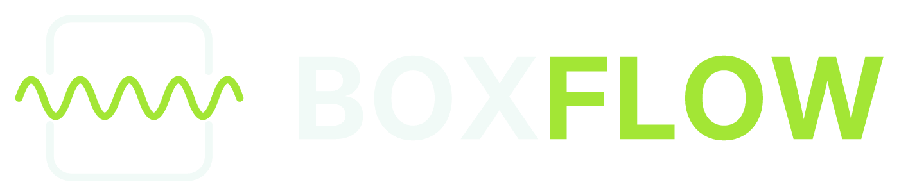

# 04 — Marca e identidade visual

O produto se chama **BoxFlow**. Ele é vendido como SaaS, e cada empresa que contrata vê o sistema com o
**seu** nome e as **suas** cores — BoxFlow aparece só na tela de entrada e no rodapé
(ver [ADR 0006](adr/0006-marca-branca-por-contratante.md)). Este documento define, então, duas coisas
diferentes: a identidade do BoxFlow como produto e as regras que o tema de cada contratante tem que
respeitar para o sistema continuar utilizável no chão de fábrica.

---

## 1. O símbolo

Uma caixa vista de frente com a **onda do papelão atravessando-a**. Os lados verticais da caixa são
interrompidos exatamente onde a onda passa, e a onda transborda para fora nos dois lados: o fluxo entra,
atravessa a caixa e sai. É a operação da cartonagem em um traço — chapa ondulada entra, caixa sai.

A onda não é decoração: é a **onda** no sentido técnico do negócio (onda B, C, BC). Quem trabalha no ramo
reconhece o perfil antes de ler o nome.

### 1.1 Variações e quando usar cada uma

Todos os arquivos estão em [`images/marca/`](../images/marca/), em SVG, e são **gerados por
[`gerar-marca.py`](../images/marca/gerar-marca.py)** a partir de parâmetros — não são exportações de
imagem. Para mudar traço, curvatura ou número de cristas, muda-se o parâmetro e regenera-se tudo.

| Arquivo | Uso |
|---|---|
| `horizontal-escuro.svg` / `-claro.svg` | Uso padrão: topo de tela, documento, apresentação |
| `vertical-escuro.svg` / `-claro.svg` | Espaço estreito e alto: crachá, banner lateral, adesivo |
| `simbolo-escuro.svg` / `-claro.svg` | Sem o letreiro, quando o nome já está escrito ao lado |
| `badge-escuro.svg` / `-claro.svg` | Selo circular: brinde, camiseta, lacre |
| `horizontal-mono-tinta.svg` | Uma cor só, escura: impressão em uma tinta, fax, carimbo |
| `horizontal-mono-reverso.svg` | Uma cor só, clara: sobre fundo colorido ou foto escura |
| `favicon.svg` | Ícone de aba e de aplicativo instalado. **Cinco cristas em vez de nove** — em 16 px a onda de nove cristas vira borrão |

O letreiro é **Inter Bold convertido em curvas**, nunca `<text>` com fonte declarada: logotipo com fonte
declarada muda de forma em máquina que não tem a fonte instalada.

### 1.2 O que não fazer

- Não recolorir o símbolo fora da paleta, e **nunca** usar a lima sobre fundo claro (§2.3).
- Não redesenhar a onda com outro número de cristas fora do favicon — a densidade é parte da marca.
- Não aplicar sombra, brilho ou contorno. O logotipo original tinha tratamento neon; ele foi abandonado
  porque não sobrevive a impressão em uma tinta nem a tela de fábrica com luz de galpão.
- Não usar o símbolo como ícone de status dentro do sistema. Ele é marca, não sinalização.
- Área de respiro mínima ao redor: a altura da caixa do símbolo dividida por 4.
- Tamanho mínimo do letreiro horizontal: 96 px de largura em tela, 22 mm em papel. Abaixo disso, usar
  só o símbolo.

---

## 2. Paleta

| Nome | Hex | Papel |
|---|---|---|
| **Petróleo** | `#0B3C49` | Base institucional. Fundo de barra superior, capa de documento, tela de entrada |
| **Teal** | `#0F766E` | Acento legível **sobre fundo claro**: link, botão primário no tema claro, onda no logotipo claro |
| **Lima** | `#A3E635` | Acento de energia **só sobre fundo escuro**: onda do logotipo, destaque no painel de galpão |
| **Cal** | `#F1FAF7` | Superfície clara do sistema e traço sobre fundo escuro |
| **Carvão** | `#1F2933` | Texto corrido e alternativa de fundo escuro |

### 2.1 Por que esta paleta serve a uma cartonagem

O azul-petróleo carrega o layout sem competir com nada, e a cal é o papel — é o que sobra de espaço para
dado. A lima é a única cor viva, e por ser única ela vira instrumento: no painel de galpão pendurado no
teto, o olho encontra a lima a dez metros sem precisar ler. Isso importa mais aqui do que em um sistema de
escritório, porque o painel é lido de longe, de passagem, por quem está com a mão ocupada.

### 2.2 Contraste medido

Calculado pela fórmula da WCAG 2.1. O mínimo é 4,5:1 para texto corrido, 3:1 para texto grande e para
elemento gráfico.

| Combinação | Razão | Serve para |
|---|---|---|
| Carvão sobre cal | 13,88:1 | Texto corrido em tema claro |
| Cal sobre petróleo | 11,25:1 | Texto corrido em tema escuro |
| Lima sobre carvão | 9,79:1 | Destaque no painel de galpão |
| Lima sobre petróleo | 7,93:1 | Número grande e destaque em tema escuro |
| Teal sobre cal | 5,15:1 | Texto de apoio e link em tema claro |
| **Teal sobre petróleo** | **2,18:1** | **Nada. Reprovado** (ver §2.3) |
| **Lima sobre cal** | **1,42:1** | **Nada. Reprovado** (ver §2.3) |

### 2.3 Os dois acentos não são intercambiáveis

Este é o detalhe que mais gera erro de aplicação, então vale explicitar: **a paleta tem dois acentos e
cada um serve a exatamente um fundo.**

- **A lima não existe sobre fundo claro.** 1,42:1 contra a cal reprova até para elemento gráfico não
  textual, cujo mínimo é 3:1.
- **O teal não existe sobre fundo escuro.** 2,18:1 contra o petróleo reprova pelo mesmo motivo — os dois
  são escuros e próximos em luminosidade.

É por isso que o logotipo tem duas versões de cor e não uma: no tema escuro a onda é lima, no tema claro
a onda é teal. Não é preferência estética, é a única combinação em que a marca sobrevive nos dois fundos.

Consequência para quem for implementar: **não** declarar o teal como "cor de acento" global. Ele é o
acento do tema claro. O tema escuro usa lima.

### 2.4 Tipografia

**Inter** em toda a interface e nos documentos gerados. Escolhida porque tem números tabulares — coluna de
medida, peso e quantidade precisa alinhar dígito com dígito — e porque distingue `1`, `l` e `I`, o que
importa em tela de fábrica lendo código de F.T.

Para o **painel de galpão** e para a **etiqueta de amarrado**, peso 700 no mínimo: os dois são lidos de
longe, um pelo olho e outro por leitor de código.

---

## 3. Tema do contratante

O contratante é dono da aparência, dentro de limites. O que segue é o contrato entre o que o cliente
escolhe e o que o sistema garante.

### 3.1 O que o contratante fornece

| Item | Formato | Se não fornecer |
|---|---|---|
| Nome de exibição | texto | Usa a razão social do CNPJ contratado |
| Logotipo | SVG, PNG ou JPG; versão clara e escura | Usa o nome de exibição composto em Inter |
| Cor primária | **uma** cor em hex | Usa petróleo `#0B3C49` |
| Favicon | derivado do logotipo automaticamente | Derivado do logotipo |

**Uma cor, não doze.** O cliente informa a cor da marca dele e o sistema **deriva a escala inteira**
(50 a 900) por ajuste de luminosidade em espaço perceptual. Deixar o cliente escolher doze tons produz
paleta ilegível, porque ele escolhe pelo que é bonito no catálogo dele, não pelo que tem contraste em tela.

### 3.2 Validação na hora de salvar

A cor primária passa por três testes antes de ser aceita:

1. **Contraste de texto** — algum tom da escala derivada tem que atingir 4,5:1 contra a cal e contra o
   petróleo. Se nenhum atinge, o sistema escurece ou clareia a cor informada e mostra ao cliente o que
   vai usar, com o motivo.
2. **Contraste de interface** — o tom usado em borda, foco e ícone tem que atingir 3:1.
3. **Colisão semântica** — se a cor cair nas faixas reservadas de matiz (§3.4), ela é aceita, mas fica
   restrita à "moldura" do sistema.

O resultado da validação é gravado junto do tema. Não se revalida a cada requisição.

### 3.3 O que o contratante **não** muda

Estas cores são do sistema, não da marca do cliente:

| Estado | Cor | Onde aparece |
|---|---|---|
| Produzindo | verde | Ficha de Serviço, painel, carga-máquina |
| Setup | âmbar | Apontamento, painel |
| **Parada** | **vermelho** | Painel, Ficha de Serviço, alerta |
| Refugo acima da meta | vermelho | Apontamento, OEE |
| Aprovado / conferido | verde | Conferência, amostra, expedição |
| Aguardando | cinza | PCP, fila |
| Atrasado | vermelho | Rastreamento, entrega programada |
| Divergente do legado | âmbar | Triagem da migração ([02-ENGENHARIA §4.4](02-ENGENHARIA.md)) |

O motivo é operacional, não gráfico: o operador **aprende a cor**. Se no cliente A vermelho significa
parada e no cliente B vermelho é a cor da barra superior, o vermelho deixa de significar coisa alguma. O
custo de errar isso não é uma tela feia, é uma máquina parada que ninguém viu.

Por isso, também: **nenhum estado é comunicado só por cor**. Todo estado carrega texto e forma junto —
exigência de acessibilidade (WCAG 1.4.1) que aqui tem uso prático imediato, porque daltonismo vermelho-verde
atinge cerca de 8% dos homens e a fábrica é um ambiente majoritariamente masculino.

### 3.4 Faixas de matiz reservadas

Se a cor primária do cliente cair em uma destas faixas, ela continua sendo usada na barra superior, em
link e em botão primário, mas **não** entra em nenhum indicador de estado:

| Faixa | Matiz | Reservada para |
|---|---|---|
| Vermelho | 355°–15° | Parada, refugo, atraso |
| Âmbar | 30°–55° | Setup, divergência |
| Verde | 95°–150° | Produzindo, aprovado |

Uma cartonagem com marca vermelha é caso comum. O sistema não recusa a cor: ele impede que ela invada a
sinalização.

### 3.5 O painel de galpão ignora o tema

O painel pendurado no teto usa **sempre** petróleo e lima, independente do tema do contratante. Ele é
lido a dez metros, muitas vezes com luz de galpão batendo na tela, e é o único lugar do sistema onde
legibilidade a distância vale mais que identidade visual. Se o cliente insistir, a discussão é comercial,
não técnica — mas está documentado aqui que a recomendação é não ceder.

---

## 4. Onde o nome do contratante aparece

Um contratante pode ter **várias empresas** (multi-CNPJ, matriz e filial). Isso divide a exibição em dois
níveis, e a distinção evita a confusão mais comum:

- **Tema** — logotipo e cores — é do **contratante** (`tenant`). Não muda quando o usuário troca de empresa.
- **Nome exibido** no topo, em documento e em e-mail é o da **empresa selecionada** (`empresa.nome_fantasia`),
  porque é o CNPJ que emite a nota e assina o romaneio.

Concretamente:

| Lugar | O que aparece |
|---|---|
| Barra superior | Logotipo do contratante + seletor com o nome fantasia da empresa ativa |
| Título da aba e aplicativo instalado | Nome de exibição do contratante |
| Documento gerado (F.T., romaneio, protocolo de amostra) | Logotipo e dados da **empresa** emissora |
| Tela de entrada | Logotipo do contratante, e "BoxFlow" discreto abaixo |
| Rodapé | "BoxFlow" com link para o produto |
| E-mail transacional | Nome da empresa no remetente; BoxFlow só no rodapé legal |

A obrigação de manter a assinatura BoxFlow na tela de entrada e no rodapé é **contratual**, não técnica —
está no contrato de licença, e o sistema não oferece chave para removê-la.

---

## 5. Implementação

Detalhe técnico de como o tema chega no navegador — variável CSS por contratante, cache, ausência de
piscada na carga, sanitização do logotipo enviado — está em
[02-ENGENHARIA §3.6](02-ENGENHARIA.md#36-tema-do-contratante). O modelo de dados do tema está em
[03-BANCO-DE-DADOS §3](03-BANCO-DE-DADOS.md), na tabela `tenant_marca`.

---

## Histórico de revisões

| Data | Mudança |
|---|---|
| 2026-09-28 | Documento criado. Nome BoxFlow, paleta petróleo/teal/lima/cal/carvão, logotipo revetorizado a partir do rascunho neon, contrato de marca branca |
